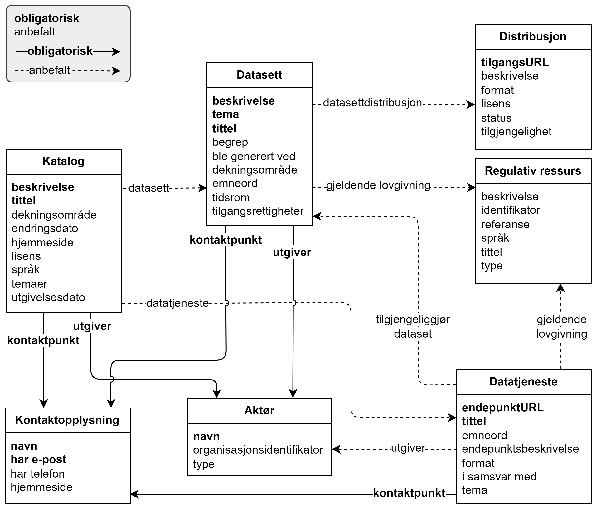

= Forenklet fremstilling av kravene i DCAT-AP-NO [[Forenklet-fremstilling]] 

_Denne delen er primært ment for den ikke-tekniske målgruppen._ 

:xrefstyle: short

<> viser en forenklet fremstilling av kravene i DCAT-AP-NO. Den viser bare obligatoriske og anbefalte krav. Modellen er ikke ment som en formell representasjon av standarden, men kun for å gi en visuell oversikt over noen av klassene og relasjoner mellom dem. Tekniske krav til hvordan klassene og egenskapene/relasjoner skal uttrykkes i RDF er spesifisert videre i standarden. Før eventuell uoverensstemmelse mellom tegningen og den tekstlige spesifikasjonen blir rettet opp, har den tekstlige spesifikasjonen av klassene/egenskapene forrang. Samme forrang gjelder også når det gjelder eventuelle uoverensstemmelser mellom tekstlige spesifikasjoner og tegninger i resten av standarden. 

[[img-ForenkletModell]]
.Forenklet fremstilling av kravene i DCAT-AP-NO, med kun obligatoriske og anbefalte krav.
[link=images/DCAT-AP-NO-forenklet-fremstilling.png]

:xrefstyle: full

// Last ned modell: link:images/DCAT-AP-NO2_20210903.png[png] |  link:files/DCAT-AP-NO2_20210903.eap[XMI for EA]

Helt overordnet illustrerer figuren bl.a. følgende:

* En *katalog* 
** SKAL alltid inneholde opplysninger om utgiveren av katalogen og kontaktpunkter, samt beskrivelse og tittel 
** BØR inneholde beskrivelse av datasett og/eller datatjenester
*** Merk at selv om hverken datasettbeskrivelse eller datatjenestebeskrivelse er obligatorisk, BØR man unngå å ha tomme kataloger. 
* En **datasett**beskrivelse 
** SKAL alltid inneholde opplysninger om utgiveren av datasettet og kontaktpunkter, samt beskrivelse, tittel og tema(er) som datasettet skal sorteres innunder
** BØR tilgjengeliggjøres vha. distribusjoner og/eller datatjenester/APIer (se neste punkt om datatjenestebeskrivelse)
** BØR inneholde opplysninger om gjeldende lovgivning som gir mandat til opprettelse eller behandling av datasettet 
* En **datatjeneste**beskrivelse 
** SKAL alltid inneholde opplysninger om utgiveren av tjenesten og kontaktpunker, samt tittel og endepunktsURL
** BØR brukes til å tilgjengeliggjøre datasett 
*** Merk at selv om det ikke er obligatorisk å knytte en datatjeneste til datasett, BØR man unngå å ha datatjeneste som ikke tilgjengeliggjør datasett. Unntaket er rene dataprosesseringstjenester.
** BØR inneholde opplysninger om utgiveren av datatjenesten
** BØR inneholde opplysninger om gjeldende lovgivning som gir mandat til opprettelse eller forvaltning av datatjenesten

Et illustrativt eksempel på en katalog som inneholder beskrivelse av et datasett og en datatjeneste, der minimumsopplysninger er uthevet: 

* katalog123:
** *Tittel*: Eksempelkatalog (bokmål) / _Example Catalog (English)_
** *Beskrivelse*: Et eksempelkatalog kun for illustrasjonsformål. (bokmål) / _An example catalog for illustration purposes only. (English)_
** *Utgiver*: 991825827 (organisasjonsnummeret til Digitaliseringsdirektoratet)
** *Kontaktopplysninger*: 
*** *Navn*: Digitaliseringsdirektoratet (bokmål) / _Norwegian Digitalisation Agency (English)_
*** e-post: informasjonsforvaltning@digdir.no
** Innholder beskrivelse av følgende datasett:
*** datasett456
** Inneholder beskrivelse av følgende datatjenester:
*** api789

* datasett456:
** *Tittel*: Eksempeldatasett (bokmål) / _Example Dataset (English)_
** *Beskrivelse*: Et eksempeldatasett kun for illustrasjonsformål. (bokmål) / _An example dataset for illustration purposes only. (English)_
** *Tema*: Forvaltning og offentlig sektor (bokmål) / _Government and public sector (English)_
** *Utgiver*: 991825827 (organisasjonsnummeret til Digitaliseringsdirektoratet)
** *Kontaktopplysninger*: 
*** *Navn*: Digitaliseringsdirektoratet (bokmål) / _Norwegian Digitalisation Agency (English)_
*** e-post: informasjonsforvaltning@digdir.no
** Gjeldende lovgivning: Lov om rett til innsyn i dokument i offentleg verksemd (offentleglova)
** Distribusjon: 
*** *TilgangsURL*: \https://example.org/exDistribution

* api789:
** *Tittel*: EksempelAPI (bokmål) / _Example API (English)_
** *EndepunktsURL*: \https://example.org/exAPI
** *Utgiver*: 991825827 (organisasjonsnummeret til Digitaliseringsdirektoratet)
** *Kontaktopplysninger*: 
*** *Navn*: Digitaliseringsdirektoratet (bokmål) / _Norwegian Digitalisation Agency (English)_
*** e-post: informasjonsforvaltning@digdir.no
** Tilgjengeliggjør datasett: datasett456

.For teknisk interessert: klikk her for å se eksemplene ovenfor representert i RDF Turtle
[%collapsible]
====
Et illustrativt eksempel på en katalog som inneholder beskrivelse av et datasett og en datatjeneste, representert i RDF Turtle: 
-----
@prefix dct: <http://purl.org/dc/terms/> .
@prefix dcat: <http://www.w3.org/ns/dcat#> .
@prefix dcatap: <http://data.europa.eu/r5r/> .
@prefix vcard: <http://www.w3.org/2006/vcard/ns#> .
@base <https://example.org/> .

<katalog123> a dcat:Catalog ; # en katalog
   dct:title "Eksempelkatalog"@nb , "Example Catalog"@en ; # tittel
   dct:description "Et eksempelkatalog kun for illustrasjonsformål."@nb , "An example catalog for illustration purposes only."@en ; # beskrivelse
   dct:publisher <https://organization-catalog.fellesdatakatalog.digdir.no/organizations/991825827> ; # utgiver
   dcat:contactPoint <kontaktpunktDigdir> ; 
   dcat:dataset <datasett456> ; # inneholder datasett
   dcat:service <api789> ; # inneholder datatjenester 
   .

<datasett456> a dcat:Dataset ; # et datasett
   dct:title "Eksempeldatasett"@nb , "Example Dataset"@en ; # tittel
   dct:description "Et eksempeldatasett kun for illustrasjonsformål."@nb , "An example dataset for illustration purposes only."@en; # beskrivelse
   dcat:theme <http://publications.europa.eu/resource/authority/data-theme/GOVE> ; # tema
   dct:publisher <https://organization-catalog.fellesdatakatalog.digdir.no/organizations/991825827> ; # utgiver
   dcat:contactPoint <kontaktpunktDigdir> ; 
   dcatap:applicableLegislation <https://lovdata.no/eli/lov/2006/05/19/16> ; # gjeldende lovgivning
   dcat:distribution <distribusjon321> ;
   .
   
<distribusjon321> a dcat:Distribution ; # en distribusjon
   dcat:accessURL <https://example.org/exDistribution> ; 
   .

<api789> a dcat:DataService ; # en datatjeneste
   dct:title "EksempelAPI"@nb , "Example API"@en ; 
   dcat:endpointURL <https://example.org/exlAPI> ; 
   dct:publisher <https://organization-catalog.fellesdatakatalog.digdir.no/organizations/991825827> ; # utgiver
   dcat:contactPoint <kontaktpunktDigdir> ; 
   dcat:servesDataset <datasett456> ;
   .

<kontaktpunktDigdir> a vcard:Organization ;
   vcard:fn "Digitaliseringsdirektoratet"@nb , "Norwegian Digitalisation Agency"@en ;
   vcard:hasEmail <mailto:informasjonsforvaltning@digdir.no> ;
   .
-----
====