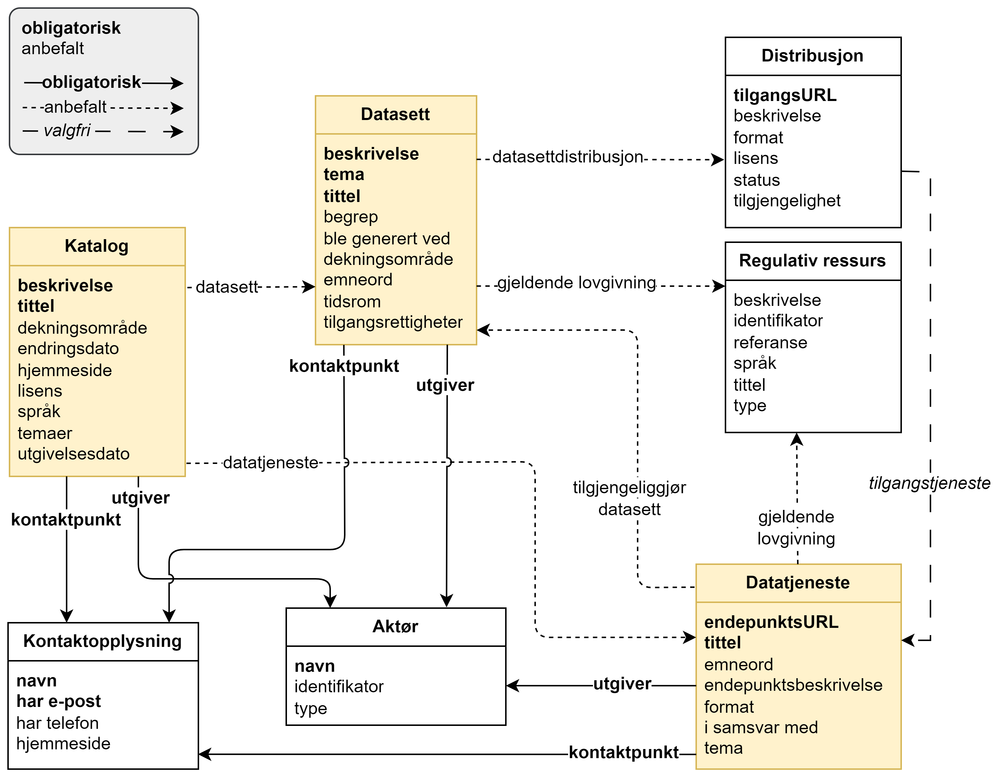

= Forenklet fremstilling av noen av kravene i DCAT-AP-NO [[Forenklet-fremstilling]] 

_Denne delen av standarden er primært ment for den ikke-tekniske målgruppen._ 

== Opplysninger som skal og bør tas med om en katalog, et datasett og en datatjeneste [[Noen-krav]]

:xrefstyle: short

<> viser en forenklet fremstilling av noen av kravene i DCAT-AP-NO. Den viser bare opplysninger som skal (obligatorisk) og bør (anbefalt) tas med i en beskrivelse av en katalog, et datasett og en datatjeneste (også kalt API). Krav til hvordan opplysningene skal representeres teknisk er spesifisert videre i standarden.  

[[img-ForenkletModell]]
.Forenklet fremstilling av noen av kravene i DCAT-AP-NO.
[link=images/DCAT-AP-NO-forenklet-fremstilling.png]

:xrefstyle: full

Helt overordnet illustrerer figuren bl.a. følgende:

* En *katalog* 
** SKAL alltid inneholde opplysninger om utgiveren av katalogen og kontaktpunkt, samt tekstlig beskrivelse og tittel til katalogen 
** BØR inneholde beskrivelse av datasett og/eller datatjenester
*** Merk at selv om hverken datasettbeskrivelse eller datatjenestebeskrivelse er obligatorisk, BØR man unngå å ha tomme kataloger. 
* Et **datasett** 
** SKAL alltid beskrives med opplysninger om utgiveren av datasettet og kontaktpunkt, tekstlig beskrivelse og tittel til datasettet, samt tema som datasettet skal grupperes innunder
** BØR tilgjengeliggjøres vha. distribusjoner og/eller datatjenester/APIer
** BØR inneholde opplysninger om gjeldende lovgivning som gir mandat til opprettelse eller behandling av datasettet 
* En **datatjeneste** 
** SKAL alltid beskrives med opplysninger om utgiveren av datatjenesten og kontaktpunkt, samt tittel og endepunktsURL til datatjenesten
** BØR brukes til å tilgjengeliggjøre datasett 
*** Merk at selv om det ikke er obligatorisk å knytte en datatjeneste til datasett, BØR man unngå å ha datatjenester som ikke tilgjengeliggjør datasett. 
*** Unntaket er rene dataprosesseringstjenester, inkl. lese- og skrive-APIer.
** BØR inneholde opplysninger om gjeldende lovgivning som gir mandat til opprettelse eller forvaltning av datatjenesten

== Et illustrativt eksempel [[Illustrativt-eksempel]]

Følgende er et illustrativt eksempel på en katalog som inneholder beskrivelse av et datasett og en datatjeneste, der minimumsopplysninger er uthevet: 

* <katalog123>:
** *Tittel*: «Eksempelkatalog» (bokmål) / _"Example Catalogue" (English)_
** *Beskrivelse*: «En eksempelkatalog, kun for illustrasjonsformål.» (bokmål) / _"An example catalogue, for illustration purposes only." (English)_
** *Utgiver*: https://organization-catalog.fellesdatakatalog.digdir.no/organizations/991825827[991825827 &#x29C9;, window="_blank", role="ext-link"] (organisasjonsnummeret til Digitaliseringsdirektoratet)
** *Kontaktopplysninger*: se <kontaktpunktDigdirFDK> 
** Innholder beskrivelse av følgende datasett: <datasett456>
** Inneholder beskrivelse av følgende datatjenester: <api789>

* <datasett456>:
** *Tittel*: «Eksempeldatasett» (bokmål) / _"Example Dataset" (English)_
** *Beskrivelse*: «Et eksempeldatasett, kun for illustrasjonsformål.» (bokmål) / _"An example dataset, for illustration purposes only." (English)_
** *Tema*: https://op.europa.eu/en/web/eu-vocabularies/concept/-/resource?uri=http://publications.europa.eu/resource/authority/data-theme/TRAN[Transport &#x29C9;, window="_blank", role="ext-link"]
** *Utgiver*: https://organization-catalog.fellesdatakatalog.digdir.no/organizations/971032081[971032081 &#x29C9;, window="_blank", role="ext-link"] (organisasjonsnummeret til Statens vegvesen)
** *Kontaktopplysninger*: se <kontaktpunktSVV> 
** Gjeldende lovgivning: https://lovdata.no/dokument/SF/forskrift/2016-12-15-1600[Forskrift om tilgjengeliggjøring av sanntids veg- og trafikkinformasjonstjenester &#x29C9;, window="_blank", role="ext-link"]
** Distribusjon: 
*** *TilgangsURL*: \https://example.org/exDistribution

* <api789>:
** *Tittel*: «EksempelAPI» (bokmål) / _"Example API" (English)_
** *EndepunktsURL*: \https://example.org/exAPI
** *Utgiver*: https://organization-catalog.fellesdatakatalog.digdir.no/organizations/971032081[971032081 &#x29C9;, window="_blank", role="ext-link"] (organisasjonsnummeret til Statens vegvesen)
** *Kontaktopplysninger*: se <kontaktpunktSVV> 
** Tilgjengeliggjør datasett: <datasett456>

* <kontaktpunktDigdirFDK>: 
*** *Navn*: «Digitaliseringsdirektoratet» (bokmål) / _"Norwegian Digitalisation Agency" (English)_
*** e-post: fellesdatakatalog@digdir.no
*** kontaktside: https://data.norge.no/contact[https://data.norge.no/contact &#x29C9;, window="_blank", role="ext-link"]

* <kontaktpunktSVV>: 
*** *Navn*: «Statens vegvesen» (bokmål) / _"Norwegian Public Roads Administration" (English)_
*** e-post: firmapost@vegvesen.no

.For deg som er teknisk interessert: klikk her for å se beskrivelsene ovenfor representert i RDF Turtle, og i henhold til kravene spesifisert videre i standarden.
[%collapsible]
====
-----
@prefix dct: <http://purl.org/dc/terms/> .
@prefix dcat: <http://www.w3.org/ns/dcat#> .
@prefix dcatap: <http://data.europa.eu/r5r/> .
@prefix vcard: <http://www.w3.org/2006/vcard/ns#> .
@base <https://example.org/> .

<katalog123> a dcat:Catalog ; # en katalog
   dct:title "Eksempelkatalog"@nb , "Example Catalogue"@en ; # tittel
   dct:description "Et eksempelkatalog, kun for illustrasjonsformål."@nb , 
      "An example catalogue, for illustration purposes only."@en ; # beskrivelse
   dct:publisher <https://organization-catalog.fellesdatakatalog.digdir.no/organizations/991825827> ; # utgiver
   dcat:contactPoint <kontaktpunktDigdirFDK> ; # kontaktpunkt
   dcat:dataset <datasett456> ; # inneholder datasett
   dcat:service <api789> ; # inneholder datatjenester 
   .

<datasett456> a dcat:Dataset ; # et datasett
   dct:title "Eksempeldatasett"@nb , "Example Dataset"@en ; # tittel
   dct:description "Et eksempeldatasett, kun for illustrasjonsformål."@nb , 
      "An example dataset, for illustration purposes only."@en; # beskrivelse
   dcat:theme <http://publications.europa.eu/resource/authority/data-theme/GOVE> ; # tema
   dct:publisher <https://organization-catalog.fellesdatakatalog.digdir.no/organizations/971032081> ; # utgiver
   dcat:contactPoint <kontaktpunktSVV> ; # kontaktpunkt
   dcatap:applicableLegislation <https://lovdata.no/eli/forskrift/2016/12/15/1600> ; # gjeldende lovgivning
   dcat:distribution <distribusjon321> ; # datasettdistribusjon
   .
   
<distribusjon321> a dcat:Distribution ; # en distribusjon
   dcat:accessURL <https://example.org/exDistribution> ; # tilgangsURL
   .

<api789> a dcat:DataService ; # en datatjeneste
   dct:title "EksempelAPI"@nb , "Example API"@en ; # tittel
   dcat:endpointURL <https://example.org/exlAPI> ; # endepunktsURL
   dct:publisher <https://organization-catalog.fellesdatakatalog.digdir.no/organizations/971032081> ; # utgiver
   dcat:contactPoint <kontaktpunktSVV> ; # kontaktpunkt
   dcat:servesDataset <datasett456> ; # tilgjengeliggjør datasett
   .

<kontaktpunktDigdirFDK> a vcard:Organization ; # et kontaktpunkt
   vcard:fn "Digitaliseringsdirektoratet"@nb , "Norwegian Digitalisation Agency"@en ; # navn
   vcard:hasEmail <mailto:fellesdatakatalog@digdir.no> ; # har e-post
   vcard:hasURL <https://data.norge.no/contact> ; # har kontaktside
   .

<kontaktpunktSVV> a vcard:Organization ; # et kontaktpunkt
   vcard:fn "Statens vegvesen"@nb , "Norwegian Public Roads Administration"@en ; # navn
   vcard:hasEmail <mailto:firmapost@vegvesen.no> ; # har e-post
   .
-----
====