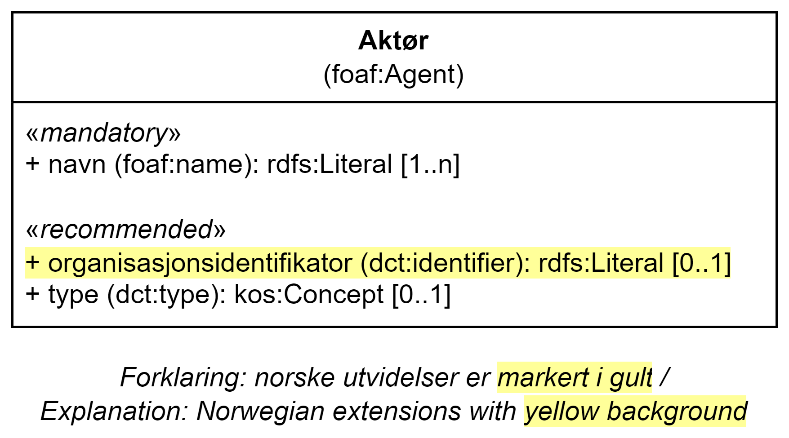

= Klassen Aktør (foaf:Agent) [[Aktør]]

:xrefstyle: short

<<diagram-Klassen-Aktør>> viser klassen Aktør og dens egenskaper og subklasser.   

[[diagram-Klassen-Aktør]]
.Klassen Aktør.
[link=images/Klassen-Aktør.png]

:xrefstyle: full

[cols="30s,70"]
|===
| _English name_ | _Agent_
| URI | foaf:Agent
|Anvendelse / _Usage note_ | Klassen brukes til å representere en aktør som er assosiert med katalogen og/eller ressursene beskrevet i katalogen. 

__This class is used to represent any entity carrying out actions with respect to the entities catalogue and the catalogued resources.__
| Merknad / _Note_ | Subklassen Organisasjon (`org:Organization`), Gruppe (`foaf:Group`) eller Person (`foaf:Person`) BØR brukes istedenfor klassen Aktør (`foaf:Agent`), når aktøren er en organisasjon, gruppe eller person. 

__The subclass Organization (`org:Organization`), Group (`foaf:Group`) or Person (`foaf:Person`) SHOULD be used instead of the class Agent (`foaf:Agent`), when the agent is an organization, group of person.__ 
|===

== Obligatoriske egenskaper for klassen _Aktør_ [[Aktør-obligatoriske-egenskaper]]

=== Aktør – navn (foaf:name) [[Aktør-navn]]

[cols="30s,70"]
|===
| _English name_ |  _name_
| URI | foaf:name
| Verdiområde / _Range_ | rdfs:Literal
| Anvendelse / _Usage note_ | Egenskapen brukes til å oppgi navnet på aktøren. Egenskapen kan gjentas for ulike versjoner av navnet (som navnet på forskjellige språk).

__This property contains the name of the agent. This property can be repeated for different versions of the name (e.g. the name in different languages).__
| Multiplisitet / _Multiplicity_ | 1..n
| Kravnivå / _Requirement level_ | Obligatorisk / _Mandatory_
| Eksempel / _Example_ | «Digitaliseringsdirektoratet» (bokmål) / _"Norwegian Digitalisation Agency" (English)_
|===

Eksempel i RDF Turtle:
-----
<digdir> a org:Organization ;
   foaf:name "Digitaliseringsdirektoratet"@nb , "Norwegian Digitalisation Agency"@en ;
   .
-----

== Anbefalte egenskaper for klassen _Aktør_

=== Aktør – identifikator (dct:identifier) [[Aktør-identifikator]]

[cols="30s,70d"]
|===
| _English name_ | _identifier_
| URI | dct:identifier
| Verdiområde / _Range_ | rdfs:Literal
| Anvendelse / _Usage note_ | Egenskapen brukes til å angi aktørens identifikasjonsnummer.

__This property contains the identifier for the agent.__
| Multiplisitet / _Multiplicity_ | 0..1
| Kravnivå / _Requirement level_ | Anbefalt / _Recommended_
| Merknad 1 / _Note 1_ | Når aktøren har et organisasjonsnummer registrert i Enhetsregisteret, BØR organisasjonsnummeret brukes her. 

__When the agent has an organization number registered in the Central Coordinating Register for Legal Entities (CCR), the organization number SHOULD be used here.__
| Merknad 2 / _Note 2_ | Norsk utvidelse: Ikke eksplisitt spesifisert i DCAT-AP/DCAT. 

_Norwegian extension: Not explicitly specified in DCAT-AP/DCAT._
| Eksempel / _Example_ | Digitaliseringsdirektoratet har organisasjonsnummer 991825827
|===

Eksempel i RDF Turtle:
-----
<digdir> a org:Organization ;
   dct:identifier "991825827" ;
   .
-----

=== Aktør – type (dct:type) [[Aktør-type]]

[cols="30s,70d"]
|===
| _English name_ | _type_
| URI | dct:type
| Verdiområde / _Range_ | skos:Concept
| Anvendelse / _Usage note_ | Egenskapen brukes til å referere til type aktør.

_This property is used to specify the nature of the agent._
| Multiplisitet / _Multiplicity_ | 0..1
| Kravnivå / _Requirement level_ | Anbefalt / _Recommended_
| Merknad / _Note_ | Verdien SKAL velges fra http://purl.org/adms/publishertype/1.0[_ADMS publisher type_ &#x29C9;, window="_blank", role="ext-link"] (lenket ressurs er i RDF).

__The value MUST be chosen from http://purl.org/adms/publishertype/1.0[ADMS publisher type &#x29C9;, window="_blank", role="ext-link"] (the ressurs linked is in RDF).__
| Eksempel / _Example_ | For Digitaliseringsdirektoratet blir dette \http://purl.org/adms/publishertype/NationalAuthority (_National authority_).
|===

Eksempel i RDF Turtle:
-----
<digdir> a org:Organization ;
   dct:type <http://purl.org/adms/publishertype/NationalAuthority> ;
   .
-----
