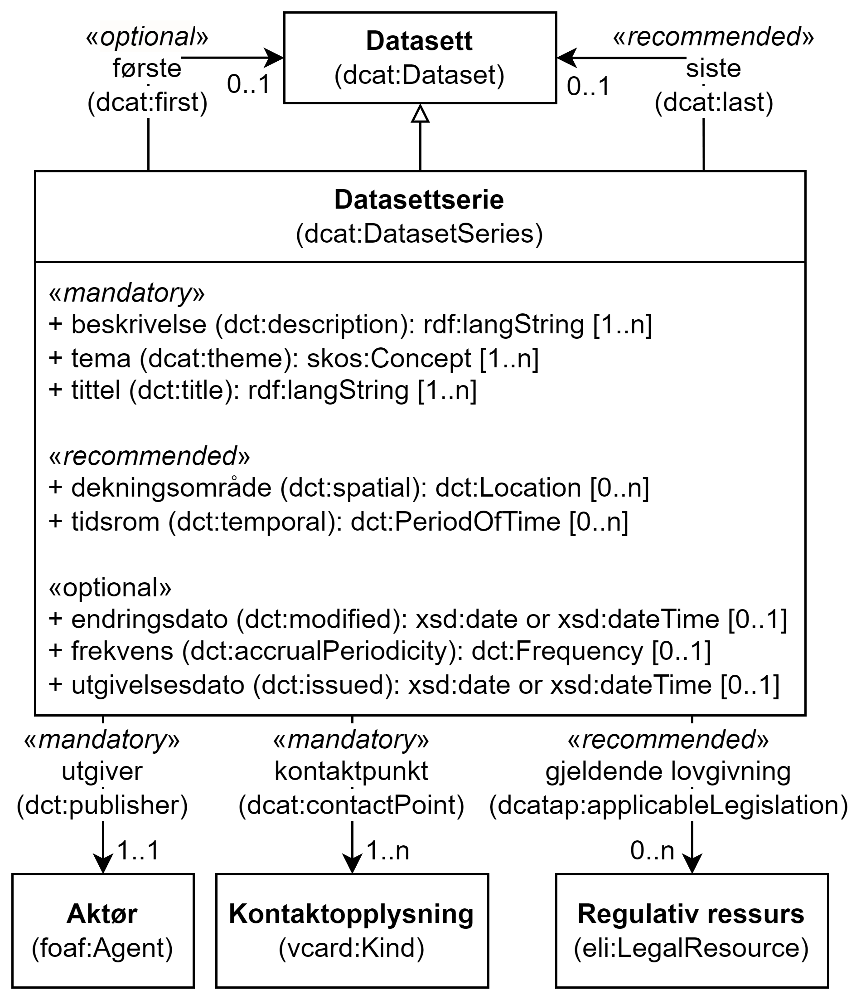

= Klassen Datasettserie (dcat:DatasetSeries) [[Datasettserie]]

:xrefstyle: short

<<diagram-Klassen-Datasettserie>> viser klassen Datasettserie og dens egenskaper, samt klassene den refererer til. I tegningen er norske utvidelser markert i gult.  

[[diagram-Klassen-Datasettserie]]
.Klassen Datasettserie og klassene den refererer til.
[link=images/Klassen-Datasettserie.png]

:xrefstyle: full

[cols="30s,70"]
|===
| _English name_ | _Dataset series_
| URI | dcat:DatasetSeries
| Subklasse av / _Subclass of_ | <<Datasett, dcat:Dataset>>
| Anvendelse / _Usage note_ | Klassen brukes til å representere en samling av datasett som publiseres separat, men som deler noen felles egenskaper som gjør at de er gruppert sammen. Se også <<Om-Datasettserie>>.

_This class is used to represent a collection of datasets that are published separately, but share some characteristics that group them._ 
|===

== Obligatoriske egenskaper for klassen _Datasettserie_ [[Datasettserie-obligatoriske-egenskaper]]

=== Datasettserie – kontaktpunkt (dcat:contactPoint) [[Datasettserie-kontaktpunkt]]

[cols="30s,70"]
|===
| _English name_ | _contact point_
| URI | dcat:contactPoint
| Verdiområde / _Range_ | <<Kontaktopplysning, vcard:Kind>>
| Anvendelse / _Usage note_ | Egenskapen brukes til å oppgi kontaktopplysninger, som kan brukes vedr. spørsmål og kommentarer om datasettserien.

_This property is used to specify contact information that can be used concerning questions and comments about the Dataset serie._
| Multiplisitet / _Multiplicity_ | 1..n
| Kravnivå / _Requirement level_ | Obligatorisk / _Mandatory_
| Merknad / _Note_ | Norsk utvidelse: Kravnivået er endret til fra anbefalt til obligatorisk, og dermed også multiplisitet til 1..n. 

_Norwegian extension: The requirement level is changed from recommended to mandatory, thus also the multiplicity to 1..n._
|===

Eksempel i RDF Turtle:
-----
<aDatasetSeries> a dcat:DatasetSeries ; 
   dcat:contactPoint <aContactPoint> ; 
   .
-----

=== Datasettserie – tema (dcat:theme) [[Datasettserie-tema]]

[cols="30s,70"]
|===
| _English name_ | _theme_
| URI | dcat:theme
| Verdiområde / _Range_ | skos:Concept
| Anvendelse / _Usage note_ | Egenskapen brukes til å referere til et hovedtema for datasettserien. En datasettserien kan assosieres med flere tema.

_This property is used to specify the category of the dataset serie. A Dataset  serie may be associated with multiple themes._
| Multiplisitet / _Multiplicity_ | 1..n
| Kravnivå / _Requirement level_ | Obligatorisk / _Mandatory_
| Merknad 1 / _Note 1_ | Verdiene for denne egenskapen er URIer til begrepene i vokabularet https://op.europa.eu/en/web/eu-vocabularies/concept-scheme/-/resource?uri=http://publications.europa.eu/resource/authority/data-theme[__Data theme__ &#x29C9;, window="_blank", role="ext-link"]. 

Norsk utvidelse: https://psi.norge.no/los/struktur.html[Los &#x29C9;, window="_blank", role="ext-link"] BØR brukes i tillegg. 

__The values to be used for this property are the URIs of the concepts in the vocabulary https://op.europa.eu/en/web/eu-vocabularies/concept-scheme/-/resource?uri=http://publications.europa.eu/resource/authority/data-theme[Data theme &#x29C9;, window="_blank", role="ext-link"].__

__Norwegian extension: https://psi.norge.no/los/struktur.html[Los &#x29C9;, window="_blank", role="ext-link"] SHOULD be used in addition.__
| Merknad 2 / _Note 2_ | Norsk utvidelse: Kravnivået er endret til fra anbefalt til obligatorisk, og dermed også multiplisitet til 1..n. 

_Norwegian extension: The requirement level is changed from recommended to mandatory, thus also the multiplicity to 1..n._
|===

Eksempel i RDF Turtle:
-----
<aDatasetSeries> a dcat:DatasetSeries ; 
   dcat:theme <http://publications.europa.eu/resource/authority/data-theme/GOVE> ; 
   .
-----

=== Datasettserie – tittel (dct:title) [[Datasettserie-tittel]]

[cols="30s,70"]
|===
| _English name_ | _title_
| URI | dct:title
| Verdiområde / _Range_ | rdfs:Literal
| Anvendelse / _Usage note_ | Egenskapen brukes til oppgi navnet på datasettserien. Egenskapen bør gjentas når navnet finnes på flere ulike språk.

_This property is used to specify a name given to the Dataset Series. This property can be repeated for parallel language versions of the name._
| Multiplisitet / _Multiplicity_ | 1..n
| Kravnivå / _Requirement level_ | Obligatorisk / _Mandatory_
|===

Eksempel i RDF Turtle:
-----
<aDatasetSeries> a dcat:DatasetSeries ; 
   dct:title "Eksempeldatasettserie"@nb , "Example Dataset Series"@en ; 
   .
-----

=== Datasettserie – utgiver (dct:publisher) [[Datasettserie-utgiver]]

[cols="30s,70"]
|===
| _English name_ | _publisher_
| URI |  dct:publisher
| Verdiområde / _Range_ | <<Aktør, foaf:Agent>>
| Anvendelse / _Usage note_ | Egenskapen brukes til å referere til en aktør (organisasjon) som er ansvarlig for å gjøre datasettserien tilgjengelig. Bør være autoritativ URI for aktøren, f.eks. `dct:publisher <\https://organization-catalog.fellesdatakatalog.digdir.no/organizations/974760673>`.

_This property is used to specify the entity (organisation) responsible for making the Dataset serie available._
| Multiplisitet / _Multiplicity_ | 1..1
| Kravnivå / _Requirement level_ | Obligatorisk / _Mandatory_
| Merknad 1 / _Note 1_ | (Lite aktuelt for bruk i Norge)  For EU-institusjoner og noen internasjonale organisasjoner SKAL verdien velges fra EUs kontrollerte vokabular https://op.europa.eu/en/web/eu-vocabularies/concept-scheme/-/resource?uri=http://publications.europa.eu/resource/authority/corporate-body[__Corporate body__ &#x29C9;, window="_blank", role="ext-link"]. 

__The value MUST be chosen from EU's controlled vocabulary https://op.europa.eu/en/web/eu-vocabularies/concept-scheme/-/resource?uri=http://publications.europa.eu/resource/authority/corporate-body[Corporate body &#x29C9;, window="_blank", role="ext-link"] for European institutions and a small set of international organisations.__
| Merknad 2 / _Note 2_ | Norsk utvidelse: Kravnivået endret fra anbefalt til obligatorisk, dermed også multiplisitet fra 0..1 til 1..1.

__Norwegian extension: The requirement level changed from recommended to mandatory, thus also the multiplicity from 0..1 to 1..1.__
|===

Eksempel i RDF Turtle:
-----
<aDatasetSeries> a dcat:DatasetSeries ; 
   dct:publisher <https://organization-catalog.fellesdatakatalog.digdir.no/organizations/991825827> ; 
   .
-----

== Anbefalte egenskaper for klassen _Datasettserie_ [[Datasettserie-anbefalte-egenskaper]]

=== Datasettserie – beskrivelse (dct:description) [[Datasettserie-beskrivelse]]

[cols="30s,70"]
|===
| _English name_ | _description_
| URI | dct:description
| Verdiområde / _Range_ | rdfs:Literal
| Anvendelse / _Usage note_ | Egenskapen brukes til å oppgi en fritekstbeskrivelse av datasettserien. Egenskapen bør gjentas når beskrivelsen finnes på flere ulike språk.

_This property is used to specify a free-text account of the Dataset serie.This property can be repeated for parallel language versions of the description._
| Multiplisitet / _Multiplicity_ | 0..n
| Kravnivå / _Requirement level_ | Anbefalt / _Recommended_
| Merknad / _Note_ | Norsk utvidelse: Kravnivået endret fra valgfri til anbefalt.

_Norwegian extension: The requirement level changed from optional to recommended._
|===

Eksempel i RDF Turtle:
-----
<aDatasetSeries> a dcat:DatasetSeries ; 
   dct:description "Et eksempeldatasett"@nb , "An example dataset"@en ; 
   .
-----

=== Datasettserie – dekningsområde (dct:spatial) [[Datasettserie-dekningsområde]]

[cols="30s,70"]
|===
| _English name_ | _geographical coverage_
| URI | dct:spatial
| Verdiområde / _Range_ | dct:Location
| Anvendelse / _Usage note_ | Egenskapen brukes til å referere til et geografisk område som er dekket av datasettserien.

_This property is used to refer to a geographic region that is covered by the Dataset serie._
| Multiplisitet / _Multiplicity_ | 0..n
| Kravnivå / _Requirement level_ | Anbefalt / _Recommended_
| Merknad / _Note_ | Verdien SKAL velges fra EU's kontrollerte vokabularer https://op.europa.eu/en/web/eu-vocabularies/concept-scheme/-/resource?uri=http://publications.europa.eu/resource/authority/continent[__Continent__ &#x29C9;, window="_blank", role="ext-link"], https://op.europa.eu/en/web/eu-vocabularies/concept-scheme/-/resource?uri=http://publications.europa.eu/resource/authority/country[__Countries and territories__ &#x29C9;, window="_blank", role="ext-link"] eller https://op.europa.eu/en/web/eu-vocabularies/concept-scheme/-/resource?uri=http://publications.europa.eu/resource/authority/place[__Place__ &#x29C9;, window="_blank", role="ext-link"], HVIS den finnes på listene; https://sws.geonames.org/[__GeoNames__ &#x29C9;, window="_blank", role="ext-link"] SKAL i andre tilfeller brukes. 

Norsk utvidelse: For å angi dekningsområde i Norge, BØR Kartverkets kontrollerte vokabular https://data.geonorge.no/administrativeEnheter/nasjon/doc/173163[Administrative enheter &#x29C9;, window="_blank", role="ext-link"] brukes i tillegg.

__The value MUST be chosen from EU's controlled vocabularies https://op.europa.eu/en/web/eu-vocabularies/concept-scheme/-/resource?uri=http://publications.europa.eu/resource/authority/continent[Continent &#x29C9;, window="_blank", role="ext-link"], https://op.europa.eu/en/web/eu-vocabularies/concept-scheme/-/resource?uri=http://publications.europa.eu/resource/authority/country[Countries and territories &#x29C9;, window="_blank", role="ext-link"] or https://op.europa.eu/en/web/eu-vocabularies/concept-scheme/-/resource?uri=http://publications.europa.eu/resource/authority/place[Place &#x29C9;, window="_blank", role="ext-link"], IF it is in one of the lists;  if a particular location is not in one of the mentioned Named Authority Lists, https://sws.geonames.org/[GeoNames &#x29C9;, window="_blank", role="ext-link"] URIs MUST be used.__

__Norwegian extension: To specify spatial coverage in Norway, the Norwegian Mapping Authority’s controlled vocabulary https://sws.geonames.org/[Administrative units &#x29C9;, window="_blank", role="ext-link"] SHOULD be used in addition.__
|===

Eksempel i RDF Turtle:
-----
<aDatasetSeries> a dcat:DatasetSeries ; 
   dct:spatial <http://publications.europa.eu/resource/authority/country/NOR> ; 
   .
-----

=== Datasettserie – første (dcat:first) [[Datasettserie-første]]

[cols="30s,70"]
|===
| _English name_ | _first_
| URI | dcat:first
| Verdiområde / _Range_ | <<Datasett, dcat:Dataset>>
| Anvendelse / _Usage note_ | Egenskapen brukes til å referere til den første ressursen i en ordnet samling eller serie av datasett.

_This property is used to refer to the first resource in an ordered collection or series of resources, to which the current resource belongs._
| Multiplisitet / _Multiplicity_ | 0..1
| Kravnivå / _Requirement level_ | Anbefalt / _Recommended_ 
|===

Eksempel i RDF Turtle:
-----
<aDatasetSeries> a dcat:DatasetSeries ; 
   dcat:first <aDataset> ; 
   .
-----

=== Datasettserie – gjeldende lovgivning (dcatap:applicableLegislation) [[Datasettserie-gjeldendeLovgivning]]

[cols="30s,70"]
|===
| _English name_ | _applicable legislation_
| URI | dcatap:applicableLegislation
| Verdiområde / _Range_ | <<RegulativRessurs, eli:LegalResource>>
| Anvendelse / _Usage note_ | Egenskapen brukes til å referere til lovgivningen som gir mandat til opprettelse eller behandling av datasettserien.

_This property is used to refer to the legislation that mandates the creation or management of the Dataset serie._
| Multiplisitet / _Multiplicity_ | 0..n
| Kravnivå / _Requirement level_ | Anbefalt / _Recommended_
| Merknad / _Note_ | Norsk utvidelse: Kravnivået endret fra valgfri til anbefalt. 

_Norwegian extension: The requirement level changed from optional to recommended._
|===

Eksempel i RDF Turtle:
-----
<aDatasetSeries> a dcat:DatasetSeries ; 
   dcatap:applicableLegislation <https://lovdata.no/eli/lov/2006/05/19/16> ; 
   .
-----

=== Datasettserie – siste (dcat:last) [[Datasettserie-siste]]

[cols="30s,70"]
|===
| _English name_ | _last_
| URI | dcat:last
| Verdiområde / _Range_ | <<Datasett, dcat:Dataset>>
| Anvendelse / _Usage note_ | Egenskapen brukes til å referere til den siste ressursen i en ordnet samling eller serie av datasett.

_This property is used to refer to the last resource in an ordered collection or series of resources, to which the current resource belongs._
| Multiplisitet / _Multiplicity_ | 0..1
| Kravnivå / _Requirement level_ | Anbefalt / _Recommended_
|===

Eksempel i RDF Turtle:
-----
<aDatasetSeries> a dcat:DatasetSeries ; 
   dcat:last <aDataset> ; 
   .
-----

=== Datasettserie – tidsrom (dct:temporal) [[Datasettserie-tidsrom]]

[cols="30s,70"]
|===
| _English name_ | _temporal coverage_
| URI | dct:temporal
| Verdiområde / _Range_ | <<Tidsrom, dct:PeriodOfTime>>
| Anvendelse / _Usage note_ | Egenskapen brukes til å oppgi et tidsrom som er dekket av datasettserien.

_This property is used to specify a temporal period that the Dataset serie covers._
| Multiplisitet / _Multiplicity_ | 0..n
| Kravnivå / _Requirement level_ | Anbefalt / _Recommended_ 
|===

Eksempel i RDF Turtle:
-----
<aDatasetSeries> a dcat:DatasetSeries ; 
   dct:temporal <aPeriodOfTime> ; 
   .
-----

== Valgfrie egenskaper for klassen _Datasettserie_ [[Datasettserie-valgfrie-egenskaper]]

=== Datasettserie – endringsdato (dct:modified) [[Datasettserie-endringsdato]]

[cols="30s,70"]
|===
| _English name_ | _modification date_
| URI | dct:modified
| Verdiområde / _Range_ | xsd:date or xsd:dateTime
| Anvendelse / _Usage note_ | Egenskapen brukes til å oppgi dato for siste oppdatering av datasettserien.

_This property is used to specify the most recent date on which the Dataset serie was changed or modified._
| Multiplisitet / _Multiplicity_ | 0..1
| Kravnivå / _Requirement level_ | Valgfri / _Optional_ 
| Merknad / _Note_ | Norsk utvidelse: Verdiområdet er eksplisitt spesifisert som `xsd:date or xsd:dateTime`, istedenfor å referere til den generiske datatype Temporal literal.  

_Norwegian extension: The range is explicitly specified as `xsd:date or xsd:dateTime`, instead of referring to the generic datatype Temporal Literal._ 
|===

=== Datasettserie – frekvens (dct:accrualPeriodicity) [[Datasettserie-frekvens]]

[cols="30s,70"]
|===
| _English name_ | _frequency_
| URI | dct:accrualPeriodicity
| Verdiområde / _Range_ | dct:Frequency
| Anvendelse / _Usage note_ | Egenskapen brukes til å oppgi oppdateringsfrekvensen for datasettserien.

_This property is used to specify the frequency at which the Dataset serie is updated._
| Multiplisitet / _Multiplicity_ | 0..1
| Kravnivå / _Requirement level_ | Valgfri / _Optional_ 
| Merknad / _Note_ | Verdien SKAL velges fra EUs kontrollerte vokabular https://op.europa.eu/en/web/eu-vocabularies/concept-scheme/-/resource?uri=http://publications.europa.eu/resource/authority/frequency[__Frequency__ &#x29C9;, window="_blank", role="ext-link"].

__The value MUST be chosen from EU's controlled vocabulary https://op.europa.eu/en/web/eu-vocabularies/concept-scheme/-/resource?uri=http://publications.europa.eu/resource/authority/frequency[Frequency &#x29C9;, window="_blank", role="ext-link"]__.
|===

=== Datasettserie – utgivelsesdato (dct:issued) [[Datasettserie-utgivelsesdato]]

[cols="30s,70d"]
|===
| _English name_ | _release date_
| URI | dct:issued
| Verdiområde / _Range_ | xsd:date or xsd:dateTime
| Anvendelse / _Usage note_ | Egenskapen brukes til å oppgi dato for den formelle utgivelsen av datasettserien.

_This property is used to specify the date of formal issuance (e.g., publication) of the Dataset serie._
| Multiplisitet / _Multiplicity_ | 0..1
| Kravnivå / _Requirement level_ | Valgfri / _Optional_
| Merknad / _Note_ | Norsk utvidelse: Verdiområdet er eksplisitt spesifisert som `xsd:date or xsd:dateTime`, istedenfor å referere til den generiske datatype Temporal literal.  

_Norwegian extension: The range is explicitly specified as `xsd:date or xsd:dateTime`, instead of referring to the generic datatype Temporal Literal._ 
|===

