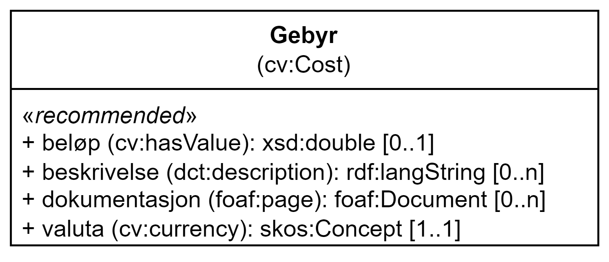

= Klassen Gebyr (cv:Cost) [[Gebyr]]

:xrefstyle: short

<> viser klassen Gebyr og dens egenskaper.   

[[img-Klassen-Gebyr]]
.Klassen Gebyr.
[link=images/Klassen-Gebyr.png]

:xrefstyle: full

[cols="30s,70d"]
|===
| _English name_ | _Cost_
| Anvendelse / _Usage note_ | Klassen brukes til å representere gebyr.

_This class is used to represent any costs._
| URI | cv:Cost
| Merknad / _Note_ | Norsk utvidelse: Ikke eksplisitt spesifisert i DCAT-AP/DCAT.

_Norwegian extension: Not explicitly specified in DCAT-AP/DCAT._
|===

== Anbefalte egenskaper for klassen _Gebyr_ [[Gebyr-anbefalte-egenskaper]]

=== Gebyr – beløp (cv:hasValue) [[Gebyr-beløp]]

[cols="30s,70d"]
|===
| _English name_ | _value_
| URI | cv:hasValue
| Verdiområde / _Range_ |  xsd:double
| Anvendelse / _Usage note_ | Egenskapen brukes til å oppgi gebyrbeløpet.

_This property is used to specify a numeric value indicating the amount of the cost._
| Multiplisitet / _Multiplicity_ | 0..1
| Kravnivå / _Requirement level_ | Anbefalt / _Recommended_
| Merknad 1 / _Note 1_ | Selv om hverken denne egenskapen eller egenskapen <<Gebyr-dokumentasjon>> er obligatorisk, SKAL minst én av dem brukes når denne klassen brukes. 

__Although neither this property nor the property <<Gebyr-dokumentasjon>> is mandatory, one of them MUST be used when the class is used. __
| Merknad 2 / _Note 2_ | Når denne egenskapen brukes, SKAL egenskapen <<Gebyr-valuta>> også brukes. 

__When this property is used, the property <<Gebyr-valuta>> MUST also be used.__
| Merknad 3 / _Note 3_ | Norsk utvidelse: Ikke eksplisitt spesifisert i DCAT-AP/DCAT.

_Norwegian extension: Not explicitly specified in DCAT-AP/DCAT._
| Eksempel / _Example_ | 100,00
|===

Eksempel i RDF Turtle:
-----
<aCost> a cv:Cost ; 
   cv:hasValue "100.00"^^xsd:double ; 
   .
-----

=== Gebyr – beskrivelse (dct:description) [[Gebyr-beskrivelse]]

[cols="30s,70d"]
|===
| _English name_ | _description_
| URI | dct:description
| Verdiområde / _Range_ | rdf:langString
| Anvendelse / _Usage note_ | Egenskapen brukes til å oppgi en tekstlig beskrivelse av gebyret. Egenskapen bør gjentas når beskrivelsen finnes på flere språk.

_This property is used to specify a free text description of the cost. This property should be repeated when the description is in parallel languages._
| Multiplisitet / _Multiplicity_ | 0..n
| Kravnivå / _Requirement level_ | Anbefalt / _Recommended_
| Merknad 1 / _Note 1_ | Norsk utvidelse: Ikke eksplisitt spesifisert i DCAT-AP/DCAT.

_Norwegian extension: Not explicitly specified in DCAT-AP/DCAT._
| Merknad 2 / _Note 2_ | Det SKAL være maks. 1 verdi per språk. 

_There MUST be max. 1 value per language._
| Eksempel / _Example_ | «Behandlingsgebyr» (bokmål) / __"Handling fee" (English)__
|===

Eksempel i RDF Turtle:
-----
<aCost> a cv:Cost ; 
   dct:description "Behandlingsgebyr"@nb , "Handling fee"@en ; 
   .
-----

=== Gebyr – dokumentasjon (foaf:page) [[Gebyr-dokumentasjon]]

[cols="30s,70"]
|===
| _English name_ | _documentation_
| URI | foaf:page
| Verdiområde / _Range_ | foaf:Document
| Anvendelse / _Usage note_ | Egenskapen brukes til å referere til en side eller et dokument som beskriver prismodell/beregningsgrunnlag. I tillegg til å dokumentere beregningsgrunnlaget, kan denne egenskapen brukes i tilfeller der det ikke bare er ett beløp, men en komplisert prismodell avhengig av f.eks. mengde data, hyppighet av oppslag/nedlasting osv. 

_This property is used to refer to a page or document which describes the cost model._
| Multiplisitet / _Multiplicity_ | 0..n
| Kravnivå / _Requirement level_ | Anbefalt / _Recommended_ 
| Merknad 1 / _Note 1_ | Selv om hverken denne egenskapen eller egenskapen <<Gebyr-beløp>> er obligatorisk, SKAL minst én av dem brukes når denne klassen brukes. 

__Although neither this property nor the property <<Gebyr-beløp>> is mandatory, one of them MUST be used when the class is used.__
| Merknad 2 / _Note 2_ | Norsk utvidelse: Ikke eksplisitt spesifisert i DCAT-AP/DCAT.

_Norwegian extension: Not explicitly specified in DCAT-AP/DCAT._
|===

=== Gebyr – valuta (cv:currency) [[Gebyr-valuta]]

[cols="30s,70d"]
|===
| _English name_ | _currency_
| URI | cv:currency
| Verdiområde / _Range_ |  skos:Concept
| Anvendelse / _Usage note_ | Egenskapen brukes til å oppgi valutatype av gebyret.

_This property is used to specify the currency in which the cost._
| Multiplisitet / _Multiplicity_ | 0..1
| Kravnivå / _Requirement level_ | Anbefalt / _Recommended_
| Merknad 1 / _Note 1_ | Verdien SKAL velges fra EUs kontrollerte vokabular https://op.europa.eu/en/web/eu-vocabularies/concept-scheme/-/resource?uri=http://publications.europa.eu/resource/authority/currency[Valuta &#x29C9;, window="_blank", role="ext-link"].

__The value MUST be chosen from EU's controlled vocabulary https://op.europa.eu/en/web/eu-vocabularies/concept-scheme/-/resource?uri=http://publications.europa.eu/resource/authority/currency[Currency &#x29C9;, window="_blank", role="ext-link"].__
| Merknad 2 / _Note 2_ | Norsk utvidelse: Ikke eksplisitt spesifisert i DCAT-AP/DCAT.

_Norwegian extension: Not explicitly specified in DCAT-AP/DCAT._
| Eksempel / _Example_ | https://op.europa.eu/en/web/eu-vocabularies/concept/-/resource?uri=http://publications.europa.eu/resource/authority/currency/NOK[Norske kroner &#x29C9;, window="_blank", role="ext-link"]
|===

Eksempel i RDF Turtle:
-----
<aCost> a cv:Cost ; 
   cv:currency <http://publications.europa.eu/resource/authority/currency/NOK> ; 
   .
-----

