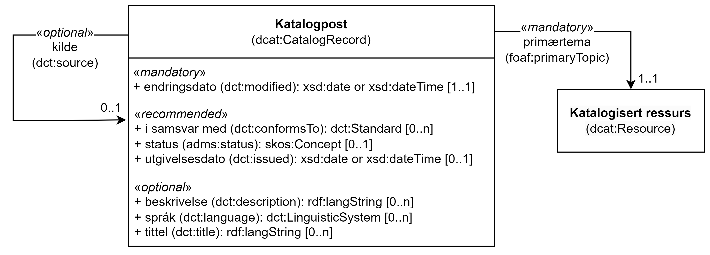

= Klassen Katalogpost (dcat:CatalogRecord) [[Katalogpost]]

:xrefstyle: short

<<diagram-KlassenKatalogpost>> viser klassen Katalogpost og dens egenskaper, samt klassene den refererer til.  

[[diagram-KlassenKatalogpost]]
.Klassen Katalogpost og klassene den refererer til.
[link=images/Klassen-Katalogpost.png]

:xrefstyle: full

[cols="30s,70d"]
|===
| _English name_ |  _Catalogue record_
| URI | dcat:CatalogRecord
| Anvendelse / _Usage note_ | Klassen brukes til å representere en beskrivelse av en oppføring av en ressurs i katalogen.

_This class is used to represent a description of a Catalogued Resource's entry in the Catalogue._
|===

== Obligatoriske egenskaper for klassen _Katalogpost_ [[Katalogpost-obligatoriske-egenskaper]]

=== Katalogpost – endringsdato (dct:modified) [[Katalogpost-endringsdato]]

[cols="30s,70d"]
|===
| _English name_ |  _modification date_
| URI | dct:modified
| Verdiområde / _Range_ | xsd:date or xsd:dateTime
| Anvendelse / _Usage note_ | Egenskapen brukes til å oppgi den nyeste datoen for når katalogposten ble endret.

_This property is used to specify the most recent date on which the Catalogue entry was changed or modified._
| Multiplisitet / _Multiplicity_ | 1..1
| Kravnivå / _Requirement level_ | Obligatorisk / _Mandatory_
| Merknad / _Note_ | Norsk utvidelse: Verdiområdet er eksplisitt spesifisert som `xsd:date or xsd:dateTime`, istedenfor å referere til den generiske datatype Temporal literal.  

_Norwegian extension: The range is explicitly specified as `xsd:date or xsd:dateTime`, instead of referring to the generic datatype Temporal Literal._ 
|===

=== Katalogpost – primærtema (foaf:primaryTopic) [[Katalogpost-primærtema]]

[cols="30s,70d"]
|===
| _English name_ |  _primary topic_
| URI | foaf:primaryTopic
| Verdiområde / _Range_ | dcat:Resource
| Anvendelse / _Usage note_ | Egenskapen brukes til å lenke katalogposten til ressursen som er beskrevet i katalogposten.

_This property is used to link to the resource (Dataset, Data service etc.) described in the record._
| Multiplisitet / _Multiplicity_ | 1..1
| Kravnivå / _Requirement level_ | Obligatorisk / _Mandatory_
|===

== Anbefalte egenskaper for klassen _Katalogpost_ [[Katalogpost-anbefalte-egenskaper]]

=== Katalogpost – i samsvar med (dct:conformsTo) [[Katalogpost-i-samsvar-med]]

[cols="30s,70d"]
|===
| _English name_ |  _application profile_
| URI | dct:conformsTo
| Verdiområde / _Range_ | dct:Standard
| Anvendelse / _Usage note_ | Egenskapen brukes til å referere til en applikasjonsprofil som den katalogiserte ressursens metadata er i samsvar med.

_This property is used to refer to an Application Profile that the Catalogued Resource's metadata conforms to._
| Multiplisitet / _Multiplicity_ | 0..n
| Kravnivå / _Requirement level_ | Anbefalt / _Recommended_
|===

=== Katalogpost – status (adms:status) [[Katalogpost-status]]

[cols="30s,70d"]
|===
| _English name_ | _change type_
| URI | adms:status
| Verdiområde / _Range_ | skos:Concept
| Anvendelse / _Usage note_ | Egenskapen brukes til å indikere status av en katalogpost i katalogen.

_This property is used to specify the status of the catalogue record in the context of editorial flow of the dataset and data service descriptions._
| Multiplisitet / _Multiplicity_ | 0..1
| Kravnivå / _Requirement level_ | Anbefalt / _Recommended_
|===

=== Katalogpost – utgivelsesdato (dct:issued) [[Katalogpost-utgivelsesdato]]

[cols="30s,70d"]
|===
| _English name_ |  _listing date_
| URI | dct:issued
| Verdiområde / _Range_ | xsd:date or xsd:dateTime
| Anvendelse / _Usage note_ | Egenskapen brukes til å oppgi datoen for når katalogposten ble inkludert i datakatalogen.

_This property is used to specify the date on which the description of the resource was included in the Catalogue._
| Multiplisitet / _Multiplicity_ | 0..1
| Kravnivå / _Requirement level_ | Anbefalt / _Recommended_
| Merknad / _Note_ | Norsk utvidelse: Verdiområdet er eksplisitt spesifisert som `xsd:date or xsd:dateTime`, istedenfor å referere til den generiske datatype Temporal literal.  

_Norwegian extension: The range is explicitly specified as `xsd:date or xsd:dateTime`, instead of referring to the generic datatype Temporal Literal._ 
|===

== Valgfrie egenskaper for klassen _Katalogpost_ [[Katalogpost-valgfrie-egenskaper]]

=== Katalogpost – beskrivelse (dct:description) [[Katalogpost-beskrivelse]]

[cols="30s,70d"]
|===
| _English name_ |  _description_
| URI | dct:description
| Verdiområde / _Range_ | rdfs:Literal
| Anvendelse / _Usage note_ | Egenskapen brukes til å oppgi en fritekstbeskrivelse av katalogposten. Bør gjentas når beskrivelsen finnes på flere ulike språk.

_This property is used to specify a free-text account of the record. This property can be repeated for parallel language versions of the description._
| Multiplisitet / _Multiplicity_ | 0..n
| Kravnivå / _Requirement level_ | Valgfri / _Optional_
|===

=== Katalogpost – kilde (dct:source) [[Katalogpost-kilde]]

[cols="30s,70d"]
|===
| _English name_ |  _source metadata_
| URI | dct:source
| Verdiområde / _Range_ | dcat:CatalogRecord
| Anvendelse / _Usage note_ | Egenskapen brukes til å referere til den originale katalogposten (metadata) som er brukt for å skape denne katalogposten (metadata) for datasettet.

_This property is used to refer to the original metadata that was used in creating metadata for the catalogued resource._
| Multiplisitet / _Multiplicity_ | 0..1
| Kravnivå / _Requirement level_ | Valgfri / _Optional_
|===

=== Katalogpost – språk (dct:language) [[Katalogpost-språk]]

[cols="30s,70d"]
|===
| _English name_ | _language_
| URI | dct:language
| Verdiområde / _Range_ | dct:LinguisticSystem
| Anvendelse / _Usage note_ | Egenskapen brukes til å oppgi språk som er brukt i tekstlige metadata av den katalogiserte ressursen. Egenskapen kan gjentas dersom metadata er oppgitt på flere språk.

_This property is used to specify a language used in the textual metadata describing titles, descriptions, etc. of the Catalogued Resource.This property can be repeated if the metadata is provided in multiple languages._
| Multiplisitet / _Multiplicity_ | 0..n
| Kravnivå / _Requirement level_ | Valgfri / _Optional_
| Merknad / _Note_ | Verdien SKAL velges fra EU's kontrollerte vokabular https://op.europa.eu/en/web/eu-vocabularies/concept-scheme/-/resource?uri=http://publications.europa.eu/resource/authority/language[__Language__ &#x29C9;, window="_blank", role="ext-link"].

__The value MUST be chosen from EU's controlled vocabulary https://op.europa.eu/en/web/eu-vocabularies/concept-scheme/-/resource?uri=http://publications.europa.eu/resource/authority/language[Language &#x29C9;, window="_blank", role="ext-link"].__
|===

=== Katalogpost – tittel (dct:title) [[Katalogpost-tittel]]

[cols="30s,70d"]
|===
| _English name_ |  _title_
| URI | dct:title
| Verdiområde / _Range_ | rdfs:Literal
| Anvendelse / _Usage note_ | Egenskapen brukes til å oppgi navnet på katalogen. Egenskapen bør gjentas når navnet finnes på flere ulike språk.

_This property is used to specify a name given to the Catalogue Record. This property can be repeated for parallel language versions of the name._
| Multiplisitet / _Multiplicity_ | 0..n
| Kravnivå / _Requirement level_ | Valgfri / _Optional_
|===
