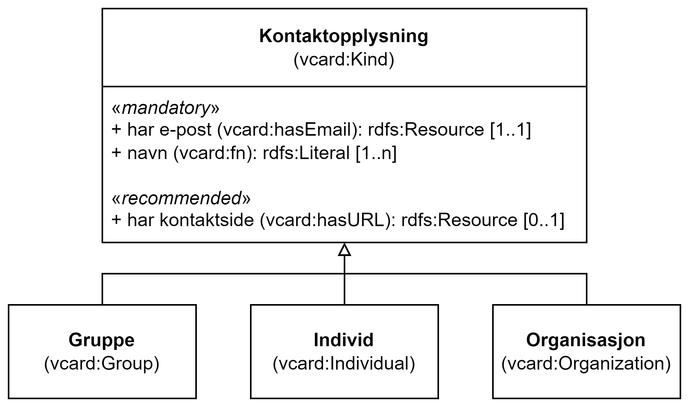

= Klassen Kontaktopplysning (vcard:Kind) [[Kontaktopplysning]]

:xrefstyle: short

<<diagram-Klassen-Kontaktopplysning>> viser klassen Kontaktopplysning og dens subklasser. I tegningen er norske utvidelser markert i gult.   

[[diagram-Klassen-Kontaktopplysning]]
.Klassen Kontaktopplysning og dens subklasser.
[link=images/Klassen-Kontaktopplysning.png]

:xrefstyle: full

[cols="30s,70d"]
|===
| _English name_ | _Kind_
| URI | vcard:Kind
| Anvendelse / _Usage note_ | Klassen brukes til å representere en beskrivelse av en kontaktopplysning i henhold til vCard-spesifikasjonen. Her kan man for eksempel oppgi telefonnummer og/eller epost. 

_This class is used to represent a description following the vCard specification, e.g. to provide telephone number and e-mail address for a contact point._
| Merknad / _Note_ | Merk at dette er en abstrakt klasse som ikke skal brukes direkte. Det er en av subklassene som skal brukes. Vi anbefaler sterkt å unngå bruk av Individ som kontaktpunkt. 

__Note that this class is an abstract class which should be be used directly, It is one of the subclasses that should be used. We strongly recommended not to use Individual as contact points.__
|===

== Obligatoriske egenskaper for klassen _Kontaktopplysning_ [[Kontaktopplysning-obligatoriske-egenskaper]]

=== Kontaktopplysning – navn (vcard:fn) [[Kontaktopplysning-navn]]

[cols="30s,70d"]
|===
| _English name_ |  _formatted name_
| URI | vcard:fn
| Verdiområde / _Range_ | rdfs:Literal
| Anvendelse / _Usage note_ | Egenskapen brukes til å oppgi navnet til kontaktpunktet. Egenskapen bør gjentas når navnet finnes på flere språk. 

_This property is used to specify the name of the contact point. This property can be repeated for parallel language versions of the name._
| Multiplisitet / _Multiplicity_ | 1..n
| Kravnivå / _Requirement level_ | Obligatorisk / _Mandatory_
| Merknad / _Note_ | Norsk utvidelse: Ikke eksplisitt spesifisert i DCAT-AP/DCAT. 

__Norwegian extension: Not explicitly specified in DCAT-AP/DCAT.__
|===

Eksempel i RDF Turtle:
-----
<aContactPoint> a vcard:Organization ; 
   vcard:fn "Brukerstøtte"@nb , "User support"@en ; 
   .
-----

== Anbefalte egenskaper for klassen _Kontaktopplysning_ [[Kontaktopplysning-anbefalte-egenskaper]]

=== Kontaktopplysning – har e-post (vcard:hasEmail) [[Kontaktopplysning-harEPost]]

[cols="30s,70d"]
|===
| _English name_ |  _has email_
| URI | vcard:hasEmail
| Verdiområde / _Range_ | rdfs:Resource
| Anvendelse / _Usage note_ | Egenskapen brukes til å oppgi en e-postadresse til kontaktpunktet. 

_This property is used to specify an email address to the contact point._
| Multiplisitet / _Multiplicity_ | 0..1
| Kravnivå / _Requirement level_ | Anbefalt / _Recommended_
| Merknad / _Note_ | Norsk utvidelse: Ikke eksplisitt spesifisert i DCAT-AP/DCAT. 

__Norwegian extension: Not explicitly specified in DCAT-AP/DCAT.__
|===

Eksempel i RDF Turtle:
-----
<aContactPoint> a vcard:Organization ; 
   vcard:hasEmail <mailto:fellesdatakatalog@digdir.no> ; 
   .
-----

=== Kontaktopplysning – har kontaktside (vcard:hasURL) [[Kontaktopplysning-kontaktside]]

[cols="30s,70d"]
|===
| _English name_ |  _contact page_
| URI | vcard:hasURL
| Verdiområde / _Range_ | rdfs:Resource
| Anvendelse / _Usage note_ | Egenskapen brukes til å oppgi f.eks. et kontaktskjema eller en side med kontaktinformasjon. 

_This property is used to specify a webpage that either allows to make contact (i.e. a webform) or the information contains how to get into contact._
| Multiplisitet / _Multiplicity_ | 0..1
| Kravnivå / _Requirement level_ | Anbefalt / _Recommended_
| Merknad / _Note_ | Norsk utvidelse: Ikke eksplisitt spesifisert i DCAT-AP/DCAT. 

__Norwegian extension: Not explicitly specified in DCAT-AP/DCAT.__
|===

Eksempel i RDF Turtle:
-----
<aContactPoint> a vcard:Organization ; 
   vcard:hasURL <https://data.norge.no/about> ; 
   .
-----
