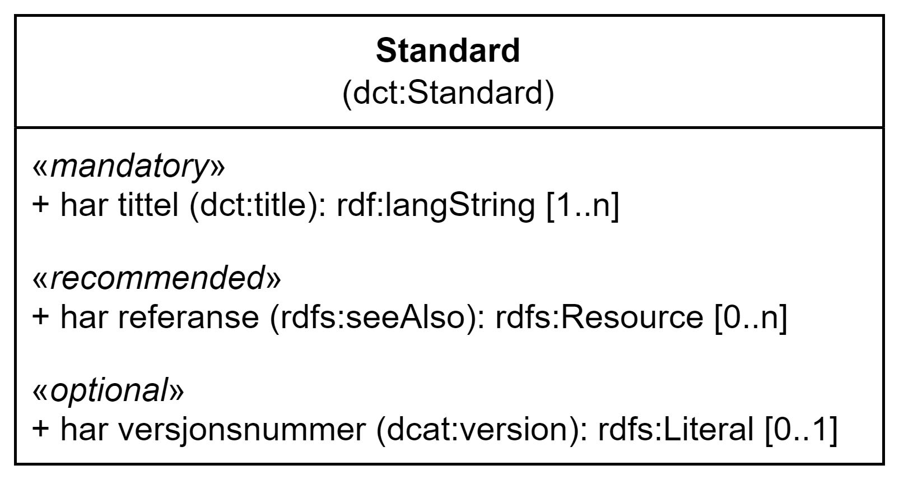

= Klassen Standard (dct:Standard) [[Standard]]

:xrefstyle: short

<<diagram-Klassen-Standard>> viser klassen Standard og dens egenskaper. I tegningen er norske utvidelser markert i gult.  

[[diagram-Klassen-Standard]]
.Klassen Standard og dens egenskaper.
[link=images/Klassen-Standard.png]

:xrefstyle: full

[cols="30s,70d"]
|===
| _English name_ |  _Standard_
| URI | dct:Standard
| Anvendelse / _Usage note_ | Klassen brukes til å representere en standard eller annen spesifikasjon som en ressurs er i samsvar med.

_This property is used to represent a standard or other specification to which a resource conforms._
|===

== Obligatoriske egenskaper for klassen _Standard_ [[Standard-obligatoriske-egenskaper]]

=== Standard – har tittel (dct:title) [[Standard-harTittel]]

[cols="30s,70d"]
|===
| _English name_ |  _has title_
| URI | dct:title
| Verdiområde / _Range_ | rdfs:Literal
| Anvendelse / _Usage note_ | Egenskapen brukes til å oppgi tittelen til standarden/spesifikasjonen. Egenskapen bør gjentas når tittelen finnes på flere ulike språk.

_This property is used to specify a name to the standard/specification. This property can be repeated for parallel language versions of the name._
| Multiplisitet / _Multiplicity_ | 1..n
| Kravnivå / _Requirement level_ | Obligatorisk / _Mandatory_
| Merknad / _Note_ | Norsk utvidelse: Ikke eksplisitt spesifisert i DCAT-AP/DCAT.

_Norwegian extension: Not explicitly specified in DCAT-AP/DCAT._
|===

== Anbefalte egenskaper for klassen _Standard_ [[Standard-anbefalte-egenskaper]]

=== Standard – har referanse (rdfs:seeAlso)  [[Standard-harReferanse]]

[cols="30s,70"]
|===
| _English name_ | _has reference_
| URI | rdfs:seeAlso
| Verdiområde / _Range_ | rdfs:Resource
| Anvendelse / _Usage note_ | Egenskapen brukes til å oppgi referanse til standarden/spesifikasjonen.

_This property is used to specify a reference to the standard/specification._
| Multiplisitet / _Multiplicity_ | 0..n
| Kravnivå / _Requirement level_ | Anbefalt / _Recommended_
| Merknad / _Note_ | Norsk utvidelse: Ikke eksplisitt spesifisert i DCAT-AP/DCAT.

_Norwegian extension: Not explicitly specified in DCAT-AP/DCAT._
|===

== Valgfrie egenskaper for klassen _Standard_ [[Standard-valgfrie-egenskaper]]

=== Standard – har versjonsnummer (dcat:version)  [[Standard-harVersjonsnummer]]

[cols="30s,70"]
|===
| _English name_ | _has version number_
| URI | dcat:version
| Verdiområde / _Range_ | rdfs:Literal
| Anvendelse / _Usage note_ | Egenskapen brukes til å oppgi versjonsnummer til standarden/spesifikasjonen.

_This property is used to specify the version of the standard/specification._
| Multiplisitet / _Multiplicity_ | 0..1
| Kravnivå / _Requirement level_ | Valgfri / _Optional_
| Merknad / _Note_ | Norsk utvidelse: Ikke eksplisitt spesifisert i DCAT-AP/DCAT.

_Norwegian extension: Not explicitly specified in DCAT-AP/DCAT._
|===
