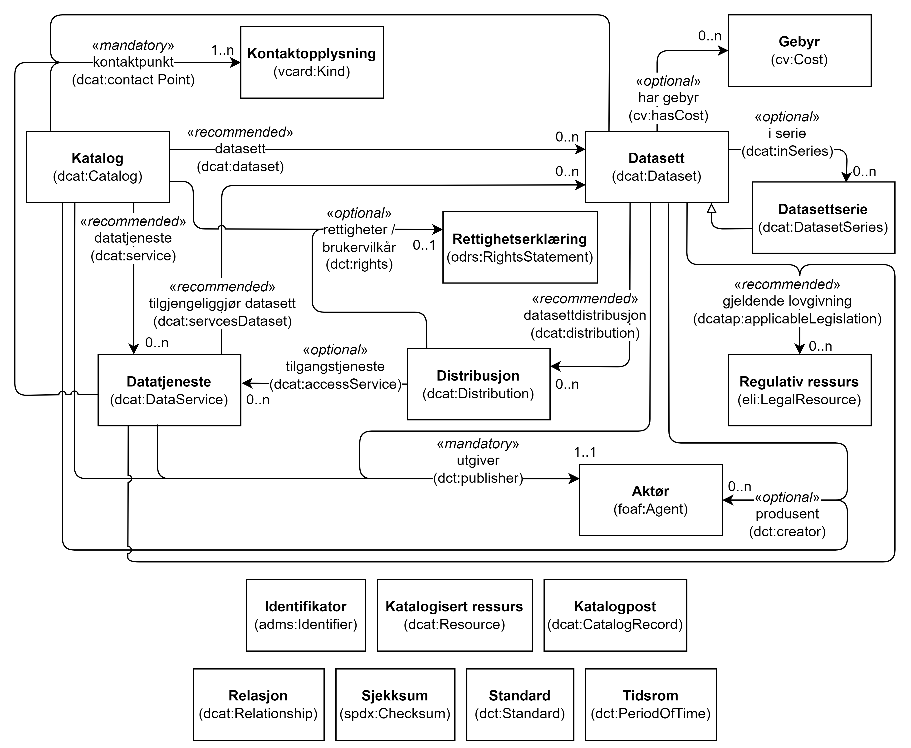

= Krav til RDF-representasjon av klassene i DCAT-AP-NO [[Spesifikasjon-per-klasse]]

_Denne delen av standarden er primært ment for den tekniske målgruppen._ 

I tillegg til å stille krav til hva skal/bør/kan tas med i beskrivelser av datasett, datatjenester og datakataloger, spesifiserer dette kapittelet også hvordan beskrivelsene SKAL representeres i RDF (https://www.w3.org/RDF/[Resource Description Framework &#x29C9;, window="_blank", role="ext-link"]). 

:xrefstyle: short

<<diagram-DCAT-AP-NO-klasser>> viser en oversikt over klassene som er spesifisert i DCAT-AP-NO samt relasjoner mellom noen av nøkkelklassene. Med tanke på lesbarhet er flere klasser bare listet opp for oversikts skyld, uten at relasjoner til/fra dem er vist i figuren. 

[[diagram-DCAT-AP-NO-klasser]]
.Oversikt over klassene i DCAT-AP-NO og noen relasjoner mellom dem.
[link=images/DCAT-AP-NO-klasser.png]

:xrefstyle: full

Hver klasse med dens egenskaper er spesifisert videre i dette kapitlet. Klassene er sortert alfabetisk etter norske klassenavn, og egenskapene i hver klasse gruppert først inn i obligatoriske, anbefalte og valgfrie egenskaper, og der under alfabetisk etter norske egenskapsnavn. 

Kravene i denne delen av standarden spesifiserer hvordan beskrivelsene skal representeres i RDF. Hvert krav er spesifisert i en tabell som inneholder syntaks og forklaring. Radene i tabellene er beskrevet nedenfor. Noen tabeller har færre rader. Engelske navn og tekster som er tatt med i tabellene, er ikke alle nødvendigvis ordrette sitater fra engelske kilder. Vi kan ha valgt en annen engelsk tekst til å formidle det samme budskapet, med mindre vi eksplisitt sier at det er et avvik. 

«Norsk utvidelse» i merknad betyr avvik mellom DCAT-AP-NO og summen av EUs DCAT-AP og W3Cs DCAT. EU har valgt å ikke gjenta valgfrie egenskaper fra DCAT når det i DCAT-AP ikke gjøres tilpasninger. Dette betyr at nasjonale applikasjonsprofiler som DCAT-AP-NO, kan bruke egenskaper fra DCAT uten å bryte med DCAT-AP. For å øke leservennlighet har vi i DCAT-AP-NO valgt å gjenta egenskaper fra DCAT-AP og DCAT som vi trenger for å dekke norske behov. Der det ikke står noe om «norsk utvidelse» i merknad til en egenskap, er egenskapen brukt slik den er spesifisert i enten DCAT-AP eller DCAT. Der det står «norsk utvidelse» i merknad til en egenskap, er kravet til egenskapen endret (f.eks. med forklaringen noe a la "Kravnivået er endret fra valgfri til anbefalt"), eller at egenskapen ikke er å finne i hverken DCAT-AP eller DCAT (f.eks. med forklaring "Ikke eksplisitt spesifisert i DCAT-AP/DCAT"). Se også <<Oversikt-norske-utvidelser>>.

[cols="30s,70"]
|===
| Ledetekst i tabellen | *Hensikt med raden i tabellen*
| _English name_ | Brukes til å angi klasse- eller egenskapsnavn på engelsk, primært ment for engelsktalende utviklere av verktøystøtte.
| URI | Brukes til å angi en unik identifikator til klassen eller egenskapen.

Det er dette som skal benyttes i RDF-basert utveksling/tilgjengeliggjøring av beskrivelser som er utformet i henhold til denne standarden.

Eksempel: `skos:Concept` er identifikatoren til klassen Begrep (Concept), slik klassen er spesifisert i `skos` (<<URIer-i-bruk>> viser hva `skos` står for).
| Subklasse av / _Subclass of_ | Denne brukes bare i spesifikasjon av en klasse, til å referere til klassen som den aktuelle klassen ev. er subklasse av. 
| Subegenskap av / _Subproperty of_ | Denne brukes bare i spesifikasjon av en egenskap, til å referere til egenskapen som den aktuelle egenskapen ev. er subegenskap av. 
| Verdiområde / _Range_ | Denne brukes bare i spesifikasjon av en egenskap, til å spesifisere lovlige verdier. Disse angis ved henvisning til en klasse eller datatype.

Eksempel: Verdiområde `skos:Concept` betyr at verdien til egenskapen skal være en instans av klassen `skos:Concept`.
|Anvendelse / _Usage note_ | Brukes til å forklare hva klassen eller egenskapen er ment å brukes til, i kontekst av denne standarden. Forklaringen er også skrevet på engelsk (_Usage note_, kursivert), primært ment for engelsktalende utviklere av verktøystøtte.
| Multiplisitet / _Multiplicity_ | Denne brukes bare i spesifikasjon av en egenskap, til å spesifisere minimum og maksimum antall verdier egenskapen skal/bør/kan ha.
| Kravnivå / _Requirement level_ | Denne brukes bare i spesifikasjon av en egenskap, til å spesifisere om egenskapen er obligatorisk, anbefalt eller valgfri. Se også <<Om-kravene>>.
| Merknad / _Note_ | Brukes til merknader knyttet til bruk av klassen eller egenskapen, f.eks. restriksjoner hvis noen. Merknadene er også skrevet på engelsk (_Note_, kursivert), primært ment for engelsktalende utviklere av verktøystøtte.
| Eksempel | Brukes til å gi eksempel på bruken av klassen/egenskapen, i prosatekst.

Eksempel i RDF Turtle, er tatt med under den aktuelle tabellen.
|===