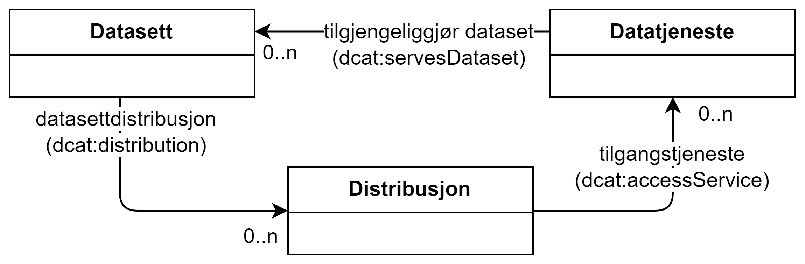

== Om bruk av datasett, datatjeneste og distribusjon [[Om-datasett-datatjeneste-distribusjon]]

=== Forholdet mellom datasett, datatjeneste og distribusjon

Et datasett kan gjøres tilgjengelig som nedlasting og/eller via en datatjeneste/API. 

:xrefstyle: short

[[diagram-datasett-distribusjon-datatjeneste]]
.Datasett, Distribusjon og Datatjeneste.
[link=images/datasett-distribusjon-datatjeneste.png]

<<diagram-datasett-distribusjon-datatjeneste>> illustrerer hvordan nedlastinger og API-tilgang skal beskrives: 

:xrefstyle: full

* Nedlastinger skal beskrives som **distribusjon**er, ved å bruke datasettegenskapen <<Datasett-datasettdistribusjon>> fra datasettbeskrivelsen. 
** En nedlasting kan gjøres tilgjengelig via API/*datatjeneste*, ved å bruke distribusjonsegenskapen <<Distribusjon-tilgangstjeneste>>. 

* API-tilgang beskrives ved at det i beskrivelsen av det aktuelle APIet (**datatjenesten**) refereres til datasettet ved å bruke datatjenesteegenskapen <<Datatjeneste-tilgjengeliggjor-datasett>>. 

=== Forskjell mellom distribusjon og datatjeneste

*Avhengighet*:

* Avhengighet til datasett: En distribusjon er en spesifikk representasjon av et gitt datasett og skal derfor alltid knyttes til et datasett. En datatjeneste skal knyttes til datasett _når_ den gir tilgang til datasett. En datatjeneste _kan_ også brukes til å gi dataprosesseringsfunksjoner, og trenger i å fall ikke å være knyttet til noen datasett. 
* Avhengighet mellom distribusjon og datatjeneste: En distribusjon _kan_, men trenger ikke å, være resultat av en datatjenesteoperasjon.

*Egenskaper* til distribusjon og datatjeneste:

* Mange av egenskapene i klassen Distribusjon (dcat:Distribution) er filorientert (f.eks. nedlastingsURL (dcat:downloadURL), format (dct:format), filstørrelse (dcat:byteSize), sjekksum (spdx:checksum), endringsdato (dct:modified) osv.)

* Relevansen av tilsvarende egenskaper er redusert for datatjenester (dcat:DataService), og egenskapene som brukes kan ha anderledes betydning. For eksempel,  datatjenester foretar (eller på forespørsel kan foreta) format-, språk- og skjematransformasjoner, mens for en gitt distribusjon er format, språk osv. gitt. Håndtering av tillit er forskjellig også: endring i nedlastbart innhold i en distribusjon oppdages ved å bruke sjekksum, mens datatjenester ofte bruker en pålitelig kanal ved å bruke sikkerhetsmekanisme som autentisering og kryptering. 

*Retningslinjer*: 

* Et *datasett* (dcat:Dataset) er den konseptuelle entiteten for en samling av data.

* En *distribusjon* (dcat:Distribution) er en spesifikk representasjon av et datasett, beskrevet med den hensikt å lette levering av data som fil. TilgangsURL (dcat:accessURL), helst nedlastingslenke (dcat:downloadURL), gir en enkel måte å få tak i (laste ned) innholdet i datasettet i den spesifikke representasjonen som angitt i distribusjonsbeskrivelsen. Det nedlastede innholdet er fullstendig bestemt av utgiveren av distribusjonen. Vær spesielt oppmerksom på følgende ang. bruk av egenskapene <<Distribusjon-tilgangsurl>> og <<Distribusjon-nedlastningslenke>>:
** Når distribusjonen bare er tilgjengelig via en nedlastingslenke, skal nedlastingslenken oppgis som verdi til _både_ distribusjonsegenskapen <<Distribusjon-nedlastningslenke>> (selv om egenskapen er valgfri), _og_ distribusjonsegenskapen <<Distribusjon-tilgangsurl>> (som er obligatorisk).
** Når distribusjonen er tilgjengelig via en webside (f.eks. et webskjema), skal adressen til websiden oppgis som verdi til distribusjonsegenskapen <<Distribusjon-tilgangsurl>> (som er obligatorisk). 
** Når distribusjonen bare er tilgjengelig via landingssiden til datasettet, skal datasettes landingsside (dvs. verdien til datasettegenskapen <<Datasett-landingsside>>) oppgis som verdi til distribusjonsegenskapen <<Distribusjon-tilgangsurl>> (som er obligatorisk). 
** Når distribusjonen er tilgjengelig via en datatjeneste/API, skal den samme verdien til datatjenesteegenskapen <<Datatjeneste-endepunktsurl>> oppgis som verdi til distribusjonsegenskapen <<Distribusjon-tilgangsurl>> (som er obligatorisk). 

* Alt som ikke har til hensikt å gi en nedlastbar representasjon av et datasett, er en *datatjeneste*. Datatjenester tilbyr smartere og mer interaktive måter å få tilgang til data på. 

