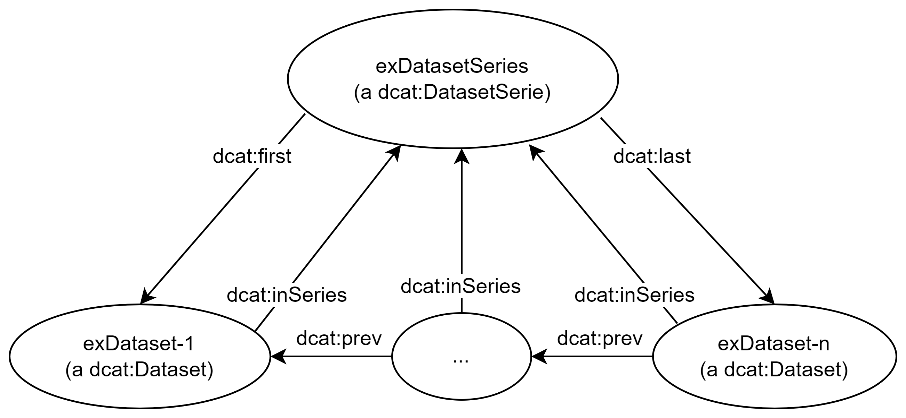

== Om bruk av datasettserie [[Om-Datasettserie]]

Datasettserien (`dcat:DatasetSeries`) brukes til å beskrive en samling av datasett (`dcat:Dataset`) som er sterkt relatert til hverandre. En datasettserie trenger ikke å være ordnet, dvs. at det ikke trenger å være noen rekkefølge mellom datasettene i en datasettserie. Et datasett inkluderes i en datasettserie ved hjelp av datasettegenskapen <<Datasett-iSerie>>. 

For å harmonisere bruk av datasettserier, skal følgende tas hensyn til: 

* Datasettserie brukes bare når utgiveren ønsker å forvalte en samling av flere datasett. Datasettserie med kun ett datasett bør unngås. 
* Datasettserie uten datasett bør unngås. Det kan imidlertid hende at en datasettserie over tid blir tom (f.eks. at datasettene i serien blir trukket tilbake). Utgiveren bør i slike tilfeller også vurdere å trekke tilbake selve serien. 
* Alle egenskaper i klassen https://www.w3.org/TR/vocab-dcat-3/#Class:Dataset_Series[Dataset Series (dcat:DatasetSeries) i W3C/DCAT &#x29C9;, window="_blank", role="ext-link"] kan i teori brukes. Vi anbefaler sterkt å
** Unngå å bruke egenskapen __in series (dcat:inSeries)__ på en datasettserie, slik at man unngår nøstede datasettserier.
** Unngå å bruke egenskapen __distribution (dcat:distribution)__ på en datasettserie, men at distribusjoner (dcat:Distribution) knyttes til datasettene som inngår i datasettserien.

Generelt er det forventet at datasettene i en datasettserie er sterkt relatert til hverandre. Det fins imidlertid ingen felles kriterier eller regler for hvordan datasettene i en datasettserie bør relateres til hverandre. Det kan f.eks. være datasett om noe som utvikler seg over tid og/eller rom, f.eks. ulvebestandstatus, budsjett, regnskap. Versjoneringsterminologi («forrige»/«neste», «første»/«siste») kan f.eks. brukes til å uttrykke rekkefølge i tid.  

:xrefstyle: short

<<figur-Ordnet-datasettserie>> illustrerer en datasettserie der rekkefølgen mellom datasettene i serien er oppgitt. Rekkefølgen mellom datasettene oppgis ved å bruke datasettegenskapen <<Datasett-forrige, Datasett – forrige (dcat:prev)>>. I eksemplet er det i tillegg oppgitt første og siste datasett i serien, ved å bruke datasettserieegenskapene <<Datasettserie-første, Datasettserie – første (dcat:first)>> hhv. <<Datasettserie-siste, Datasettserie – siste (dcat:last)>>. 

[[figur-Ordnet-datasettserie]]
.Illustrasjon av en ordnet datasettserie.
[link=images/Figur-ordnet-datasettserie.png]

:xrefstyle: full

