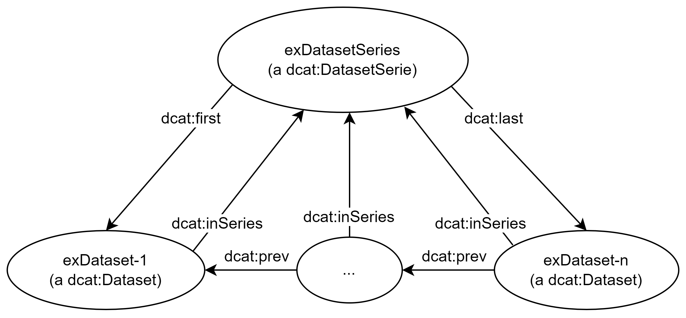

== Om bruk av klassen _Datasettserie (dcat:DatasetSeries)_ [[Om-Datasettserie]]

_Datasett_ (`dcat:Dataset`) inkluderes i en _datasettserie_ (`dcat:DatasetSeries`) ved hjelp av datasettegenskapen <<Datasett-iSerie>>. 

For å harmonisere bruk av datasettserier, skal følgende tas hensyn til: 

* Datasettserie brukes bare når utgiveren ønsker å forvalte en samling av flere datasett. Datasettserie med kun ett datasett bør unngås. 
* Datasettserie uten datasett bør unngås. Det kan imidlertid hende at en datasettserie over tid blir tom (f.eks. at datasettene i serien blir trukket tilbake). Utgiveren bør i slike tilfeller også vurdere å trekke tilbake selve serien. 
* Klassen Datasettserie (dcat:DatasetSeries) er en subklasse av Datasett (dcat:Dataset). Rent modelleringsmessig kan derfor klassen Datasettserie arve alle egenskapene fra klassen Datasett. Man skal allikevel vurdere om det faglig sett er hensiktsmessig å bruke en egenskap fra Datasett. Vi anbefaler sterkt at
** Man ikke bruker egenskapen <<Datasett-forrige>> på en datasettserie, ettersom egenskapen er ment for å uttrykke rekkefølge mellom datasett i en datasettserie. 
** Man unngår å bruke egenskapen <<Datasett-iSerie>> eller <<Datasett-harDel>> på en datasettserie, slik at man unngår nøstede datasettserier. 
** Man unngår å bruke egenskapen <<Datasett-datasettdistribusjon>> eller <<Datasett-eksempeldata>> på en datasettserie, men at distribusjoner (dcat:Distribution) knyttes til datasettene som inngår i datasettserien. 

Generelt er det forventet at datasettene i en datasettserie er sterkt relatert til hverandre. Det fins imidlertid ingen felles kriterier eller regler for hvordan datasettene i en datasettserie bør relateres til hverandre. Det kan f.eks. være datasett om noe som utvikler seg over tid og/eller rom, f.eks. ulvebestandstatus, budsjett, regnskap. Versjoneringsterminologi («forrige»/«neste», «første»/«siste») kan f.eks. brukes til å uttrykke rekkefølge i tid. 

:xrefstyle: short

<<figur-Ordnet-datasettserie>> illustrerer en datasettserie der rekkefølgen mellom datasettene i serien er oppgitt. Rekkefølgen mellom datasettene oppgis ved hjelp av datasettegenskapen <<Datasett-forrige>>. I beskrivelsen av selve datasettserien er det i tillegg oppgitt første og siste datasett i serien, ved hjelp av datasettserieegenskapene <<Datasettserie-første>> hhv. <<Datasettserie-siste>>. 

[[figur-Ordnet-datasettserie]]
.Illustrasjon av en ordnet datasettserie.
[link=images/Figur-ordnet-datasettserie.png]

:xrefstyle: full

