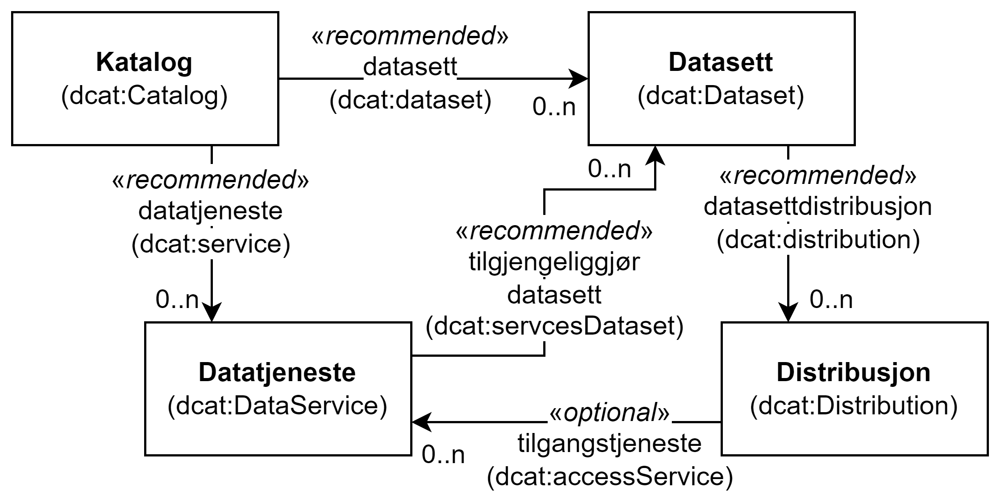

= Forenklet modell av DCAT-AP-NO [[UML-diagram]] 

<> viser en meget forenklet modell av DCAT-AP-NO. Den viser ikke alle klasser i standarden, heller ikke alle relasjoner og egenskaper. Modellen er ikke ment som en formell representasjon av standarden, men kun for å gi en visuell oversikt over noen av klassene og relasjoner mellom dem. Før eventuell uoverensstemmelse mellom tegningen og den tekstlige beskrivelsen blir rettet opp, har den tekstlige beskrivelsen av klassene/egenskapene forrang. Samme forrang gjelder også når det gjelder eventuelle uoverensstemmelser mellom tekstlige beskrivelser og tegninger i resten av standarden. 

[[img-ForenkletModell]]
.Forenklet modell av DCAT-AP-NO.
[link=images/DCAT-AP-NO-forenklet-modell.png]

// Last ned modell: link:images/DCAT-AP-NO2_20210903.png[png] |  link:files/DCAT-AP-NO2_20210903.eap[XMI for EA]
