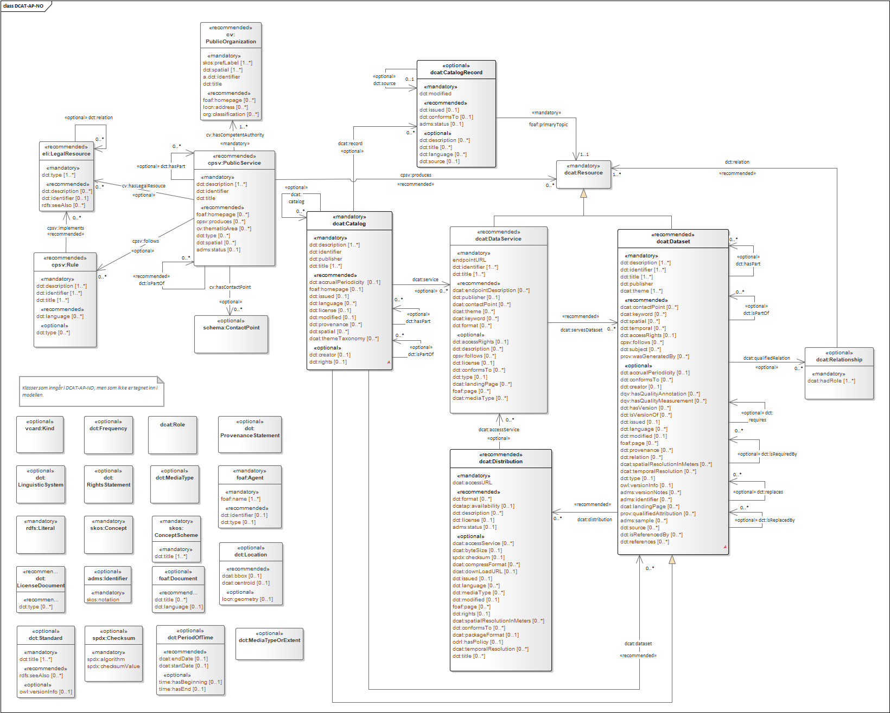

= UML-diagram [[UML-diagram]]

UML-diagram over alle klassene og egenskapene i DCAT-AP-NO v. 2.1

[link=images/DCAT-AP-NO2_20210611.png]

Last ned modell: link:images/DCAT-AP-NO2_20210611.png[png] |  link:files/DCAT-AP-NO2_20210611.eap[XMI for EA]
