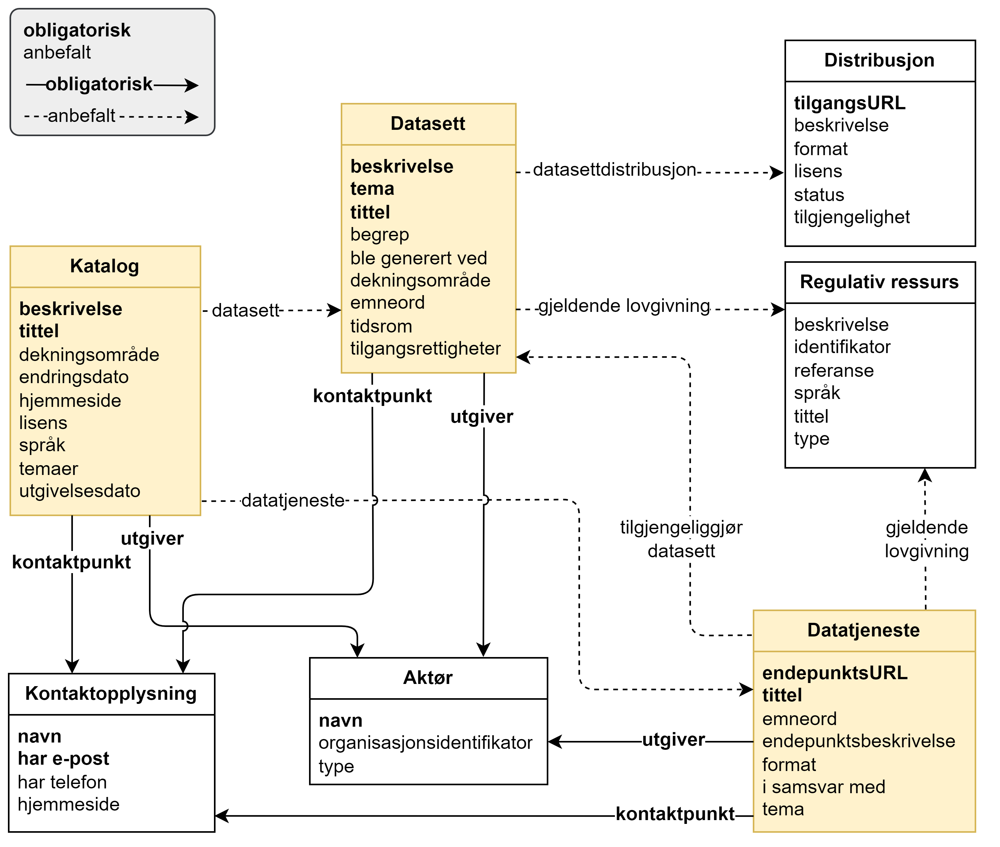

= Forenklet fremstilling av kravene i DCAT-AP-NO [[Forenklet-fremstilling]] 

:xrefstyle: short

<> viser en forenklet fremstilling av kravene i DCAT-AP-NO. Den viser bare obligatoriske og anbefalte krav. Modellen er ikke ment som en formell representasjon av standarden, men kun for å gi en visuell oversikt over noen av klassene og relasjoner mellom dem. Tekniske krav til hvordan klassene og egenskapene/relasjoner skal uttrykkes i RDF er spesifisert videre i standarden. Før eventuell uoverensstemmelse mellom tegningen og den tekstlige spesifikasjonen blir rettet opp, har den tekstlige spesifikasjonen av klassene/egenskapene forrang. Samme forrang gjelder også når det gjelder eventuelle uoverensstemmelser mellom tekstlige spesifikasjoner og tegninger i resten av standarden. 

[[img-ForenkletModell]]
.Forenklet fremstilling av kravene i DCAT-AP-NO, men kun obligatoriske og anbefalte krav.
[link=images/DCAT-AP-NO-forenklet-fremstilling.png]

:xrefstyle: full

// Last ned modell: link:images/DCAT-AP-NO2_20210903.png[png] |  link:files/DCAT-AP-NO2_20210903.eap[XMI for EA]

Helt overordnet illustrerer figuren bl.a. følgende:

* En *katalog* 
** SKAL alltid inneholde opplysninger om utgiveren av katalogen og kontaktpunkter 
** BØR inneholde beskrivelse av datasett og/eller datatjenester
*** Merk at selv om hverken datasettbeskrivelse eller datatjenestebeskrivelse er obligatorisk, BØR man unngå å ha tomme kataloger. 
* En **datasett**beskrivelse 
** SKAL alltid inneholde opplysninger om utgiveren av datasettet og kontaktpunkter
** BØR tilgjengeliggjøres vha. distribusjoner
** BØR inneholde opplysninger om gjeldende lovgivning som gir mandat til opprettelse eller behandling av datasettet 
* En **datatjeneste**beskrivelse 
** SKAL alltid inneholde opplysninger om kontaktpunker
** BØR brukes til å tilgjengeliggjøre datasett 
*** Merk at selv om det ikke er obligatorisk å knytte en datatjeneste til datasett, BØR man unngå å ha datatjeneste som ikke tilgjengeliggjør datasett. 
** BØR inneholde opplysninger om utgiveren av datatjenesten
** BØR inneholde opplysninger om gjeldende lovgivning som gir mandat til opprettelse eller forvaltning av datatjenesten

