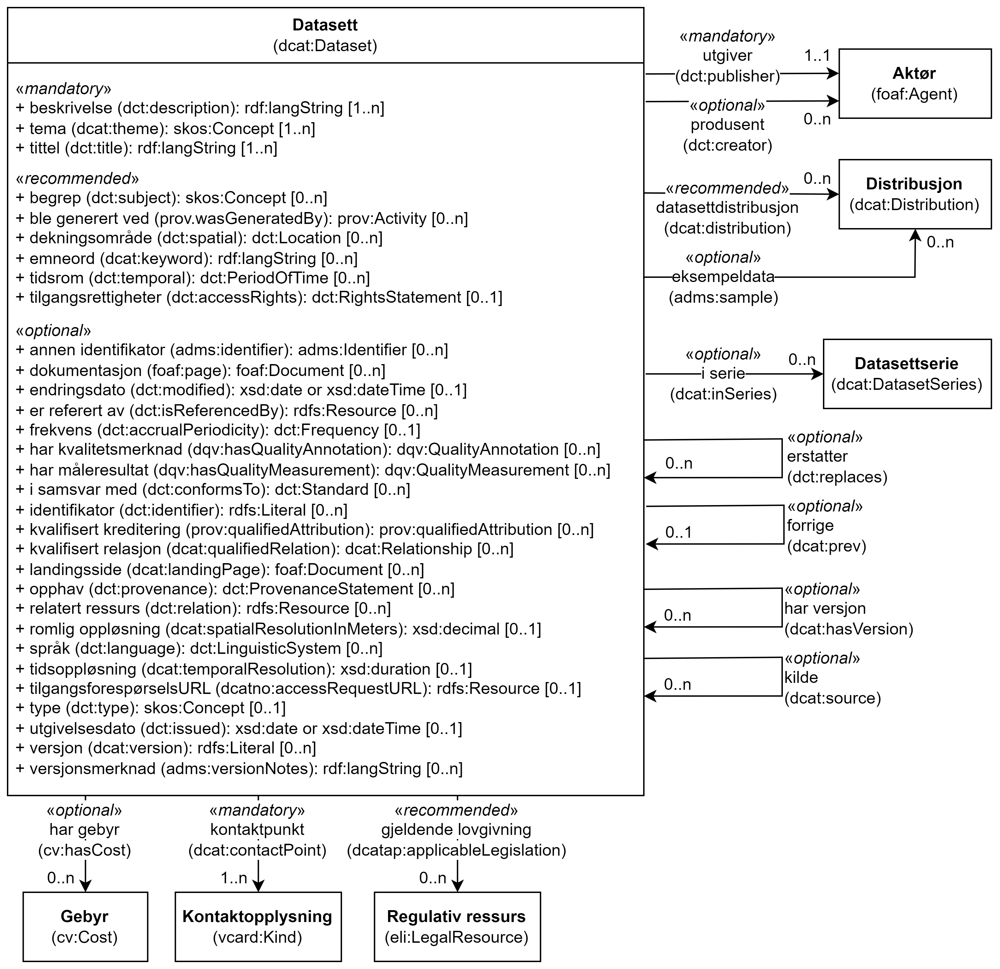

= Klassen Datasett (dcat:Dataset) [[Datasett]]

<<diagram-KlassenDatasett>> viser klassen Datasett og dens egenskaper, samt klassene den refererer til.  

[[diagram-KlassenDatasett]]
.Klassen Datasett og klassene den refererer til.
[link=images/Klassen-Datasett.png]

[cols="30s,70"]
|===
| _English name_ | _Dataset_
| URI | dcat:Dataset
| Subklasse av / _Subclass of_ | dcat:Resource
| Anvendelse / _Usage note_ | Klassen brukes til å representere et datasett, dvs. en konseptuell entitet som representerer publisert informasjon.

_This class is used to represent a conceptual entity that represents the information published._
|===

== Obligatoriske egenskaper for klassen _Datasett_ [[Datasett-obligatoriske-egenskaper]]

=== Datasett – beskrivelse (dct:description) [[Datasett-beskrivelse]]

[cols="30s,70"]
|===
| _English name_ | _description_
| URI | dct:description
| Verdiområde / _Range_ | rdfs:Literal
| Anvendelse / _Usage note_ | Egenskapen brukes til å oppgi en fritekstbeskrivelse av datasettet. Egenskapen bør gjentas når beskrivelsen finnes i flere ulike språk.

_This property is used to specify a free-text account of the Dataset.This property can be repeated for parallel language versions of the description._
| Multiplisitet / _Multiplicity_ | 1..n
| Kravnivå / _Requirement level_ | Obligatorisk / _Mandatory_
|===

=== Datasett – identifikator (dct:identifier) [[Datasett-identifikator]]

[cols="30s,70"]
|===
| _English name_ | _identifier_
| URI | dct:identifier
| Verdiområde / _Range_ | rdfs:Literal
| Anvendelse / _Usage note_ | Egenskapen brukes til å oppgi identifikator for datasettet, for eksempel en URI eller annen identifikator som er stabil og unik innen konteksten av katalogen.

_This property is used to specify the main identifier for the Dataset, e.g. the URI or other unique identifier in the context of the Catalogue._
| Multiplisitet / _Multiplicity_ | 1..n
| Kravnivå / _Requirement level_ | Obligatorisk / _Mandatory_
| Merknad / _Note_ | Norsk utvidelse: Kravnivået endret fra valgfri til obligatorisk, dermed også multiplisiteten fra 0..n til 1..n. 

_Norwegian extension: The requirement level changed from optional to mandatory, thus also the multiplicity from 0..n to 1..n._
|===

=== Datasett – kontaktpunkt (dcat:contactPoint) [[Datasett-kontaktpunkt]]

[cols="30s,70"]
|===
| _English name_ | _contact point_
| URI | dcat:contactPoint
| Verdiområde / _Range_ | vcard:Kind
| Anvendelse / _Usage note_ | Egenskapen brukes til å oppgi kontaktopplysninger, som kan brukes vedr. spørsmål og kommentarer om datasettet.

_This property is used to specify contact information that can be used concerning questions and comments about the Dataset._
| Multiplisitet / _Multiplicity_ | 1..n
| Kravnivå / _Requirement level_ | Obligatorisk / _Mandatory_
| Merknad / _Note_ | Norsk utvidelse: Kravnivået er endret til fra anbefalt til obligatorisk, og dermed også multiplisitet til 1..n. 

_Norwegian extension: The requirement level is changed from recommended to mandatory, thus also the multiplicity to 1..n._
|===

=== Datasett – tema (dcat:theme) [[Datasett-tema]]

[cols="30s,70"]
|===
| _English name_ | _theme_
| URI | dcat:theme
| Verdiområde / _Range_ | skos:Concept
| Anvendelse / _Usage note_ | Egenskapen brukes til å referere til et hovedtema for datasettet. Et datasett kan assosieres med flere tema.

_This property is used to specify the category of the dataset. A Dataset may be associated with multiple themes._
| Multiplisitet / _Multiplicity_ | 1..n
| Kravnivå / _Requirement level_ | Obligatorisk / _Mandatory_
| Merknad 1 / _Note 1_ | Verdiene for denne egenskapen er URIer til begrepene i vokabularet https://op.europa.eu/en/web/eu-vocabularies/concept-scheme/-/resource?uri=http://publications.europa.eu/resource/authority/data-theme[__Data theme__  &#x29C9;, window="_blank", role="ext-link"]. 

Norsk utvidelse: https://psi.norge.no/los/struktur.html[Los &#x29C9;, window="_blank", role="ext-link"] BØR brukes i tillegg. 

__The values to be used for this property are the URIs of the concepts in the vocabulary https://op.europa.eu/en/web/eu-vocabularies/concept-scheme/-/resource?uri=http://publications.europa.eu/resource/authority/data-theme[Data theme &#x29C9;, window="_blank", role="ext-link"].__

__Norwegian extension: https://psi.norge.no/los/struktur.html[Los &#x29C9;, window="_blank", role="ext-link"] SHOULD be used in addition.__
| Merknad 2 / _Note 2_ | Norsk utvidelse: Kravnivå er endret til fra anbefalt til obligatorisk, og dermed også multiplisitet til 1..n.

_Norwegian extension: The requirement level is changed from recommended to mandatory, thus also the multiplicity to 1..n._
|===

=== Datasett – tittel (dct:title) [[Datasett-tittel]]

[cols="30s,70"]
|===
| _English name_ | _title_
| URI | dct:title
| Verdiområde / _Range_ | rdfs:Literal
| Anvendelse / _Usage note_ | Egenskapen brukes til oppgi navnet på datasettet. Egenskapen bør gjentas når navnet finnes i flere ulike språk.

_This property is used to specify a name given to the dataset. This property can be repeated for parallel language versions of the name._
| Multiplisitet / _Multiplicity_ | 1..n
| Kravnivå / _Requirement level_ | Obligatorisk / _Mandatory_
|===

=== Datasett – utgiver (dct:publisher) [[Datasett-utgiver]]

[cols="30s,70"]
|===
| _English name_ | _publisher_
| URI |  dct:publisher
| Verdiområde / _Range_ | foaf:Agent
| Anvendelse / _Usage note_ | Egenskapen brukes til å referere til en aktør (organisasjon) som er ansvarlig for å gjøre datasettet tilgjengelig. Bør være autoritativ URI for aktøren, f.eks. `dct:publisher <\https://organization-catalog.fellesdatakatalog.digdir.no/organizations/974760673>`.

_This property is used to specify the entity (organisation) responsible for making the Dataset available._
| Multiplisitet / _Multiplicity_ | 1..1
| Kravnivå / _Requirement level_ | Obligatorisk / _Mandatory_
| Merknad 1 / _Note 1_ | (Lite aktuelt for bruk i Norge)  For EU-institusjoner og noen internasjonale organisasjoner SKAL verdien velges fra EUs kontrollerte vokabular https://op.europa.eu/en/web/eu-vocabularies/concept-scheme/-/resource?uri=http://publications.europa.eu/resource/authority/corporate-body[__Corporate body__ &#x29C9;, window="_blank", role="ext-link"]. 

__The value MUST be chosen from EU's controlled vocabulary https://op.europa.eu/en/web/eu-vocabularies/concept-scheme/-/resource?uri=http://publications.europa.eu/resource/authority/corporate-body[Corporate body &#x29C9;, window="_blank", role="ext-link"] for European institutions and a small set of international organisations.__
| Merknad 2 / _Note 2_ | Norsk utvidelse: Kravnivået er endret fra anbefalt til obligatorisk, dermed også multiplisitet fra 0..1 til 1..1.

_Norwegian extension: The requirement level is changed from recommended to mandatory, thus also the multiplicity from 0..1 to 1..1._
|===

== Anbefalte egenskaper for klassen _Datasett_ [[Datasett-anbefalte-egenskaper]]

=== Datasett – begrep (dct:subject) [[Datasett-begrep]]

[cols="30s,70"]
|===
| _English name_ | _concept_
| URI | dct:subject
| Verdiområde / _Range_ | skos:Concept
| Anvendelse / _Usage note_ | Egenskapen brukes til å referere til sentrale begrep som er viktige for å forstå og tolke datasettet. 

_This property is used to refer to concepts that are important to understand and interpret the dataset._
| Multiplisitet / _Multiplicity_ | 0..n
| Kravnivå / _Requirement level_ | Anbefalt / _Recommended_
| Merknad / _Note_ | Norsk utvidelse: Ikke eksplisitt spesifisert i DCAT-AP/DCAT.

_Norwegian extension: Not explicitly specified in DCAT-AP/DCAT._
|===

=== Datasett – ble generert ved (prov:wasGeneratedBy) [[Datasett-bleGenerertVed]]

[cols="30s,70"]
|===
| _English name_ | _was generated by_
| URI | prov:wasGeneratedBy
| Verdiområde / _Range_ | prov:Activity
| Anvendelse / _Usage note_ | Brukes til å referere til en aktivitet som genererte datasettet, eller som gir forretningskontekst for oppretting av det.

_This property is used to refer to an activity that generated, or provides the business context for the creation of, the dataset._
| Multiplisitet / _Multiplicity_ | 0..n
| Kravnivå / _Requirement level_ | Anbefalt / _Recommended_
| Merknad 1 / _Note 1_ | Norsk utvidelse: Verdien BØR velges fra kontrollert vokabular https://data.norge.no/vocabulary/provenance-activity-type[Proveniensaktivitetstype &#x29C9;, window="_blank", role="ext-link"]. 

__Norwegian extension: The value SHOULD be chosen from the controlled vocabulary https://data.norge.no/vocabulary/provenance-activity-type[Provenance activity type &#x29C9;, window="_blank", role="ext-link"].__
| Merknad 2 / _Note 2_ | Norsk utvidelse: Kravnivået er endret fra valgfri til anbefalt.

_Norwegian extension: The requirement level is changed from optional to recommended._
|===

Eksempel i RDF Turtle: 
----
:dataset1
   a dcat:Dataset ;
   prov:wasGeneratedBy <https://data.norge.no/vocabulary/provenance-activity-type#administrative-decision> .

:dataset2
   a dcat:Dataset ;
   prov:wasGeneratedBy <https://data.norge.no/vocabulary/provenance-activity-type#collecting-from-third-party> .

:dataset3
   a dcat:Dataset ;
   prov:wasGeneratedBy <https://data.norge.no/vocabulary/provenance-activity-type#collecting-from-user> .
----

=== Datasett – datasettdistribusjon (dcat:distribution) [[Datasett-datasettdistribusjon]]

[cols="30s,70"]
|===
| _English name_ | _dataset distribution_
| URI | dcat:distribution
| Verdiområde / _Range_ | dcat:Distribution
| Anvendelse / _Usage note_ | Egenskapen brukes til å referere til en tilgjengelig distribusjon for datasettet.

_This property is used to refer to an available Distribution for the Dataset._
| Multiplisitet / _Multiplicity_ | 0..n
| Kravnivå / _Requirement level_ | Anbefalt / _Recommended_
|===

=== Datasett – dekningsområde (dct:spatial) [[Datasett-dekningsområde]]

[cols="30s,70"]
|===
| _English name_ | _geographical coverage_
| URI | dct:spatial
| Verdiområde / _Range_ | dct:Location
| Anvendelse / _Usage note_ | Egenskapen brukes til å referere til et geografisk område som er dekket av datasettet.

_This property is used to refer to a geographic region that is covered by the Dataset._
| Multiplisitet / _Multiplicity_ | 0..n
| Kravnivå / _Requirement level_ | Anbefalt / _Recommended_
| Merknad / _Note_ | Verdien SKAL velges fra EU's kontrollerte vokabularer https://op.europa.eu/en/web/eu-vocabularies/concept-scheme/-/resource?uri=http://publications.europa.eu/resource/authority/continent[__Continent__ &#x29C9;, window="_blank", role="ext-link"], https://op.europa.eu/en/web/eu-vocabularies/concept-scheme/-/resource?uri=http://publications.europa.eu/resource/authority/country[__Countries and territories__ &#x29C9;, window="_blank", role="ext-link"] eller https://op.europa.eu/en/web/eu-vocabularies/concept-scheme/-/resource?uri=http://publications.europa.eu/resource/authority/place[__Place__ &#x29C9;, window="_blank", role="ext-link"], HVIS den finnes på listene; https://sws.geonames.org/[__GeoNames__ &#x29C9;, window="_blank", role="ext-link"] SKAL i andre tilfeller brukes. 

Norsk utvidelse: For å angi dekningsområde i Norge, BØR Kartverkets kontrollerte vokabular https://data.geonorge.no/administrativeEnheter/nasjon/doc/173163[Administrative enheter &#x29C9;, window="_blank", role="ext-link"] brukes i tillegg.

__The value MUST be chosen from EU's controlled vocabularies https://op.europa.eu/en/web/eu-vocabularies/concept-scheme/-/resource?uri=http://publications.europa.eu/resource/authority/continent[Continent &#x29C9;, window="_blank", role="ext-link"], https://op.europa.eu/en/web/eu-vocabularies/concept-scheme/-/resource?uri=http://publications.europa.eu/resource/authority/country[Countries and territories &#x29C9;, window="_blank", role="ext-link"] or https://op.europa.eu/en/web/eu-vocabularies/concept-scheme/-/resource?uri=http://publications.europa.eu/resource/authority/place[Place &#x29C9;, window="_blank", role="ext-link"], IF it is in one of the lists;  if a particular location is not in one of the mentioned Named Authority Lists, https://sws.geonames.org/[GeoNames &#x29C9;, window="_blank", role="ext-link"] URIs MUST be used.__

__Norwegian extension: To specify spatial coverage in Norway, the Norwegian Mapping Authority’s controlled vocabulary https://sws.geonames.org/[Administrative units &#x29C9;, window="_blank", role="ext-link"] SHOULD be used in addition.__
|===

=== Datasett – emneord (dcat:keyword) [[Datasett-emneord]]

[cols="30s,70"]
|===
| _English name_ | keyword
| URI | dcat:keyword
| Verdiområde / _Range_ | rdfs:Literal
| Anvendelse / _Usage note_ | Egenskapen brukes til å oppgi emneord (eller tag) som beskriver datasettet. 

_This property is used to specify a keyword or tag describing the Dataset._
| Multiplisitet / _Multiplicity_ | 0..n
| Kravnivå / _Requirement level_ | Anbefalt / _Recommended_
|===

=== Datasett – gjeldende lovgivning (dcatap:applicableLegislation) [[Datasett-gjeldendeLovgivning]]

[cols="30s,70"]
|===
| _English name_ | _applicable legislation_
| URI | dcatap:applicableLegislation
| Verdiområde / _Range_ | eli:LegalResource
| Anvendelse / _Usage note_ | Egenskapen brukes til å referere til lovgivningen som gir mandat til opprettelse eller behandling av datasettet.

_This property is used to refer to the legislation that mandates the creation or management of the Dataset._
| Multiplisitet / _Multiplicity_ | 0..n
| Kravnivå / _Requirement level_ | Anbefalt / _Recommended_
| Merknad / _Note_ | Norsk utvidelse: Kravnivået endret fra valgfri til anbefalt. 

_Norwegian extension: The requirement level changed from optional to recommended._
|===

=== Datasett – tidsrom (dct:temporal) [[Datasett-tidsrom]]

[cols="30s,70"]
|===
| _English name_ | _temporal coverage_
| URI | dct:temporal
| Verdiområde / _Range_ | dct:PeriodOfTime
| Anvendelse / _Usage note_ | Egenskapen brukes til å oppgi et tidsrom som er dekket av datasettet.

_This property is used to specify a temporal period that the Dataset covers._
| Multiplisitet / _Multiplicity_ | 0..n
| Kravnivå / _Requirement level_ | Anbefalt / _Recommended_ 
|===

=== Datasett – tilgangsrettigheter (dct:accessRights) [[Datasett-tilgangsrettigheter]]

[cols="30s,70"]
|===
| _English name_ | _access rights_
| URI | dct:accessRights
| Verdiområde / _Range_ | dct:RightsStatement
| Anvendelse / _Usage note_ | Egenskapen brukes til å angi om det er allmenn tilgang, betinget tilgang eller ikke-allmenn tilgang til datasettet.

_This property is used to specify information that indicates whether the Dataset is publicly accessible, has access restrictions or is not public._
| Multiplisitet / _Multiplicity_ | 0..1
| Kravnivå / _Requirement level_ | Anbefalt / _Recommended_
| Merknad 1 / _Note 1_ | Verdien SKAL være `PUBLIC`, `RESTRICTED` eller `NON_PUBLIC` fra EU's kontrollerte vokabular https://op.europa.eu/en/web/eu-vocabularies/concept-scheme/-/resource?uri=http://publications.europa.eu/resource/authority/access-right[__Access right__ &#x29C9;, window="_blank", role="ext-link"].

__The value MUST be `PUBLIC`, `RESTRICTED` or `NON_PUBLIC` from EU's controlled vocabulary https://op.europa.eu/en/web/eu-vocabularies/concept-scheme/-/resource?uri=http://publications.europa.eu/resource/authority/access-right[Access right &#x29C9;, window="_blank", role="ext-link"].__
| Merknad 2 / _Note 2_ | Norsk utvidelse: Kravnivået er endret fra valgfri til anbefalt.

_Norwegian extension: The requirement level is changed from optional to recommended._
|===

== Valgfrie egenskaper for klassen _Datasett_ [[Datasett-valgfrie-egenskaper]]

=== Datasett – annen identifikator (adms:identifier) [[Datasett-annenIdentifikator]]

[cols="30s,70"]
|===
| _English name_ | _other identifier_
| URI | adms:identifier
| Verdiområde / _Range_ | adms:Identifier
| Anvendelse / _Usage note_ | Egenskapen brukes til å oppgi en sekundær identifikator av datasettet som http://archive.stsci.edu/pub_dsn.html[MAST/ADS &#x29C9;, window="_blank", role="ext-link"], https://datacite.org/[DataCite &#x29C9;, window="_blank", role="ext-link"], http://www.doi.org/[DOI &#x29C9;, window="_blank", role="ext-link"], https://ezid.cdlib.org/[EZID &#x29C9;, window="_blank", role="ext-link"] eller https://w3id.org/[W3ID &#x29C9;, window="_blank", role="ext-link"].

__This property is used to specify a secondary identifier of the Dataset, such as http://archive.stsci.edu/pub_dsn.html[MAST/ADS &#x29C9;, window="_blank", role="ext-link"], https://datacite.org/[DataCite &#x29C9;, window="_blank", role="ext-link"], http://www.doi.org/[DOI &#x29C9;, window="_blank", role="ext-link"], https://ezid.cdlib.org/[EZID &#x29C9;, window="_blank", role="ext-link"] or https://w3id.org/[W3ID &#x29C9;, window="_blank", role="ext-link"].__
| Multiplisitet / _Multiplicity_ | 0..n
| Kravnivå / _Requirement level_ | Valgfri / _Optional_ 
|===

=== Datasett – dokumentasjon (foaf:page) [[Datasett-dokumentasjon]]

[cols="30s,70"]
|===
| _English name_ | _documentation_
| URI | foaf:page
| Verdiområde / _Range_ | foaf:Document
| Anvendelse / _Usage note_ | Egenskapen brukes til å referere til en side eller et dokument som beskriver datasettet.

_This property is used to refer to a page or document about this Dataset._
| Multiplisitet / _Multiplicity_ | 0..n
| Kravnivå / _Requirement level_ | Valgfri / _Optional_ 
|===

=== Datasett – eksempeldata (adms:sample) [[Datasett-eksempeldata]]

[cols="30s,70"]
|===
| _English name_ | _sample_
| URI | adms:sample
| Verdiområde / _Range_ | dcat:Distribution
| Anvendelse / _Usage note_ | Egenskapen brukes til å referere til eksempeldata.

_This property is used to refer to a sample distribution of the dataset._
| Multiplisitet / _Multiplicity_ | 0..n
| Kravnivå / _Requirement level_ | Valgfri / _Optional_ 
|===

=== Datasett – endringsdato (dct:modified) [[Datasett-endringsdato]]

[cols="30s,70"]
|===
| _English name_ | _modification date_
| URI | dct:modified
| Verdiområde / _Range_ | xsd:date or xsd:dateTime
| Anvendelse / _Usage note_ | Egenskapen brukes til å oppgi dato for siste oppdatering av datasettet.

_This property is used to specify the most recent date on which the Dataset was changed or modified._
| Multiplisitet / _Multiplicity_ | 0..1
| Kravnivå / _Requirement level_ | Valgfri / _Optional_ 
| Merknad / _Note_ | Norsk utvidelse: Verdiområdet er eksplisitt spesifisert som `xsd:date or xsd:dateTime`, istedenfor å referere til den generiske datatype Temporal literal.  

_Norwegian extension: The range is explicitly specified as `xsd:date or xsd:dateTime`, instead of referring to the generic datatype Temporal Literal._ 
|===

=== Datasett – er referert av (dct:isReferencedBy) [[Datasett-erReferertAv]]

[cols="30s,70"]
|===
| _English name_ | _is referenced by_
| URI | dct:isReferencedBy
| Verdiområde / _Range_ | rdfs:Resource
| Anvendelse / _Usage note_ | Egenskapen brukes til å referere til en annen ressurs som refererer til dette datasettet.

_This property is used to refer to a related resource, such as a publication, that references, cites, or otherwise points to the dataset._
| Multiplisitet / _Multiplicity_ | 0..n
| Kravnivå / _Requirement level_ | Valgfri / _Optional_ 
|===

=== Datasett – erstatter (dct:replaces) [[Datasett-erstatter]]

[cols="30s,70"]
|===
| _English name_ | _replaces_
| URI | dct:replaces
| Verdiområde / _Range_ | dcat:Dataset
| Anvendelse / _Usage note_ | Egenskapen brukes til å referere til et annet datasett som dette datasettet er ment å erstatte.

_This property is used to refer to another dataset that this dataset replaces._
| Multiplisitet / _Multiplicity_ | 0..n
| Kravnivå / _Requirement level_ | Valgfri / _Optional_
|===

=== Datasett – forrige (dcat:prev) [[Datasett-forrige]]

[cols="30s,70"]
|===
| _English name_ | _previous_
| URI | dcat:prev
| Verdiområde / _Range_ | dcat:Dataset
| Anvendelse / _Usage note_ | Egenskapen brukes itl å referere til det forrige datasettet i en ordnet samling eller serie av datasett.

_This property is used to refer to the previous resource (before the current one) in an ordered collection or series of resources._
| Multiplisitet / _Multiplicity_ | 0..1
| Kravnivå / _Requirement level_ | Valgfri / _Optional_ 
|===

=== Datasett – frekvens (dct:accrualPeriodicity) [[Datasett-frekvens]]

[cols="30s,70"]
|===
| _English name_ | _frequency_
| URI | dct:accrualPeriodicity
| Verdiområde / _Range_ | dct:Frequency
| Anvendelse / _Usage note_ | Egenskapen brukes til å oppgi oppdateringsfrekvensen for datasettet.

_This property is used to specify the frequency at which the Dataset is updated._
| Multiplisitet / _Multiplicity_ | 0..1
| Kravnivå / _Requirement level_ | Valgfri / _Optional_ 
| Merknad / _Note_ | Verdien SKAL velges fra EUs kontrollerte vokabular https://op.europa.eu/en/web/eu-vocabularies/concept-scheme/-/resource?uri=http://publications.europa.eu/resource/authority/frequency[__Frequency__ &#x29C9;, window="_blank", role="ext-link"].

__The value MUST be chosen from EU's controlled vocabulary https://op.europa.eu/en/web/eu-vocabularies/concept-scheme/-/resource?uri=http://publications.europa.eu/resource/authority/frequency[Frequency &#x29C9;, window="_blank", role="ext-link"]__.
|===

=== Datasett – har del (dct:hasPart) [[Datasett-harDel]]

[cols="30s,70"]
|===
| _English name_ | _has part_
| URI | dct:hasPart
| Verdiområde / _Range_ | dcat:Dataset
| Anvendelse / _Usage note_ | Egenskapen brukes til å referere til et annet datasett som er en del av dette datasettet. Det bør vurderes om <<Datasettserie>> kan dekke behovet. 

_This property is used to refer to another dataset that is a part of this dataset._
| Multiplisitet / _Multiplicity_ | 0..n
| Kravnivå / _Requirement level_ | Valgfri / _Optional_
| Merknad / _Note_ | Norsk utvidelse: Ikke eksplisitt spesifisert i DCAT-AP/DCAT. 

_Norwegian extension: Not explicitly specified in DCAT-AP/DCAT._
|===

=== Datasett – har gebyr (cv:hasCost) [[Datasett-har-gebyr]]

[cols="30s,70d"]
|===
| _English name_ | _has cost_
| URI | cv:hasCost
| Verdiområde / _Range_ | cv:Cost
| Anvendelse / _Usage note_ |  Egenskapen brukes til å referere til en eller flere instanser av klassen Gebyr (`cv:Cost`), for å oppgi prisinfomasjonen og utrekningsgrunnlaget for gebyr for bruk av datasettet.

_This property is used to refer to one or more instances of the Cost class, to specify information about the cost for reusing the dataset._
| Multiplisitet / _Multiplicity_ | 0..n
| Kravnivå / _Requirement level_ | Valgfri / _Optional_
|===

=== Datasett – har kvalitetsmerknad (dqv:hasQualityAnnotation) [[Datasett-harKvalitetsmerknad]]

[cols="30s,70"]
|===
| _English name_ | _has quality annotation_
| URI | dqv:hasQualityAnnotation
| Verdiområde / _Range_ | dqv:QualityAnnotation
| Anvendelse / _Usage note_ | Egenskapen brukes til å referere til en kvalitetsmerknad. 

_This property is used to refer to a quality annotation._
| Multiplisitet / _Multiplicity_ | 0..n
| Kravnivå / _Requirement level_ | Valgfri / _Optional_
| Merknad / _Note_ | Se https://data.norge.no/specification/dqv-ap-no[DQV-AP-NO (norsk applikasjonsprofil av DQV) &#x29C9;, window="_blank", role="ext-link"] for bruk av klassen Kvalitetsnote/Kvalitetsmerknad (`dqv:QualityAnnotation`) og dens subklasser Brukertilbakemelding (`dqv:UserQualityFeedback`) og Kvalitetssertifikat (`dqv:QualityCertificate`).

__See the Norwegian application profile of DQV, https://data.norge.no/specification/dqv-ap-no[DQV-AP-NO &#x29C9;, window="_blank", role="ext-link"], for the usage of the class Quality annotation (`dqv:QualityAnnotation`) and its subclasses User quality feedback (`dqv:UserQualityFeedback`) and Quality certificate (`dqv:QualityCertificate`).__ 
|===

Eksempel i RDF Turtle: 
-----
:dataset1
   a dcat:Dataset ;
   dqv:hasQualityAnnotation :qualityAnnotation1, :userFeedBack1, dqvno:isAuthoritative .
-----
hvor `dqvno:isAuthoritative` er en predefinert instans av klassen Kvalitetssertifikat (`dqv:QualityCertificate`). 

=== Datasett – har måleresultat (dqv:hasQualityMeasurement) [[Datasett-harMåleresultat]]

[cols="30s,70"]
|===
| _English name_ | _has quality measurement_
| URI | dqv:hasQualityMeasurement
| Verdiområde / _Range_ | dqv:QualityMeasurement
| Anvendelse / _Usage note_ | Egenskapen brukes til å referere til en måleresultat. 

_This property is used to refer to a quality measurement._
| Multiplisitet / _Multiplicity_ | 0..n
| Kravnivå / _Requirement level_ | Valgfri / _Optional_
| Merknad / _Note_ | Se https://data.norge.no/specification/dqv-ap-no[DQV-AP-NO (norsk applikasjonsprofil av DQV) &#x29C9;, window="_blank", role="ext-link"] for bruk av klassen Måleresultat (`dqv:QualityMeasurement`).

__See the Norwegian application profile of DQV, https://data.norge.no/specification/dqv-ap-no[DQV-AP-NO &#x29C9;, window="_blank", role="ext-link"], for the usage of the class Quality measurement (`dqv:QualityMeasurement`).__ 
|===

Eksempel i RDF Turtle: 
-----
:dataset1
   a dcat:Dataset ;
   dqv:hasQualityMeasurement :qualityMeasurement1 .
----- 

=== Datasett – har versjon (dcat:hasVersion) [[Datasett-harVersjon]]

[cols="30s,70"]
|===
| _English name_ | _has version_
| URI | dcat:hasVersion
| Verdiområde / _Range_ | dcat:Dataset
| Anvendelse / _Usage note_ | Egenskapen brukes til å referere til et datasett som er en versjon, utgave, eller tilpasning av det beskrevne datasettet. 

_This property is used to refer to a related Dataset that is a version, edition, or adaptation of the described Dataset._
| Multiplisitet / _Multiplicity_ | 0..n 
| Kravnivå / _Requirement level_ | Valgfri / _Optional_ 
|===

=== Datasett – i samsvar med (dct:conformsTo) [[Datasett-iSamsvarMed]]

[cols="30s,70"]
|===
| _English name_ | _conforms to_
| URI | dct:conformsTo
| Verdiområde / _Range_ | dct:Standard
| Anvendelse / _Usage note_ | Egenskapen brukes til å referere til en implementasjonsregel eller annen spesifikasjon, som ligger til grunn for opprettelsen av datasettet.

_This property is used to refer to an implementing rule or other specification._
| Multiplisitet / _Multiplicity_ | 0..n
| Kravnivå / _Requirement level_ | Valgfri / _Optional_ 
|===

=== Datasett – i serie (dcat:inSeries) [[Datasett-iSerie]]

[cols="30s,70"]
|===
| _English name_ | _in series_
| URI | dcat:inSeries
| Verdiområde / _Range_ | dcat:DatasetSeries
| Anvendelse / _Usage note_ | Egenskapen brukes til å referere til en datasett serie som dette datasett er del av.

_This property is used to refer to a dataset series of which the dataset is part._
| Multiplisitet / _Multiplicity_ | 0..n
| Kravnivå / _Requirement level_ | Valgfri / _Optional_ 
|===

Eksempel i RDF Turtle
-----
ex:EUCatalogue a dcat:Catalog ;
  dct:title "European Data Catalogue"@en ;
  dcat:dataset ex:budget  ;
  .

ex:budget a dcat:DatasetSeries ;
  dct:title "Budget data"@en ;
  dcat:first ex:budget-2018 ;
  dcat:last ex:budget-2020 ;
  .

ex:budget-2018 a dcat:Dataset ;
  dct:title "Budget data for year 2018"@en ;
  dcat:inSeries ex:budget ;
  dct:issued "2019-01-01"^^xsd:date ;
 .

ex:budget-2019 a dcat:Dataset ;
  dct:title "Budget data for year 2019"@en ;
  dcat:inSeries ex:budget ;
  dct:issued "2020-01-01"^^xsd:date ;
  dcat:prev ex:budget-2018 ;
 .

ex:budget-2020 a dcat:Dataset ;
  dct:title "Budget data for year 2020"@en ;
  dcat:inSeries ex:budget ;
  dct:issued "2021-01-01"^^xsd:date ;
  dcat:prev ex:budget-2019 ;
  .
-----

=== Datasett – kilde (dct:source) [[Datasett-kilde]]

[cols="30s,70"]
|===
| _English name_ | _source_
| URI | dct:source
| Verdiområde / _Range_ | dcat:Dataset
| Anvendelse / _Usage note_ | Egenskapen brukes til å referere til et datasett som gjeldende datasett er avledet fra.

_This property is used to refer to a related Dataset from which the described Dataset is derived._
| Multiplisitet / _Multiplicity_ | 0..n
| Kravnivå / _Requirement level_ | Valgfri / _Optional_ 
|===

=== Datasett – kvalifisert kreditering (prov:qualifiedAttribution) [[Datasett-kvalifisertKreditering]]

[cols="30s,70"]
|===
| _English name_ | _qualified attribution_
| URI | prov:qualifiedAttribution
| Verdiområde / _Range_ | prov:Attribution
| Anvendelse / _Usage note_ | Egenskapen brukes til å referere til en aktør som har en eller annen form for ansvar for ressursen.

_This property is used to refer to an Agent having some form of responsibility for the resource._
| Multiplisitet / _Multiplicity_ | 0..n
| Kravnivå / _Requirement level_ | Valgfri / _Optional_ 
|===

=== Datasett – kvalifisert relasjon (dcat:qualifiedRelation) [[Datasett-kvalifisertRelasjon]]

[cols="30s,70d"]
|===
| _English name_ | _qualified relation_
| URI | dcat:qualifiedRelation
| Verdiområde / _Range_ | dcat:Relationship
| Anvendelse / _Usage note_ | Egenskapen brukes til å referere til en beskrivelse av en relasjon til en annen ressurs.

_This property is used to refer to a description of a relationship with another resource._
| Multiplisitet / _Multiplicity_ | 0..n
| Kravnivå / _Requirement level_ | Valgfri / _Optional_
|===

=== Datasett – landingsside (dcat:landingPage) [[Datasett-landingsside]]

[cols="30s,70d"]
|===
| _English name_ | _landing page_
| URI | dcat:landingPage
| Verdiområde / _Range_ | foaf:Document
| Anvendelse / _Usage note_ | Egenskapen brukes til å referere til nettside som gir tilgang til datasettet, dets distribusjoner og/eller tilleggsinformasjon. Intensjonen er å peke til en landingsside hos den opprinnelige datautgiveren.

_This property is used to refer to a web page that provides access to the Dataset, its Distributions and/or additional information. It is intended to point to a landing page at the original data provider, not to a page on a site of a third party, such as an aggregator._
| Multiplisitet / _Multiplicity_ | 0..n
| Kravnivå / _Requirement level_ | Valgfri / _Optional_
|===

=== Datasett – opphav (dct:provenance) [[Datasett-opphav]]

[cols="30s,70d"]
|===
| _English name_ | _provenance_
| URI | dct:provenance
| Verdiområde / _Range_ | dct:ProvenanceStatement
| Anvendelse / _Usage note_ | Egenskapen brukes itl å referere til beskrivelse av endring i eierskap og forvaltning av datasett (fra det ble skapt) som har betydning for autentisitet, integritet og fortolkning.

_This property is used to refer to a statement about the lineage of a Dataset._
| Multiplisitet / _Multiplicity_ | 0..n
| Kravnivå / _Requirement level_ | Valgfri / _Optional_
|===

=== Datasett – produsent (dct:creator) [[Datasett-produsent]]

[cols="30s,70d"]
|===
| _English name_ | _creator_
| URI | dct:creator
| Verdiområde / _Range_ | foaf:Agent
| Anvendelse / _Usage note_ | Egenskapen brukes til å referere til aktøren som er produsent av datasettet.

_This property is used to refer to an entity responsible for producing the dataset._
| Multiplisitet / _Multiplicity_ | 0..n
| Kravnivå / _Requirement level_ | Valgfri / _Optional_
|===

=== Datasett – relatert ressurs (dct:relation) [[Datasett-relatertRessurs]]

[cols="30s,70d"]
|===
| _English name_ | _related resource_
| URI | dct:relation
| Verdiområde / _Range_ | rdfs:Resource
| Anvendelse / _Usage note_ | Egenskapen brukes til å referere til en beslektet ressurs.

_This property is used to refer to a related resource._
| Multiplisitet / _Multiplicity_ | 0..n
| Kravnivå / _Requirement level_ | Valgfri / _Optional_
|===

=== Datasett – romlig oppløsning (dcat:spatialResolutionInMeters) [[Datasett-romligOppløsning]]

[cols="30s,70d"]
|===
| _English name_ | _spatial resolution_
| URI | dcat:spatialResolutionInMeters
| Verdiområde / _Range_ | xsd:decimal
| Anvendelse / _Usage note_ | Egenskapen brukes til å oppgi den minste romlige oppløsningen for et datasett målt i meter.

_This property is used to specify the minimum spatial separation resolvable in a dataset, measured in meters._
| Multiplisitet / _Multiplicity_ | 0..n
| Kravnivå / _Requirement level_ | Valgfri / _Optional_
|===

=== Datasett – språk (dct:language) [[Datasett-språk]]

[cols="30s,70d"]
|===
| _English name_ | _language_
| URI | dct:language
| Verdiområde / _Range_ | dct:LinguisticSystem
| Anvendelse / _Usage note_ | Egenskapen brukes til å oppgi språket som datasettet er på. Kan repeteres dersom det er flere språk i datasettet.

_This property is used to specify a language of the Dataset._
| Multiplisitet / _Multiplicity_ | 0..n
| Kravnivå / _Requirement level_ | Valgfri / _Optional_
| Merknad / _Note_ | Verdien SKAL velges fra EU's kontrollerte vokabular https://op.europa.eu/en/web/eu-vocabularies/concept-scheme/-/resource?uri=http://publications.europa.eu/resource/authority/language[__Language__ &#x29C9;, window="_blank", role="ext-link"].

__The value MUST be chosen from EU's controlled vocabulary https://op.europa.eu/en/web/eu-vocabularies/concept-scheme/-/resource?uri=http://publications.europa.eu/resource/authority/language[Language &#x29C9;, window="_blank", role="ext-link"].__
|===

=== Datasett – tidsoppløsning (dcat:temporalResolution) [[Datasett-tidsoppløsning]]

[cols="30s,70d"]
|===
| _English name_ | _temporal resolution_
| URI | dcat:temporalResolution
| Verdiområde / _Range_ | xsd:duration
| Anvendelse / _Usage note_ | Egenskapen brukes til å referere til den minste oppløsningen for tidsperiode i datasettet.

_This property is used to specify the minimum time period resolvable in the dataset._
| Multiplisitet / _Multiplicity_ | 0..n
| Kravnivå / _Requirement level_ | Valgfri / _Optional_
|===

=== Datasett – type (dct:type) [[Datasett-type]]

[cols="30s,70d"]
|===
| _English name_ | _type_
| URI | dct:type
| Verdiområde / _Range_ | skos:Concept
| Anvendelse / _Usage note_ | Egenskapen brukes til å referere til et begrep som identifiserer datasettets type.

_This property is used to specify the type of the Dataset._
| Multiplisitet / _Multiplicity_ | 0..1
| Kravnivå / _Requirement level_ | Valgfri / _Optional_
| Merknad / _Note_ | Norsk utvidelse: Verdien KAN velges fra EU's kontrollerte vokabular https://op.europa.eu/en/web/eu-vocabularies/concept-scheme/-/resource?uri=http://publications.europa.eu/resource/authority/dataset-type[__Dataset type__ &#x29C9;, window="_blank", role="ext-link"].

__Norwegian extension: The value MAY be chosen from EU's controlled vocabulary https://op.europa.eu/en/web/eu-vocabularies/concept-scheme/-/resource?uri=http://publications.europa.eu/resource/authority/dataset-type[Dataset type &#x29C9;, window="_blank", role="ext-link"].__
|===

Eksempel i RDF Turtle:
----
:aCodeList
   a dcat:Dataset ;
   dct:type <http://publications.europa.eu/resource/authority/dataset-type/CODE_LIST> .

:aTestDataset
   a dcat:Dataset ;
   dct:type <http://publications.europa.eu/resource/authority/dataset-type/TEST_DATA> .

:aSyntheticDataset
   a dcat:Dataset ;
   dct:type <http://publications.europa.eu/resource/authority/dataset-type/SYNTHETIC_DATA> .
----

=== Datasett – utgivelsesdato (dct:issued) [[Datasett-utgivelsesdato]]

[cols="30s,70d"]
|===
| _English name_ | _release date_
| URI | dct:issued
| Verdiområde / _Range_ | xsd:date or xsd:dateTime
| Anvendelse / _Usage note_ | Egenskapen brukes til å oppgi dato for den formelle utgivelsen av datasettet.

_This property is used to specify the date of formal issuance (e.g., publication) of the Dataset._
| Multiplisitet / _Multiplicity_ | 0..1
| Kravnivå / _Requirement level_ | Valgfri / _Optional_
| Merknad / _Note_ | Norsk utvidelse: Verdiområdet er eksplisitt spesifisert som `xsd:date or xsd:dateTime`, istedenfor å referere til den generiske datatype Temporal literal.  

_Norwegian extension: The range is explicitly specified as `xsd:date or xsd:dateTime`, instead of referring to the generic datatype Temporal Literal._ 
|===

=== Datasett – versjon (dcat:version) [[Datasett-versjon]]

[cols="30s,70d"]
|===
| _English name_ | _version_
| URI | dcat:version
| Verdiområde / _Range_ | rdfs:Literal
| Anvendelse / _Usage note_ | Egenskapen brukes til å oppgi et versjonsnummer eller annen versjonsbetegnelse for ressursen.

_This property is used to specify the version indicator (name or identifier) of a resource._
| Multiplisitet / _Multiplicity_ | 0..n
| Kravnivå / _Requirement level_ | Valgfri / _Optional_
|===

=== Datasett – versjonsmerknad (adms:versionNotes) [[Datasett-versjonsmerknad]]

[cols="30s,70d"]
|===
| _English name_ | _version notes_
| URI | adms:versionNotes
| Verdiområde / _Range_ | rdfs:Literal
| Anvendelse / _Usage note_ | Egenskap brukes til å beskrive forskjellene mellom denne og en tidligere versjon av datasettet. Bør gjentas når merknaden finnes i flere ulike språk.

_This property is used to specify a description of the differences between this version and a previous version of the Dataset. This property can be repeated for parallel language versions of the version notes._
| Multiplisitet / _Multiplicity_ | 0..n
| Kravnivå / _Requirement level_ | Valgfri / _Optional_
|===
