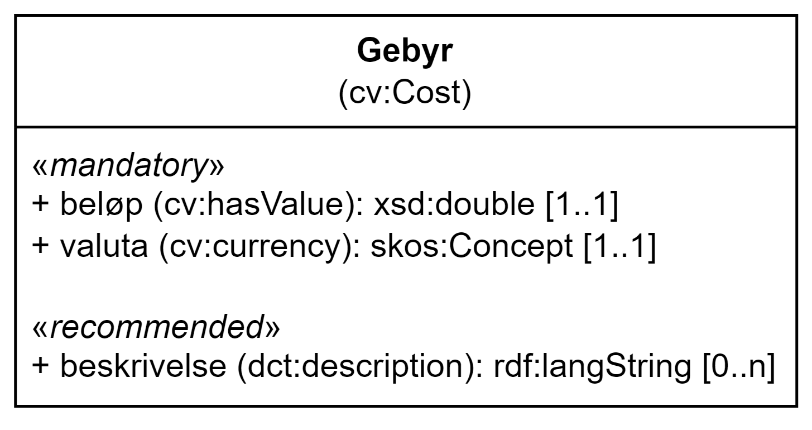

= Klassen Gebyr (cv:Cost) [[Gebyr]]

:xrefstyle: short

<> viser klassen Gebyr og dens egenskaper. I tegningen er norske utvidelser markert i gult.  

[[img-Klassen-Gebyr]]
.Klassen Gebyr.
[link=images/Klassen-Gebyr.png]

:xrefstyle: full

[cols="30s,70d"]
|===
| _English name_ | _Cost_
| Anvendelse / _Usage note_ | Klassen brukes til å representere gebyr.

_This class is used to represent any costs._
| URI | cv:Cost
| Merknad / _Note_ | Norsk utvidelse: Ikke eksplisitt spesifisert i DCAT-AP/DCAT.

_Norwegian extension: Not explicitly specified in DCAT-AP/DCAT._
|===

== Obligatoriske egenskaper for klassen _Gebyr_ [[Gebyr-obligatoriske-egenskaper]]

=== Gebyr – beløp (cv:hasValue) [[Gebyr-beløp]]

[cols="30s,70d"]
|===
| _English name_ | _value_
| URI | cv:hasValue
| Verdiområde / _Range_ |  xsd:double
| Anvendelse / _Usage note_ | Egenskapen brukes til å oppgi gebyrbeløpet.

_This property is used to specify a numeric value indicating the amount of the Cost._
| Multiplisitet / _Multiplicity_ | 1..1
| Kravnivå / _Requirement level_ | Obligatorisk / _Mandatory_
| Merknad / _Note_ | Norsk utvidelse: Ikke eksplisitt spesifisert i DCAT-AP/DCAT.

_Norwegian extension: Not explicitly specified in DCAT-AP/DCAT._
|===

=== Gebyr – valuta (cv:currency) [[Gebyr-valuta]]

[cols="30s,70d"]
|===
| _English name_ | _currency_
| URI | cv:currency
| Verdiområde / _Range_ |  skos:Concept
| Anvendelse / _Usage note_ | Egenskapen brukes til å oppgi valutatype av gebyret.

_This property is used to specify the currency in which the Cost._
| Multiplisitet / _Multiplicity_ | 1..1
| Kravnivå / _Requirement level_ | Obligatorisk / _Mandatory_
| Merknad 1 / _Note 1_ | Verdien SKAL velges fra EUs kontrollerte vokabular https://op.europa.eu/en/web/eu-vocabularies/concept-scheme/-/resource?uri=http://publications.europa.eu/resource/authority/currency[Valuta &#x29C9;, window="_blank", role="ext-link"].

__The value MUST be chosen from EU's controlled vocabulary https://op.europa.eu/en/web/eu-vocabularies/concept-scheme/-/resource?uri=http://publications.europa.eu/resource/authority/currency[Currency &#x29C9;, window="_blank", role="ext-link"].__
| Merknad 2 / _Note 2_ | Norsk utvidelse: Ikke eksplisitt spesifisert i DCAT-AP/DCAT.

_Norwegian extension: Not explicitly specified in DCAT-AP/DCAT._
|===

== Anbefalte egenskaper for klassen _Gebyr_ [[Gebyr-anbefalte-egenskaper]]

=== Gebyr – beskrivelse (dct:description) [[Gebyr-beskrivelse]]

[cols="30s,70d"]
|===
| _English name_ | _description_
| URI | dct:description
| Verdiområde / _Range_ | rdfs:Literal
| Anvendelse / _Usage note_ | Egenskapen brukes til å oppgi en tekstlig beskrivelse av gebyret. Egenskapen bør gjentas når beskrivelsen finnes på flere språk.

_This property is used to specify a free text description of the Cost. This property should be repeated when the description is in parallel languages._
| Multiplisitet / _Multiplicity_ | 0..n
| Kravnivå / _Requirement level_ | Anbefalt / _Recommended_
| Merknad / _Note_ | Norsk utvidelse: Ikke eksplisitt spesifisert i DCAT-AP/DCAT.

_Norwegian extension: Not explicitly specified in DCAT-AP/DCAT._
|===

