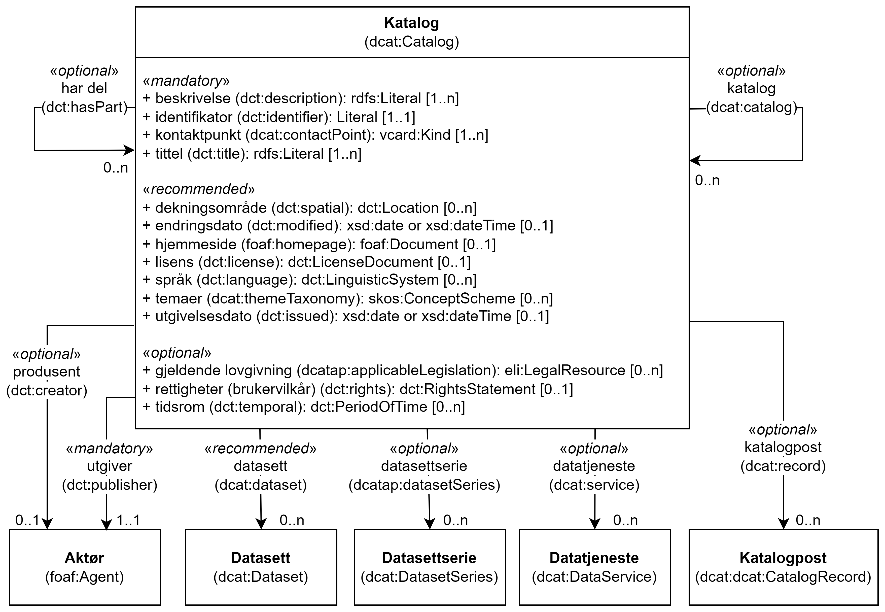

= Klassen Katalog (dcat:Catalog) [[Katalog]]

:xrefstyle: short

<<diagram-Klassen-Katalog>> viser klassen Katalog og dens egenskaper, samt klassene den refererer til.  

[[diagram-Klassen-Katalog]]
.Klassen Katalog og klassene den refererer til.
[link=images/Klassen-Katalog.png]

:xrefstyle: full

[cols="30s,70d"]
|===
| _English name_ |  _Catalogue_
| URI | dcat:Catalog
| Anvendelse / _Usage note_ | Klassen brukes til å representere en katalog eller repository som inneholder beskrivelser av ressurser som f.eks. datasett og datatjenester.

_This class is used to represent a catalogue or repository that hosts the Datasets or Data Services being described._
|===

== Obligatoriske egenskaper for klassen _Katalog_ [[Katalog-obligatoriske-egenskaper]]

=== Katalog – beskrivelse (dct:description) [[Katalog-beskrivelse]]

[cols="30s,70d"]
|===
| _English name_ |  _description_
| URI | dct:description
| Verdiområde / _Range_ | rdfs:Literal
| Anvendelse / _Usage note_ | Egenskapen brukes til å oppgi fritekst-beskrivelse av innholdet i katalogen. Egenskapen bør gjentas når beskrivelsen finnes på flere ulike språk.

_This property is used to specify a free-text account of the Catalogue. This property can be repeated for parallel language versions of the description._
| Multiplisitet / _Multiplicity_ | 1..n
| Kravnivå / _Requirement level_ | Obligatorisk / _Mandatory_
|===

=== Katalog – kontaktpunkt (dcat:contactPoint) [[Katalog-kontaktpunkt]]

[cols="30s,70"]
|===
| _English name_ | _contact point_
| URI | dcat:contactPoint
| Verdiområde / _Range_ | vcard:Kind
| Anvendelse / _Usage note_ | Egenskapen brukes til å oppgi kontaktopplysninger, som kan brukes vedr. spørsmål og kommentarer om katalogen.

_This property is used to specify contact information that can be used concerning questions and comments about the Catalog._
| Multiplisitet / _Multiplicity_ | 1..n
| Kravnivå / _Requirement level_ | Obligatorisk / _Mandatory_
| Merknad / _Note_ | Norsk utvidelse: Kravnivået endret fra valgfri (i DCAT) til obligatorisk, dermed også multiplisitet fra 0..1 til 1..1. 

__Norwegian extension: The requirement level changed from optional (in DCAT) to mandatory, thus also the multiplicity from 0..1 to 1..1.__
|===

=== Katalog – tittel (dct:title) [[Katalog-tittel]]

[cols="30s,70d"]
|===
| _English name_ | _title_
| URI | dct:title
| Verdiområde / _Range_ | rdfs:Literal
| Anvendelse / _Usage note_ | Egenskapen brukes til å oppgi navnet på katalogen. Egenskapen bør gjentas når navnet finnes på flere ulike språk.

_This property is used to specify a name given to the Catalogue. This property can be repeated for parallel language versions of the name._
| Multiplisitet / _Multiplicity_ | 1..n
| Kravnivå / _Requirement level_ | Obligatorisk / _Mandatory_
|===

=== Katalog – utgiver (dct:publisher) [[Katalog-utgiver]]

[cols="30s,70d"]
|===
| _English name_ | _publisher_
| URI | dct:publisher
| Verdiområde / _Range_ | foaf:Agent
| Anvendelse / _Usage note_ | Egenskapen brukes til å referere til en aktør (organisasjon) som er ansvarlig for å gjøre katalogen tilgjengelig. Verdien bør være autoritativ URI for aktøren, sekundært organisasjonsnummer.

_This property is used to refer to an entity (organisation) responsible for making the Catalogue available._
| Multiplisitet / _Multiplicity_ | 1..1
| Kravnivå / _Requirement level_ | Obligatorisk / _Mandatory_
| Merknad / _Note_ | (Lite aktuelt for bruk i Norge) Verdien SKAL velges fra EUs kontrollerte vokabular https://op.europa.eu/en/web/eu-vocabularies/concept-scheme/-/resource?uri=http://publications.europa.eu/resource/authority/corporate-body[__Corporate body__ &#x29C9;, window="_blank", role="ext-link"] for EU-institusjoner og noen internasjonale organisasjoner. 

__The value MUST be chosen from EU's controlled vocabulary https://op.europa.eu/en/web/eu-vocabularies/concept-scheme/-/resource?uri=http://publications.europa.eu/resource/authority/corporate-body[Corporate body &#x29C9;, window="_blank", role="ext-link"] for European institutions and a small set of international organisations.__
|===

== Anbefalte egenskaper for klassen _Katalog_ [[Katalog-anbefalte-egenskaper]]

=== Katalog – datasett (dcat:dataset) [[Katalog-datasett]]

[cols="30s,70d"]
|===
| _English name_ |  _dataset_
| URI | dcat:dataset
| Verdiområde / _Range_ | dcat:Dataset
| Anvendelse / _Usage note_ | Egenskapen brukes til å referere til datasett som er en del av katalogen. Gjelder også datasettserie som er subklasse av datasett. (#@@@@@@ NB! Sjekk hva EU endelig velger her! #)

_This property is used to refer to a Dataset that is part of the Catalogue. This also applies to Dataset series which is a subclass of Dataset._
| Multiplisitet / _Multiplicity_ | 0..n
| Kravnivå / _Requirement level_ | Anbefalt / _Recommended_
|===

=== Katalog – datatjeneste (dcat:service) [[Katalog-datatjeneste]]

[cols="30s,70d"]
|===
| _English name_ |  _service_
| URI | dcat:service
| Verdiområde / _Range_ | dcat:DataService
| Anvendelse / _Usage note_ | Egenskapen brukes til å referere til en datatjeneste som er oppført i katalogen.

_This property is used to refer to a Data Service that is listed in the Catalogue._
| Multiplisitet / _Multiplicity_ | 0..n
| Kravnivå / _Requirement level_ | Anbefalt / _Recommended_
|===

=== Katalog – dekningsområde (dct:spatial) [[Katalog-dekningsområde]]

[cols="30s,70d"]
|===
| _English name_ |  _geographical coverage_
| URI | dct:spatial
| Verdiområde / _Range_ | dct:Location
| Anvendelse / _Usage note_ | Egenskapen brukes til å referere til et geografisk område som er dekket av katalogen.

_This property is used to refer to a geographical area covered by the Catalogue._
| Multiplisitet / _Multiplicity_ | 0..n
| Kravnivå / _Requirement level_ | Anbefalt / _Recommended_
| Merknad / _Note_ | Verdien SKAL velges fra EU's kontrollerte vokabularer https://op.europa.eu/en/web/eu-vocabularies/dataset/-/resource?uri=http://publications.europa.eu/resource/dataset/continent[__Continent__ &#x29C9;, window="_blank", role="ext-link"], https://op.europa.eu/en/web/eu-vocabularies/dataset/-/resource?uri=http://publications.europa.eu/resource/dataset/country[__Countries and territories__ &#x29C9;, window="_blank", role="ext-link"] eller https://op.europa.eu/en/web/eu-vocabularies/dataset/-/resource?uri=http://publications.europa.eu/resource/dataset/place[__Place__ &#x29C9;, window="_blank", role="ext-link"], HVIS den finnes på listene; https://sws.geonames.org/[__GeoNames__ &#x29C9;, window="_blank", role="ext-link"] SKAL i andre tilfeller brukes. 

For å angi dekningsområde i Norge, BØR Kartverkets kontrollerte vokabular https://data.geonorge.no/administrativeEnheter/nasjon/doc/173163[Administrative enheter &#x29C9;, window="_blank", role="ext-link"] brukes i tillegg.

__The value MUST be chosen from EU's controlled vocabularies https://op.europa.eu/en/web/eu-vocabularies/dataset/-/resource?uri=http://publications.europa.eu/resource/dataset/continent[Continent &#x29C9;, window="_blank", role="ext-link"], https://op.europa.eu/en/web/eu-vocabularies/dataset/-/resource?uri=http://publications.europa.eu/resource/dataset/country[Countries and territories &#x29C9;, window="_blank", role="ext-link"] or https://op.europa.eu/en/web/eu-vocabularies/dataset/-/resource?uri=http://publications.europa.eu/resource/dataset/place[Place &#x29C9;, window="_blank", role="ext-link"], IF it is in the lists;  if a particular location is not in one of the mentioned Named Authority Lists, https://sws.geonames.org/[GeoNames &#x29C9;, window="_blank", role="ext-link"] URIs MUST be used.__

__To specify spatial coverage in Norway, the Norwegian Mapping Authority’s controlled vocabulary https://sws.geonames.org/[Administrative units &#x29C9;, window="_blank", role="ext-link"] SHOULD be used in addition.__
|===

=== Katalog – endringsdato (dct:modified) [[Katalog-endringsdato]]

[cols="30s,70d"]
|===
| _English name_ |  _modification date_
| URI | dct:modified
| Verdiområde / _Range_ | xsd:date or xsd:dateTime
| Anvendelse / _Usage note_ | Egenskapen brukes til å oppgi dato for siste oppdatering/endring av katalogen.

_This property is used to specify the most recent date on which the Catalogue was modified._
| Multiplisitet / _Multiplicity_ | 0..1
| Kravnivå / _Requirement level_ | Anbefalt / _Recommended_
| Merknad / _Note_ | Norsk utvidelse: Verdiområdet er eksplisitt spesifisert som `xsd:date or xsd:dateTime`, istedenfor å referere til den generiske datatype Temporal literal.  

_Norwegian extension: The range is explicitly specified as `xsd:date or xsd:dateTime`, instead of referring to the generic datatype Temporal Literal._ 
|===

=== Katalog – hjemmeside (foaf:homepage) [[Katalog-hjemmeside]]

[cols="30s,70d"]
|===
| _English name_ |  _homepage_
| URI | foaf:homepage
| Verdiområde / _Range_ | foaf:Document
| Anvendelse / _Usage note_ | Egenskapen brukes til å referere til nettside som fungerer som hovedside for katalogen.

_This property is used to refer to a web page that acts as the main page for the Catalogue._
| Multiplisitet / _Multiplicity_ | 0..1
| Kravnivå / _Requirement level_ | Anbefalt / _Recommended_
|===

=== Katalog – lisens (dct:license) [[Katalog-lisens]]

[cols="30s,70d"]
|===
| _English name_ |  _licence_
| URI | dct:license
| Verdiområde / _Range_ | dct:LicenseDocument
| Anvendelse / _Usage note_ |Egenskapen brukes til å referere til lisens for datakatalogen som beskriver hvordan den kan viderebrukes.

_This property is used to refer to a licence under which the Catalogue can be used or reused._
| Multiplisitet / _Multiplicity_ | 0..1
| Kravnivå / _Requirement level_ | Anbefalt / _Recommended_
| Merknad / _Note_ | Norsk utvidelse: Verdien SKAL velges fra EUs kontrollerte vokabular https://op.europa.eu/en/web/eu-vocabularies/concept-scheme/-/resource?uri=http://publications.europa.eu/resource/authority/licence[__Licence__ &#x29C9;, window="_blank", role="ext-link"].

__Norwegian extension: The value MUST be chosen from EU's controlled vocabulary https://op.europa.eu/en/web/eu-vocabularies/concept-scheme/-/resource?uri=http://publications.europa.eu/resource/authority/licence[Licence &#x29C9;, window="_blank", role="ext-link"].__
|===

=== Katalog – språk (dct:language) [[Katalog-språk]]

[cols="30s,70d"]
|===
| _English name_ |  _language_
| URI | dct:language
| Verdiområde / _Range_ | dct:LinguisticSystem
| Anvendelse / _Usage note_ | Egenskapen brukes til å referere til et språk som brukes i tekstlige metadata som beskriver ressursene i katalogen. Egenskapen kan gjentas hvis metadata er gitt på flere språk.

_This property is used to refer to a language used in the textual metadata describing titles, descriptions, etc. of the resources (e.g. Datasets, Data services) in the Catalogue. This property can be repeated if the metadata is provided in multiple languages._
| Multiplisitet / _Multiplicity_ | 0..n
| Kravnivå / _Requirement level_ | Anbefalt / _Recommended_
| Merknad / _Note_ | Verdien SKAL velges fra EU's kontrollerte vokabular https://op.europa.eu/en/web/eu-vocabularies/concept-scheme/-/resource?uri=http://publications.europa.eu/resource/authority/language[__Language__ &#x29C9;, window="_blank", role="ext-link"].

__The value MUST be chosen from EU's controlled vocabulary https://op.europa.eu/en/web/eu-vocabularies/concept-scheme/-/resource?uri=http://publications.europa.eu/resource/authority/language[Language &#x29C9;, window="_blank", role="ext-link"].__
|===

=== Katalog – temaer (dcat:themeTaxonomy) [[Katalog-temaer]]

[cols="30s,70d"]
|===
| _English name_ |  _themes_
| URI | dcat:themeTaxonomy
| Verdiområde / _Range_ | skos:ConceptScheme
| Anvendelse / _Usage note_ | Egenskapen brukes til å referere til et kunnskapsorganiseringssystem (KOS) som er brukt for å klassifisere de katalogiserte ressursene i katalogen.

_This property is used to refer to a knowledge organization system used to classify the resources in the catalogue._
| Multiplisitet / _Multiplicity_ | 0..n
| Kravnivå / _Requirement level_ | Anbefalt / _Recommended_
| Merknad / _Note_ | Norsk utvidelse: https://psi.norge.no/los/struktur.html[Los &#x29C9;, window="_blank", role="ext-link"] BØR brukes. 

__Norwegian extension: https://psi.norge.no/los/struktur.html[Los &#x29C9;, window="_blank", role="ext-link"] SHOULD be used.__
| Merknad / _Note_ | Siden EUs kontrollerte vokabular https://op.europa.eu/en/web/eu-vocabularies/concept-scheme/-/resource?uri=http://publications.europa.eu/resource/authority/data-theme[__Data theme__ &#x29C9;, window="_blank", role="ext-link"] er obligatorisk for egenskap dcat:theme i datasettbeskrivelser, skal denne egenskapen inneholde som minimum referanse til EUs Data theme, når katalogen inneholder datasettbeskrivelser. 

__It must have at least the value NAL:data-theme as this is the mandatory controlled vocabulary for dcat:theme.__
|===

=== Katalog – utgivelsesdato (dct:issued) [[Katalog-utgivelsesdato]]

[cols="30s,70d"]
|===
| _English name_ |  _release date_
| URI | dct:issued
| Verdiområde / _Range_ | xsd:date or xsd:dateTime
| Anvendelse / _Usage note_ | Egenskapen brukes til å oppgi dato for formell utgivelse (publisering) av katalogen.

_This property is used to specify the date of formal issuance (e.g., publication) of the Catalogue._
| Multiplisitet / _Multiplicity_ | 0..1
| Kravnivå / _Requirement level_ | Anbefalt / _Recommended_
| Merknad / _Note_ | Norsk utvidelse: Verdiområdet er eksplisitt spesifisert som `xsd:date or xsd:dateTime`, istedenfor å referere til den generiske datatype Temporal literal.  

_Norwegian extension: The range is explicitly specified as `xsd:date or xsd:dateTime`, instead of referring to the generic datatype Temporal Literal._ 
|===

== Valgfrie egenskaper for klassen _Katalog_ [[Katalog-valgfrie-egenskaper]]

=== Katalog – gjeldende lovgivning (dcatap:applicableLegislation) [[Katalog-gjeldendeLovgivning]]

[cols="30s,70"]
|===
| _English name_ | _applicable legislation_
| URI | dcatap:applicableLegislation
| Verdiområde / _Range_ | eli:LegalResource
| Anvendelse / _Usage note_ | Egenskapen brukes til å referere til lovgivningen som gir mandat til opprettelse eller forvaltning av katalogen.

_This property is used to refer to the legislation that mandates the creation or management of the Catalogue._
| Multiplisitet / _Multiplicity_ | 0..n
| Kravnivå / _Requirement level_ | Valgfri / _Optional_
|===

=== Katalog – har del (dct:hasPart) [[Katalog-har-del]]

[cols="30s,70d"]
|===
| _English name_ | _has part_
| URI | dct:hasPart
| Verdiområde / _Range_ | dcat:Catalog
| Anvendelse / _Usage note_ | Egenskapen brukes til å referere til en beslektet katalog som er en del av den beskrevne katalogen.

_This property is used to refer to a related Catalogue that is physically or logically included in the described Catalogue._
| Multiplisitet / _Multiplicity_ | 0..n
| Kravnivå / _Requirement level_ | Valgfri / _Optional_
|===

=== Katalog – identifikator (dct:identifier) [[Katalog-identifikator]]

[cols="30s,70d"]
|===
| _English name_ |  _identifier_
| URI | dct:identifier
| Verdiområde / _Range_ | rdfs:Literal
| Anvendelse / _Usage note_ | Egenskapen brukes til å oppgi identifikatoren av katalogen.

_This property is used to specify the identifier of the catalogue._
| Multiplisitet / _Multiplicity_ | 0..1
| Kravnivå / _Requirement level_ | Valgfri / _Optional_
|===

=== Katalog – katalog (dcat:catalog) [[Katalog-katalog]]

[cols="30s,70d"]
|===
| _English name_ |  _catalogue_
| URI | dcat:catalog
| Verdiområde / _Range_ | dcat:Catalog
| Anvendelse / _Usage note_ | Egenskapen brukes til å referere til en katalog hvis innhold er av interesse i kontekst av denne katalogen.

_This property is used to refer to a catalogue whose contents are of interest in the context of this catalogue._
| Multiplisitet / _Multiplicity_ | 0..n
| Kravnivå / _Requirement level_ | Valgfri / _Optional_
|===

=== Katalog – katalogpost (dcat:record) [[Katalog-katalogpost]]

[cols="30s,70d"]
|===
| _English name_ |  _record_
| URI | dcat:record
| Verdiområde / _Range_ | dcat:CatalogRecord
| Anvendelse / _Usage note_ | Egenskapen brukes til å referere til en katalogpost som er del av katalogen.

_This property is used to refer to a Catalogue Record that is part of the Catalogue._
| Multiplisitet / _Multiplicity_ | 0..n
| Kravnivå / _Requirement level_ | Valgfri / _Optional_
|===

=== Katalog – produsent (dct:creator) [[Katalog-produsent]]

[cols="30s,70d"]
|===
| _English name_ |  _creator_
| URI | dct:creator
| Verdiområde / _Range_ | foaf:Agent
| Anvendelse / _Usage note_ | Egenskapen brukes til å referere til aktøren som er hovedansvarlig for å produsere katalogen.

_This property is used to refer to an entity responsible for the creation of the catalogue._
| Multiplisitet / _Multiplicity_ | 0..1
| Kravnivå / _Requirement level_ | Valgfri / _Optional_
|===

=== Katalog – rettigheter (brukervilkår) (dct:rights) [[Katalog-rettigheter]]

[cols="30s,70d"]
|===
| _English name_ |  _rights (use terms)_
| URI | dct:rights
| Verdiområde / _Range_ | dct:RightsStatement
| Anvendelse / _Usage note_ | Egenskapen brukes til å referere uttalelse som spesifiserer brukervilkår knyttet til katalogen.

_This property is used to refer to a statement that specifies rights associated with the Catalogue._
| Multiplisitet / _Multiplicity_ | 0..1
| Kravnivå / _Requirement level_ | Valgfri / _Optional_
| Merknad / _Note_ | Det anbefales å bruke <<Rettighetserklæring>> som er en subklasse av `dct:RightsStatement`. Se også <<Om-lisens-tilgang-rettigheter>>. 

__It is recommended to use the class <<Rettighetserklæring, Rights statement (odrs:RightsStatement)>> which is a subclass of `dct:RightsStatement`.__
|===

=== Katalog – tidsrom (dct:temporal) [[Katalog-tidsrom]]

[cols="30s,70"]
|===
| _English name_ | _temporal coverage_
| URI | dct:temporal
| Verdiområde / _Range_ | dct:PeriodOfTime
| Anvendelse / _Usage note_ | Egenskapen brukes til å oppgi et tidsrom som er dekket av katalogen.

_This property is used to specify a temporal period that the Catalogue covers._
| Multiplisitet / _Multiplicity_ | 0..n
| Kravnivå / _Requirement level_ | Valgfri / _Optional_
|===

