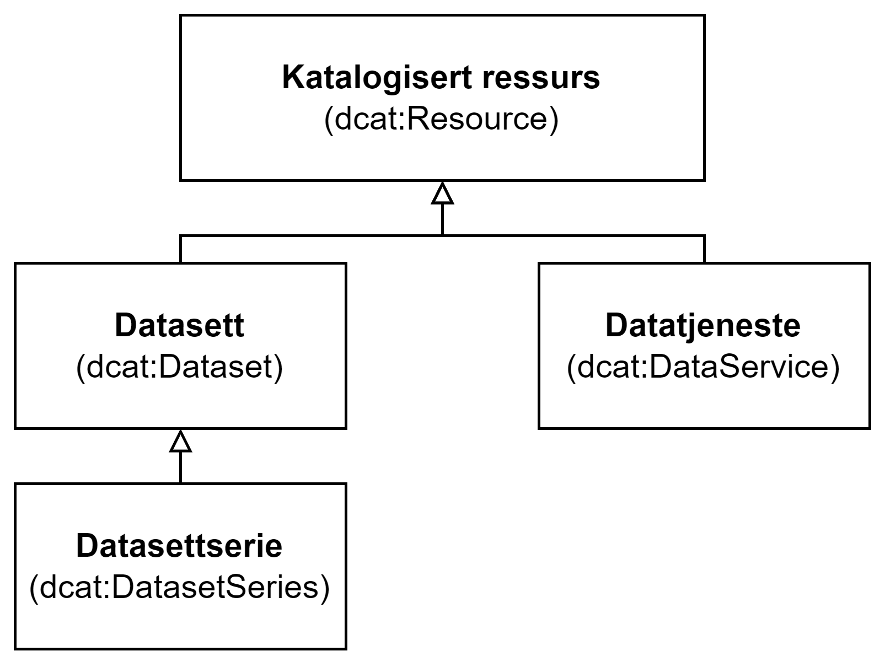

= Klassen Katalogisert ressurs (dcat:Resource) [[KatalogisertRessurs]]

:xrefstyle: short

<<diagram-Klassen-KatalogisertRessurs>> viser klassen Katalogisert ressurs og dens subklasser.  

[[diagram-Klassen-KatalogisertRessurs]]
.Klassen Katalogisert ressurs og dens subklasser.
[link=images/Klassen-KatalogisertRessurs.png]

:xrefstyle: full

[cols="30s,70d"]
|===
| _English name_ | _Catalogued resource_
| URI | dcat:Resource
| Anvendelse / _Usage note_ | Klassen brukes til å representere en ressurs som er beskrevet i en katalog.

_This class is used to represent a resource published or curated by a single agent._
| Merknad / _Note_ |  Dette er en abstrakt klasse. I en konkret anvendelse/serialisering BØR bare subklassene <<Datasett>>, <<Datasettserie>> eller <<Datatjeneste>> brukes.

_This class is an abstract class. Therefore only subclasses dcat:Dataset, dcat:DatasetSeries or dcat:DataService SHOULD be used in a data exchange._
|===

