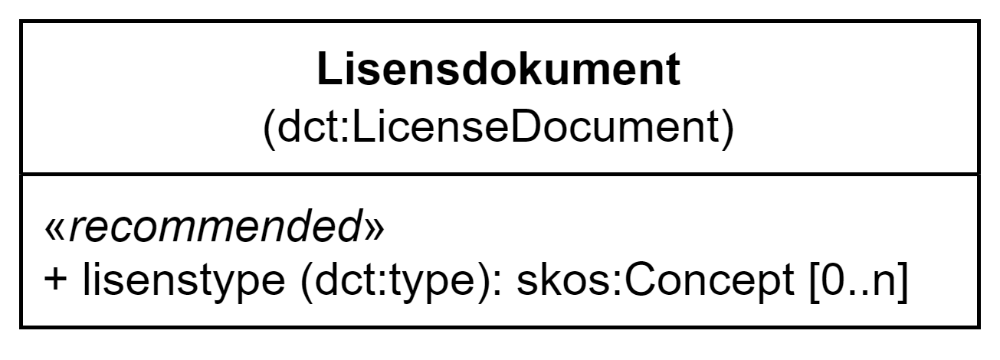

= Klassen Lisensdokument (dct:LicenseDocument) [[Lisensdokument]]

<<diagram-KlassenLisensdokument>> viser klassen Lisensdokument og dens egenskap.  

[[diagram-KlassenLisensdokument]]
.Klassen Lisensdokument og dens egenskap.
[link=images/Klassen-Lisensdokument.png]

[cols="30s,70d"]
|===
| _English name_ | _License document_
| URI | dct:LicenseDocument
| Anvendelse / _Usage note_ | Klassen brukes til å representere et juridisk dokument som gir offisiell tillatelse til å gjøre noe med en ressurs.

_This property is used to represent a legal document giving official permission to do something with a resource._
|===

== Anbefalte egenskaper for klassen _Lisensdokument_ [[Lisensdokument-anbefalte-egenskaper]]

=== Lisensdokument – lisenstype (dct:type) [[Lisensdokument-lisenstype]]

[cols="30s,70d"]
|===
| _English name_ | _type_
| URI | dct:type
| Verdiområde / _Range_ | skos:Concept
| Anvendelse / _Usage note_ | Egenskapen brukes til å referere til type lisens, f.eks. som indikerer "fri bruk" (Public Domain) eller "royalties kreves". 

_This property is used to refer to a type of licence, e.g. indicating 'public domain' or 'royalties required'._
| Multiplisitet / _Multiplicity_ | 0..n
| Kravnivå / _Requirement level_ | Anbefalt / _Recommended_
| Merknad / _Note_ | Norsk utvidelse: Verdien SKAL velges fra kontrollerte vokabular https://raw.githubusercontent.com/SEMICeu/ADMS-AP/master/purl.org/ADMS_SKOS_v1.00.rdf[__ADMS licence type__ &#x29C9;, window="_blank", role="ext-link"]  (lenket ressurs er i RDF).

__Norwegian extension: The value MUST be chosen from the controlled vocabulary https://raw.githubusercontent.com/SEMICeu/ADMS-AP/master/purl.org/ADMS_SKOS_v1.00.rdf[ADMS licence type &#x29C9;, window="_blank", role="ext-link"] (the linked resource is in RDF).__
|===
