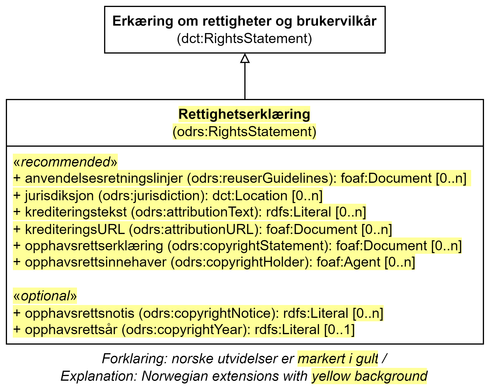

= Klassen Rettighetserklæring (odrs:RightsStatement) [[Rettighetserklæring]]

:xrefstyle: short

<<diagram-Klassen-Rettighetserklæring>> viser klassen Rettighetserklæring og dens egenskaper.  

[[diagram-Klassen-Rettighetserklæring]]
.Klassen Rettighetserklæring og dens egenskap.
[link=images/Klassen-Rettighetserklæring.png]

:xrefstyle: full

[cols="30s,70d"]
|===
| _English name_ |  _Rights statement_
| URI | odrs:RightsStatement
| Subklasse av / _Subclass of_ | dct:RightsStatement
| Anvendelse / _Usage note_ | Klassen brukes til å representere en erklæring om immaterielle rettigheter knyttet til en ressurs, et juridisk dokument som gir offisiell tillatelse til å gjøre noe med en ressurs, eller erklæring om tilgangsrettigheter.

_This property is used to represent a statement about the intellectual property rights (IPR) held in or over a resource, a legal document giving official permission to do something with a resource, or a statement about access rights._
| Merknad / _Note_ | Norsk utvidelse: Hele klassen er ikke eksplisitt spesifisert i DCAT-AP/DCAT. 

_Norwegian extension: The whole class is not explicitly specified in DCAT-AP/DCAT._ 
|===

== Anbefalte egenskaper for klassen _Rettighetserklæring_ [[Rettighetserklæring-anbefalte-egenskaper]]

=== Rettighetserklæring – anvendelsesretningslinjer (odrs:reuserGuidelines)  [[Rettighetserklæring-anvendelsesretningslinjer]]

[cols="30s,70"]
|===
| _English name_ | _guidelines for re-users_
| URI | odrs:reuserGuidelines
| Verdiområde / _Range_ | foaf:Document
| Anvendelse / _Usage note_ | Egenskapen brukes til å en lenke/URL til et dokument som gir retningslinjer for bruk av data dekket av rettighetserklæringen. Retningslinjer kan inneholde mer detaljer om kreditering, en mer fyldig versjon av opphavsrett, generell veiledning om hvordan data bør brukes.  

_This property is used to specify a link (URL) to a document that provides guidelines for re-users of data that is covered by a specific rights statement. The guidelines may include more detail on attribution guidelines, a fuller copyright statement, and general guidance on how the data might be re-used._
| Multiplisitet / _Multiplicity_ | 0..n
| Kravnivå / _Requirement level_ | Anbefalt / _Recommended_
| Merknad / _Note_ | Norsk utvidelse: Ikke eksplisitt spesifisert i DCAT-AP/DCAT.

_Norwegian extension: Not explicitly specified in DCAT-AP/DCAT._
|===

=== Rettighetserklæring – jurisdiksjon (odrs:jurisdiction)  [[Rettighetserklæring-jurisdiksjon]]

[cols="30s,70"]
|===
| _English name_ | _jurisdiction_
| URI | odrs:jurisdiction
| Verdiområde / _Range_ | dct:Location
| Anvendelse / _Usage note_ | Egenskapen brukes til å referere til jurisdiksjonen under hvilken rettighetserklæringen gjelder. Det er anbefalt å bruke en URI for et land eller region. 

_This property is used to specify a reference (URI) to the jurisdiction in which copyright and/or database rights have been asserts. It is recommended that this refer to the URI for a country or region._
| Multiplisitet / _Multiplicity_ | 0..n
| Kravnivå / _Requirement level_ | Anbefalt / _Recommended_
| Merknad 1 / _Note 1_ | Norsk utvidelse: Ikke eksplisitt spesifisert i DCAT-AP/DCAT.

_Norwegian extension: Not explicitly specified in DCAT-AP/DCAT._
| Merknad 2 / _Note 2_ | Norsk utvidelse: Verdien SKAL velges fra EU's kontrollerte vokabular https://op.europa.eu/en/web/eu-vocabularies/concept-scheme/-/resource?uri=http://publications.europa.eu/resource/authority/country[__Countries and territories__ &#x29C9;, window="_blank", role="ext-link"] for land. For å angi dekningsområde i Norge, BØR Kartverkets kontrollerte vokabular https://data.geonorge.no/administrativeEnheter/nasjon/doc/173163[Administrative enheter &#x29C9;, window="_blank", role="ext-link"] brukes i tillegg. 

__The value MUST be chosen from EU's controlled vocabulary https://op.europa.eu/en/web/eu-vocabularies/concept-scheme/-/resource?uri=http://publications.europa.eu/resource/authority/country[Countries and territories &#x29C9;, window="_blank", role="ext-link"] for country. To specify coverage in Norway, the Norwegian Mapping Authority’s controlled vocabulary https://sws.geonames.org/[Administrative units &#x29C9;, window="_blank", role="ext-link"] SHOULD be used in addition.__
|===

=== Rettighetserklæring – krediteringstekst (odrs:attributionText)  [[Rettighetserklæring-krediteringstekst]]

[cols="30s,70"]
|===
| _English name_ | _attribution text_
| URI | odrs:attributionText
| Verdiområde / _Range_ | rdfs:Literal
| Anvendelse / _Usage note_ | Egenskapen brukes til å oppgi en tekstlig kreditering. Egenskapen bør gjentas når teksten finnes på flere språk.

_This property is used to specify an attribution text. This property should be repeated for parallel language versions of the text._
| Multiplisitet / _Multiplicity_ | 0..n
| Kravnivå / _Requirement level_ | Anbefalt / _Recommended_
| Merknad / _Note_ | Norsk utvidelse: Ikke eksplisitt spesifisert i DCAT-AP/DCAT.

_Norwegian extension: Not explicitly specified in DCAT-AP/DCAT._
|===

=== Rettighetserklæring – krediteringsURL (odrs:attributionURL)  [[Rettighetserklæring-krediteringsURL]]

[cols="30s,70"]
|===
| _English name_ | _attribution URL_
| URI | odrs:attributionURL
| Verdiområde / _Range_ | foaf:Document
| Anvendelse / _Usage note_ | Egenskapen brukes til å oppgi en lenke/URL som bør brukes ved kreditering. URLen kan være referanse til datasettet eller utgivers hjemmeside, men kan også være en dedikert hjemmeside for kreditering. 

_This property is used to specify a link (URL) which should be used when attributing a data source. The URL could be a reference to the dataset or publisher homepage, but may also be a dedicated attribution page. This is useful when providing onward attribution to upstream sources._
| Multiplisitet / _Multiplicity_ | 0..n
| Kravnivå / _Requirement level_ | Anbefalt / _Recommended_
| Merknad / _Note_ | Norsk utvidelse: Ikke eksplisitt spesifisert i DCAT-AP/DCAT.

_Norwegian extension: Not explicitly specified in DCAT-AP/DCAT._
|===

=== Rettighetserklæring – opphavsrettserkæring (odrs:copyrightStatement)  [[Rettighetserklæring-opphavsrettserklæring]]

[cols="30s,70"]
|===
| _English name_ | _copyright statement_
| URI | odrs:copyrightStatement
| Verdiområde / _Range_ | foaf:Document
| Anvendelse / _Usage note_ | Egenskapen brukes til å referere til et dokument som inneholder uttalelse om opphavsrett til innholdet i et datasett. Dokumentet (websiden) kan inneholde både selve opphavsrettsmerknad, og relevant veiledning til bruk. 

_This property is used to a link (URL) to a document that includes a statement about the copyright status of the content of a dataset. The web page might include both a copyright notice for a dataset, and any relevant guidance for re-users._
| Multiplisitet / _Multiplicity_ | 0..n
| Kravnivå / _Requirement level_ | Anbefalt / _Recommended_
| Merknad / _Note_ | Norsk utvidelse: Ikke eksplisitt spesifisert i DCAT-AP/DCAT.

_Norwegian extension: Not explicitly specified in DCAT-AP/DCAT._
|===

=== Rettighetserklæring – opphavsrettsinnehaver (odrs:copyrightHolder)  [[Rettighetserklæring-opphavsrettsinnehaver]]

[cols="30s,70"]
|===
| _English name_ | _copyright holder_
| URI | odrs:copyrightHolder
| Verdiområde / _Range_ | foaf:Agent
| Anvendelse / _Usage note_ | Egenskapen brukes til å referere til en opphavsrettsinnehaver til innholdet i datasettet. 

_This property is used to refer to the agent/organization that holds copyright over the content of the dataset._
| Multiplisitet / _Multiplicity_ | 0..n
| Kravnivå / _Requirement level_ | Anbefalt / _Recommended_
| Merknad / _Note_ | Norsk utvidelse: Ikke eksplisitt spesifisert i DCAT-AP/DCAT.

_Norwegian extension: Not explicitly specified in DCAT-AP/DCAT._
|===

== Valgfrie egenskaper for klassen _Rettighetserklæring_ [[Rettighetserklæring-valgfrie-egenskaper]]

=== Rettighetserklæring – opphavsrettsnotis (odrs:copyrightNotice)  [[Rettighetserklæring-opphavsrettsnotis]]

[cols="30s,70"]
|===
| _English name_ | _copyright notice_
| URI | odrs:copyrightNotice
| Verdiområde / _Range_ | rdfs:Literal
| Anvendelse / _Usage note_ | Egenskapen brukes til å oppgi en enkel tekstlig notis om opphavsretten. Egenskapen bør gjentas når teksten finnes på flere språk. 

_This property is used to specify the copyright notice associated with a rights statement. A notice must typically be preserved and displayed when acknowledging the source of some data. This property is expressed as a simple literal value and so is suitable for simple copyright notices. Where a data publisher needs to reference a larger copyright statement and/or related guidance then the copyrightStatement property should be used instead. This property should be repeated for parallel language versions of the text._
| Multiplisitet / _Multiplicity_ | 0..n
| Kravnivå / _Requirement level_ | Anbefalt / _Recommended_
| Merknad / _Note_ | Norsk utvidelse: Ikke eksplisitt spesifisert i DCAT-AP/DCAT.

_Norwegian extension: Not explicitly specified in DCAT-AP/DCAT._
|===

=== Rettighetserklæring – opphavsrettsår (odrs:copyrightYear)  [[Rettighetserklæring-opphavsrettsår]]

[cols="30s,70"]
|===
| _English name_ | _copyright year_
| URI | odrs:copyrightYear
| Verdiområde / _Range_ | rdfs:Literal
| Anvendelse / _Usage note_ | Egenskapen brukes til å oppgi året fra hvilket opphavsretten gjelder.

_This property is used to specify the year from which copyright over the content of the dataset is asserted._
| Multiplisitet / _Multiplicity_ | 0..1
| Kravnivå / _Requirement level_ | Anbefalt / _Recommended_
| Merknad / _Note_ | Norsk utvidelse: Ikke eksplisitt spesifisert i DCAT-AP/DCAT.

_Norwegian extension: Not explicitly specified in DCAT-AP/DCAT._
|===

