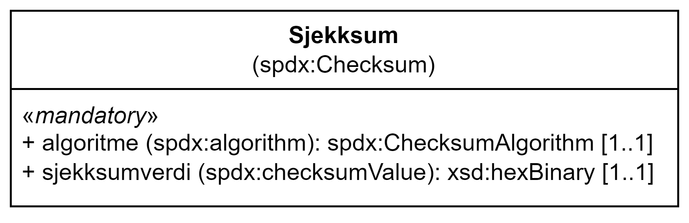

= Klassen Sjekksum (spdx:Checksum) [[Sjekksum]]

:xrefstyle: short

<<diagram-Klassen-Sjekksum>> viser klassen Sjekksum og dens egenskaper.  

[[diagram-Klassen-Sjekksum]]
.Klassen Sjekksum og dens egenskaper.
[link=images/Klassen-Sjekksum.png]

:xrefstyle: full

[cols="30s,70d"]
|===
| _English name_ | _Checksum_
| URI | spdx:Checksum
| Anvendelse / _Usage note_ | Klassen brukes til å representere en verdi som muliggjør autentisering av innholdet i en fil. Flere sjekksumtyper og kryptografiske algoritmer kan brukes.

_This class is used to represent a value that allows the contents of a file to be authenticated. This class allows the results of a variety of checksum and cryptographic message digest algorithms to be represented._
|===

== Obligatoriske egenskaper for klassen _Sjekksum_ [[Sjekksum-obligatoriske-egenskaper]]

=== Sjekksum – algoritme (spdx:algorithm) [[Sjekksum-algoritme]]

[cols="30s,70d"]
|===
| _English name_ | _algorithm_
| URI | spdx:algorithm
| Verdiområde / _Range_ | spdx:ChecksumAlgorithm
| Anvendelse / _Usage note_ | Egenskapen brukes til å identifisere algoritmen som er brukt til å produsere sjekksummen. 

_This property is used to refer to the algorithm used to produce the checksum._
| Multiplisitet / _Multiplicity_ | 1..1
| Kravnivå / _Requirement level_ | Obligatorisk / _Mandatory_
| Merknad / _Note_ | Verdien SKAL velges blant https://spdx.org/rdf/terms/#d4e2129[__Checksum algorithm members__ &#x29C9;, window="_blank", role="ext-link"].

__The value MUST be chosen among https://spdx.org/rdf/terms/#d4e2129[Checksum algorithm members &#x29C9;, window="_blank", role="ext-link"].__
| Eksempel / _Example_ | SHA-256
|===

Eksempel i RDF Turtle:
-----
<aChecksum> a spdx:Checksum ; 
   spdx:algorithm <http://spdx.org/rdf/terms#checksumAlgorithm_sha256> ; 
   .
-----

=== Sjekksum – sjekksumverdi (spdx:checksumValue) [[Sjekksum-sjekksumverdi]]

[cols="30s,70d"]
|===
| _English name_ | _checksum value_
| URI | spdx:checksumValue
| Verdiområde / _Range_ | xsd:hexBinary
| Anvendelse / _Usage note_ | Egenskapen brukes til å oppgi en heksadesimal-kodet verdi med små bokstaver, produsert ved hjelp av en spesifikk algoritme.

_This property is used to specify a lower case hexadecimal encoded digest value produced using a specific algorithm._
| Multiplisitet / _Multiplicity_ | 1..1
| Kravnivå / _Requirement level_ | Obligatorisk / _Mandatory_
|===

Eksempel i RDF Turtle:
-----
<aChecksum> a spdx:Checksum ; 
   spdx:checksumValue "30a4985fd07730d5876254998e8808d5836629394cc43b15ad6beee1dce1995b"^^xsd:hexBinary ; 
   .
-----

