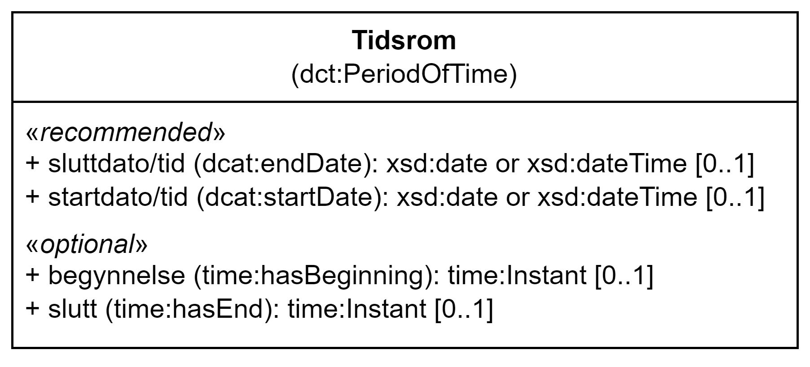

= Klassen Tidsrom (dct:PeriodOfTime) [[Tidsrom]]

:xrefstyle: short

<<diagram-Klassen-Tidsrom>> viser klassen Tidsrom og dens egenskaper. I tegningen er norske utvidelser markert i gult.  

[[diagram-Klassen-Tidsrom]]
.Klassen Tidsrom og dens egenskaper.
[link=images/Klassen-Tidsrom.png]

:xrefstyle: full

[cols="30s,70d"]
|===
| _English name_ | _Period of time_
| URI | dct:PeriodOfTime
| Anvendelse / _Usage note_ | Klassen brukes til å representere et tidsintervall som er navngitt eller definert av en start- og sluttdato.

_This class is used to represent an interval of time that is named or defined by its start and end dates._
|===

== Anbefalte egenskaper for klassen _Tidsrom_ [[Tidsrom-anbefalte-egenskaper]]

NOTE: Vær oppmerksom på at selv om begge egenskapene anbefales, SKAL en av de to være til stede for hver forekomst av klassen `dct:PeriodOfTime` (hvis klassen er brukt). Starten av perioden bør forstås som starten på datoen, timen, minuttet (f.eks. starter ved midnatt på begynnelsen av dagen hvis verdien er en dato). Slutten av perioden skal forstås som slutten av datoen, timen, minuttet (f.eks. slutter ved midnatt på slutten av dagen hvis verdien er en dato).

=== Tidsrom – sluttdato/tid (dcat:endDate) [[Tidsrom-sluttdato]]

[cols="30s,70d"]
|===
| _English name_ | _end date_
| URI | dcat:endDate
| Verdiområde / _Range_ | xsd:date or xsd:dateTime
| Anvendelse / _Usage note_ | Egenskapen brukes til å definere slutten på tidsrommet.

_This property is used to specify the end of the period._
| Multiplisitet / _Multiplicity_ | 0..1
| Kravnivå / _Requirement level_ | Anbefalt / _Recommended_
| Merknad / _Note_ | Norsk utvidelse: Verdiområdet er eksplisitt spesifisert som `xsd:date or xsd:dateTime`, istedenfor å referere til den generiske datatype Temporal literal.  

_Norwegian extension: The range is explicitly specified as `xsd:date or xsd:dateTime`, instead of referring to the generic datatype Temporal Literal._ 
|===

Eksempel i RDF Turtle:
-----
<aPeriodOfTime> a dct:PeriodOfTime ; 
   dcat:endDate "2024-06-30"^^xsd:date ; 
   .
-----

=== Tidsrom – startdato/tid (dcat:startDate) [[Tidsrom-startdato]]
[cols="30s,70d"]
|===
| _English name_ | _start date_
| URI | dcat:startDate
| Verdiområde / _Range_ | xsd:date or xsd:dateTime
| Anvendelse / _Usage note_ | Egenskapen brukes til å definere starten på tidsrommet.

_This property is used to specify the start of the period._
| Multiplisitet / _Multiplicity_ | 0..1
| Kravnivå / _Requirement level_ | Anbefalt / _Recommended_
| Merknad / _Note_ | Norsk utvidelse: Verdiområdet er eksplisitt spesifisert som `xsd:date or xsd:dateTime`, istedenfor å referere til den generiske datatype Temporal literal.  

_Norwegian extension: The range is explicitly specified as `xsd:date or xsd:dateTime`, instead of referring to the generic datatype Temporal Literal._ 
|===

Eksempel i RDF Turtle:
-----
<aPeriodOfTime> a dct:PeriodOfTime ; 
   dcat:startDate "2020-06-30"^^xsd:date ; 
   .
-----

== Valgfrie egenskaper for klassen _Tidsrom_ [[Tidsrom-valgfrie-egenskaper]]

=== Tidsrom – begynnelse (time:hasBeginning) [[Tidsrom-begynnelse]]
[cols="30s,70d"]
|===
| _English name_ | _beginning_
| URI | time:hasBeginning
| Verdiområde / _Range_ | time:Instant
| Anvendelse / _Usage note_ | Egenskapen brukes til å definere begynnelsen på et tidsrom eller intervall.

_This property is used to specify the beginning of a period or interval._
| Multiplisitet / _Multiplicity_ | 0..1
| Kravnivå / _Requirement level_ | Valgfri / _Optional_
|===

=== Tidsrom – slutt (time:hasEnd) [[Tidsrom-slutt]]
[cols="30s,70d"]
|===
| _English name_ | _end_
| URI | time:hasEnd
| Verdiområde / _Range_ | time:Instant
| Anvendelse / _Usage note_ | Egenskapen brukes til å definere slutten på et tidsrom eller intervall.

_This property is used to specify the end of a period or interval._
| Multiplisitet / _Multiplicity_ | 0..1
| Kravnivå / _Requirement level_ | Valgfri / _Optional_
|===
