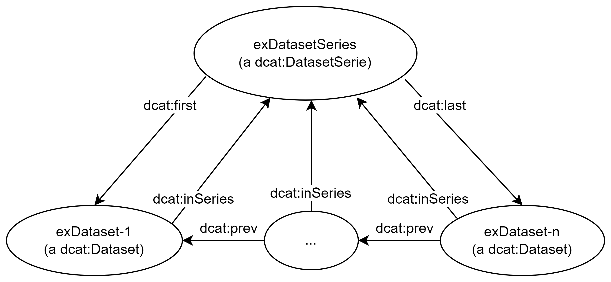

= Noen spesielle temaer [[Spesielle-temaer]]

== Om bruk av egenskapene _lisens (dct:license)_, _tilgangsrettigheter (dct:accessRights)_ og _rettigheter/brukervilkår (dct:rights)_ [[Om-lisens-tilgang-rettigheter]]

DCAT-AP-NO støtter følgende tre hovedscenarier der man trenger å beskrive tilgang og/eller brukervilkår til en ressurs (f.eks. et datasett): 1) behov for å referere til en lisens, 2) behov for å spesifisere tilgangsrettigheter og 3) andre behov enn ovennevnte, for å uttrykke rettigheter eller brukervilkår, f.eks. opphavsrett. 

DCAT-AP-NO støtter disse scenariene på følgende måte: 

. `dct:license` SKAL brukes til å referere til en lisens, og verdien SKAL hentes fra EUs kontrollerte vokabular https://op.europa.eu/en/web/eu-vocabularies/concept-scheme/-/resource?uri=http://publications.europa.eu/resource/authority/licence[__Licence__ &#x29C9;, window="_blank", role="ext-link"]. Dette gjelder egenskapene <<Datatjeneste-lisens>>, <<Distribusjon-lisens>> og <<Katalog-lisens>>. 

. `dct:accessRights` SKAL brukes til å uttrykke tilgangsrettigheter, og verdien SKAL være `PUBLIC`, `RESTRICTED` eller `NON_PUBLIC` fra EU's kontrollerte vokabular https://op.europa.eu/en/web/eu-vocabularies/concept-scheme/-/resource?uri=http://publications.europa.eu/resource/authority/access-right[__Access right__ &#x29C9;, window="_blank", role="ext-link"]. Dette gjelder egenskapene <<Datasett-tilgangsrettigheter>> og <<Datatjeneste-tilgangsrettigheter>>.

. `dct:rights` KAN brukes til å uttrykke alle andre typer rettigheter og brukervilkår, bl.a. opphavsrett. Det er anbefalt å bruke <<Rettighetserklæring>> til å ha en strukturert beskrivelse av rettigheter og brukervilkår. Dette gjelder egenskapene <<Distribusjon-rettigheter>> og <<Katalog-rettigheter>>.

== Om bruk av klassen _Datasettserie (dcat:DatasetSeries)_ [[Om-Datasettserie]]

_Datasett_ (`dcat:Dataset`) inkluderes i en _datasettserie_ (`dcat:DatasetSeries`) ved hjelp av datasettegenskapen <<Datasett-iSerie>>. 

For å harmonisere bruk av datasettserier, skal følgende tas hensyn til: 

* Datasettserie brukes bare når utgiveren ønsker å forvalte en samling av flere datasett. Datasettserie med kun ett datasett bør unngås. 
* Datasettserie uten datasett bør unngås. Det kan imidlertid hende at en datasettserie over tid blir tom (f.eks. at datasettene i serien blir trukket tilbake). Utgiveren bør i slike tilfeller også vurdere å trekke tilbake selve serien. 
* Klassen Datasettserie (dcat:DatasetSeries) er en subklasse av Datasett (dcat:Dataset). Rent modelleringsmessig kan derfor klassen Datasettserie arve alle egenskapene fra klassen Datasett. Man skal allikevel vurdere om det faglig sett er hensiktsmessig å bruke en egenskap fra Datasett. Vi anbefaler sterkt at
** Man ikke bruker egenskapen <<Datasett-forrige>> på en datasettserie, ettersom egenskapen er ment for å uttrykke rekkefølge mellom datasett i en datasettserie. 
** Man unngår å bruke egenskapen <<Datasett-iSerie>> eller <<Datasett-harDel>> på en datasettserie, slik at man unngår nøstede datasettserier. 
** Man unngår å bruke egenskapen <<Datasett-datasettdistribusjon>> eller <<Datasett-eksempeldata>> på en datasettserie, men at distribusjoner (dcat:Distribution) knyttes til datasettene som inngår i datasettserien. 
* __#@@@@@@ sjekk om https://semiceu.github.io/DCAT-AP/releases/3.0.0/#usage-guide-on-dataset-series[de andre kulepunkter fra EUs DCAT-AP 3.0.0-Draft] som trengs omskriving (jf. https://github.com/SEMICeu/DCAT-AP/issues/354[Issue #354]), er aktuelle her#__

Generelt er det forventet at datasettene i en datasettserie er sterkt relatert til hverandre. Det fins imidlertid ingen felles kriterier eller regler for hvordan datasettene i en datasettserie bør relateres til hverandre. Det kan f.eks. være datasett om noe som utvikler seg over tid og/eller rom, f.eks. ulvebestandstatus, budsjett, regnskap. Versjoneringsterminologi («forrige»/«neste», «første»/«siste») kan f.eks. brukes til å uttrykke rekkefølge i tid. 

<<figur-OrdnetDatasettserie>> illustrerer en datasettserie der rekkefølgen mellom datasettene i serien er oppgitt. Rekkefølgen mellom datasettene oppgis ved hjelp av datasettegenskapen <<Datasett-forrige>>. I beskrivelsen av selve datasettserien er det i tillegg oppgitt første og siste datasett i serien, ved hjelp av datasettserieegenskapene <<Datasettserie-første>> hhv. <<Datasettserie-siste>>. 

[[figur-OrdnetDatasettserie]]
.Illustrasjon av en ordnet datasettserie.
[link=images/Figur-ordnet-datasetserie.png]

== Om bruk av inverse egenskaper [[Om-inverse-egenskaper]]

I klassebeskrivelsene foran er inverse egenskaper bevisst utelatt, i tråd med DCAT-AP og DCAT. 

Også i tråd med DCAT-AP og DCAT, tillater DCAT-AP-NO å bruke inverse egenskaper når de trengs, men under forutsetning av at de brukes i tillegg til, og _ikke_ istedenfor, egenskapene som er eksplisitt tatt med i klassebeskrivelsene ovenfor. 

Følgende inverse egenskaper kan brukes: 

[cols="50s,50"]
|===
| Egenskap i DCAT-AP-NO | Invers egenskap som kan brukes i tillegg
| dcat:prev | dcat:next
| dcat:previousVersion | dcat:nextVersion
| dcat:distribution | dcat:isDistributionOf
| dct:hasPart | dct:isPartOf
// | dcat:resource | dcat:inCatalog
| dct:replaces | dct:isReplacedBy
| dct:isReferencedBy | dct:references
| dcat:hasVersion | dcat:isVersionOf
| dcat:inSeries | dcat:seriesMember
| foaf:primaryTopic | foaf:isPrimaryTopicOf
| prov:wasGeneratedBy | prov:generated
|===

