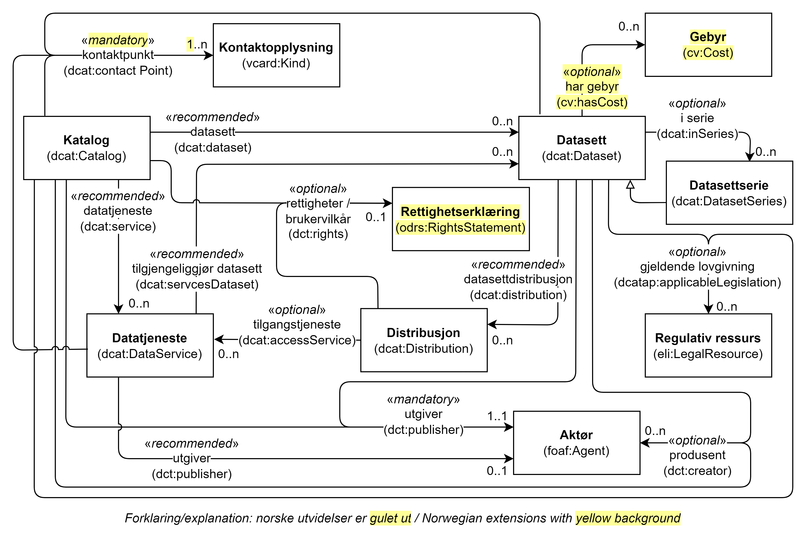

= Spesifikasjon per klasse [[Spesifikasjon-per-klasse]]

:xrefstyle: short

<<diagram-NoenKlasser>> viser en oversikt over noen av de klassene i DCAT-AP-NO og relasjoner mellom dem.   

[[diagram-NoenKlasser]]
.Oversikt over noen av klassene i DCAT-AP-NO og relasjoner mellom dem.
[link=images/DCAT-AP-NO-noen-klasser.png]

:xrefstyle: full

Hver klasse med dens egenskaper er spesifisert videre i dette kapitlet. Klassene er sortert alfabetisk etter norske klassenavn, og egenskapene i hver klasse gruppert først inn i obligatoriske, anbefalte og valgfrie egenskaper, og der under alfabetisk etter norske egenskapsnavn. 